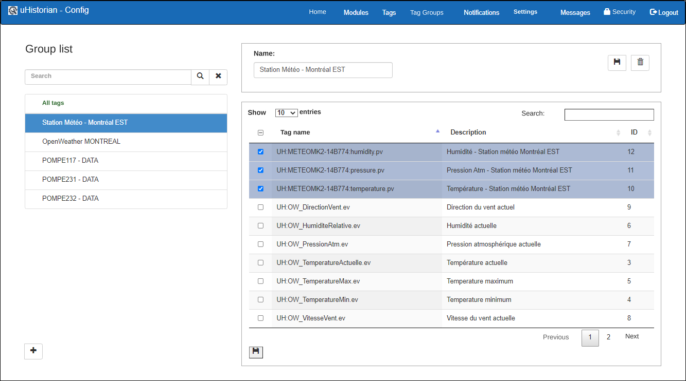
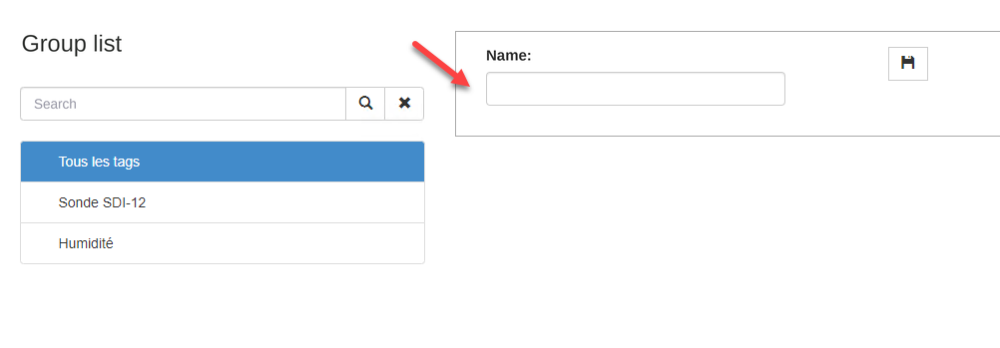
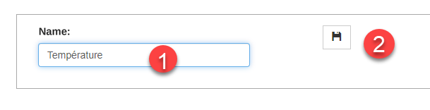
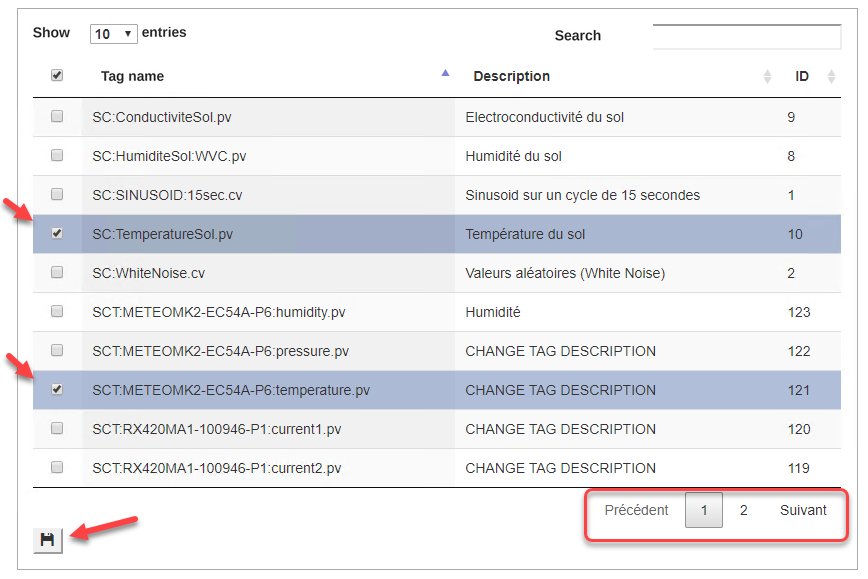
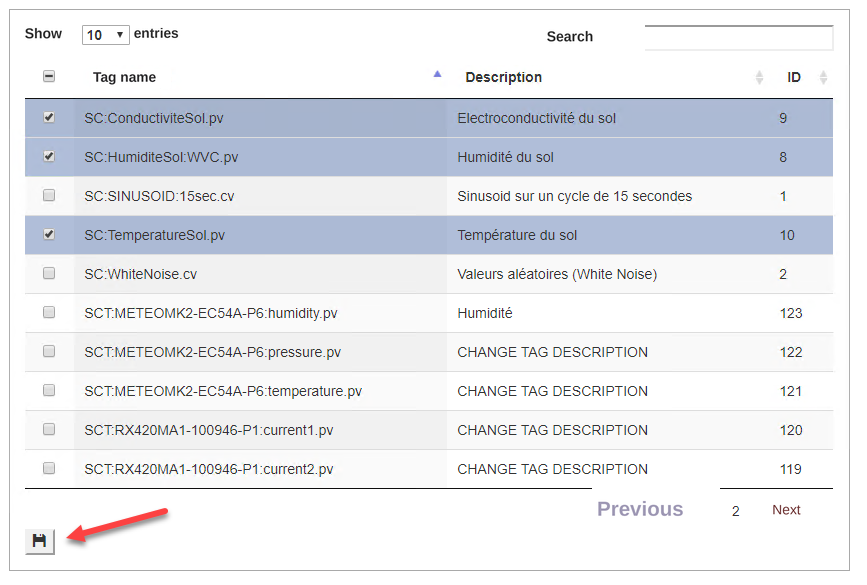
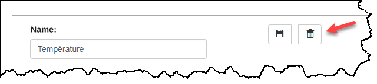

# Tag Groups

The Tag Groups tab lets you group tags in order to feed the display lists in the Dataview Web and Dataview iPhone/Android applications

{ width=394 }

The list on the left of the screen (1) contains the tag groups, and the list on the right of the screen (2) contains the list of tags for the selected group.

!!! info

    **The default group All Tags contains all the tags in the system and cannot be deleted or edited**.

## Step-by-step guide

The functions for configuring a tag group are as follows:

## Add a group

1.  Click the **+** button below the list of groups;

2.  The window on the right is displayed empty;

    { width=274 }

3.  Enter a group name that describes its content and click the Save button:

    { width=217 }

4.  Check the desired tags for the new group from the list of tags. You can check as many as needed:

5.  Before changing page or searching for another tag, you must click the Save button. Otherwise the newly selected Tags will not be saved.

    { width=868 }

6.  A message is displayed to indicate that the list has been saved:

7.  Continue until all the desired tags have been added;

## Edit a group

You can change the content of a tag group.

1.  Choose the group in the list on the left, and its list of tags appears in the list on the right;

2.  To add a tag, simply check the tag in question. If the tag is not on the first page, you can move from page to page or do a search.

3.  Once the Tag or Tags are checked, you must click the Save button of the Tags list.

4.  To remove a tag from the list, simply uncheck the tag in question and click the **Save** button of the Tags list.

{ width=867 }

!!! warning

    Note that you must click the Save button **on every page** that you modify.

## Delete a group

1.  Choose the group to delete in the window on the left;

2.  Click the Delete button located at the bottom left of the screen:

    { width=640 }

3.  A message asks you to confirm the deletion of the group:

    { width=210 }

4.  Click **Confirm** to delete the group, which then disappears from the list of tag groups, or click **Close** to cancel the deletion of the group.
