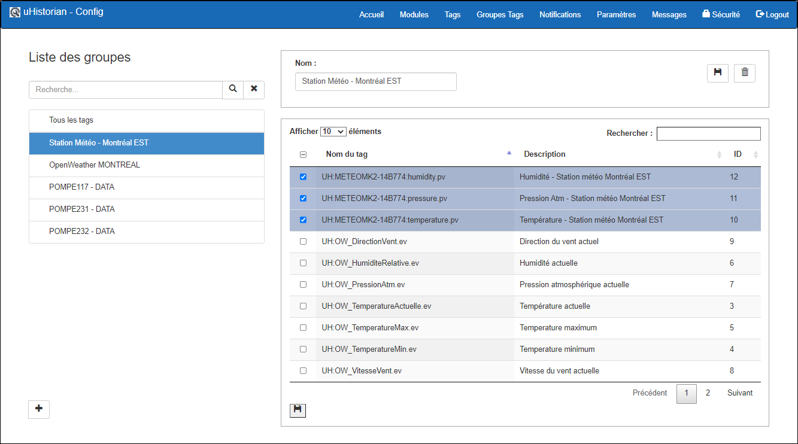
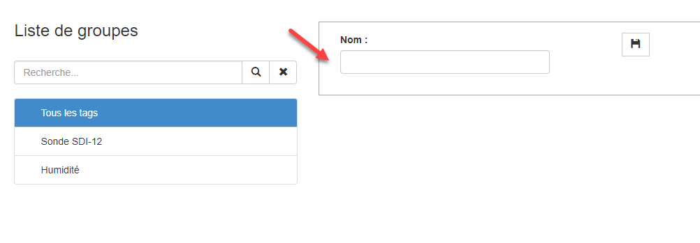
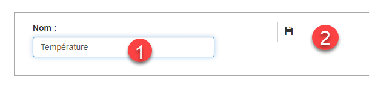
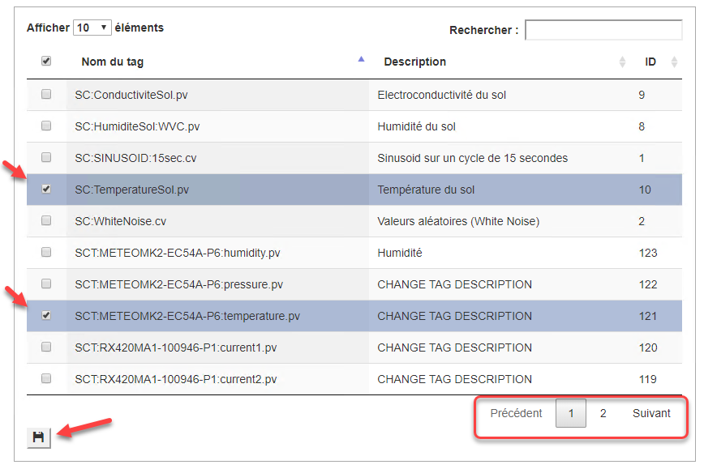
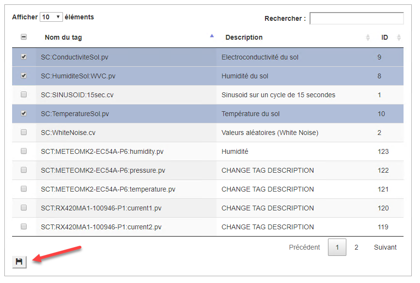
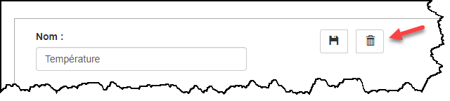
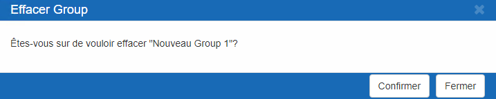

# Groupes de Tags

L'onglet Groupes Tag permet de regrouper des tags afin d'alimenter les listes d'affichage dans l'application Dataview Web et Dataview iPhone/Android

{ width=394 }

La liste à gauche de l'écran (1) contient les groupes de tags et la liste à droite de l'écran (2) contient la liste de tags pour le groupe sélectionné.

!!! info

    **Le groupe par défaut All Tags contient tous les tags du système et ne peut être effacé ou édité**.

## Guide étape par étape

Les fonctions pour la configuration d'un groupe de tags sont les suivantes:

## Ajouter un groupe

1.  Cliquer sur le bouton **+** en bas dessous la liste de groupes;

2.  La fenêtre de droite s'affichera vide;

    { width=274 }

3.  Entrer le nom du groupe qui en décrira le contenu et cliquer sur le bouton Sauvegarder:

    { width=217 }

4.  Cocher les tags voulus pour le nouveau groupe à partir de la liste de tags. Vous pouvez en cocher autant qu'il en faut:

5.  Avant de changer de page ou chercher un nouveau tag, il faut cliquer sur le bouton Sauvegarder. Sinon les nouveaux Tags sélectionnés ne seront pas sauvegardés.

    { width=868 }

6.  Un message s'afficheras pour indiquer que la liste est sauvegarder:

7.  Continuer jusqu'à ce que tous les tags désirés ont été ajoutés;

## Éditer un groupe

On peut modifier le contenu d'un groupe de tags.

1.  Choisir le groupe dans la liste de gauche et sa liste de tags apparait dans la liste de droite;

2.  Pour ajouter un tag, il suffit de cocher le tag en question. Si le tag ne fait pas parti de la première page, vous pouvez vous déplacer de page en page ou faire une recherche.

3.  Une fois le Tag ou les Tags cochés, il faut cliquer sur le bouton Sauvegarger de la liste des Tags.

4.  Pour effacer une tag de la liste, il suffit de décocher le Tag en question et cliquer sur le bouton **Sauvegarder** de la liste de la liste des Tags.

{ width=867 }

!!! warning

    Notez qu’il faut cliquer sur le bouton de Sauvegarde **à chaque page** que vous modifiez.

## Effacer un groupe

1.   Choisir le groupe pour effacer dans la fenêtre de gauche;

2.  Cliquer sur le bouton Effacer situé en bas à gauche de l'écran:

    { width=640 }

3.  Un message demande de confirmer l'effacement du groupe:

    { width=210 }

4.  Cliquer sur **Confirmer** pour effacer le groupe et ce dernier disparaitra de la liste des groupes de tags ou cliquer **Fermer** pour annuler l'effacement du groupe.
