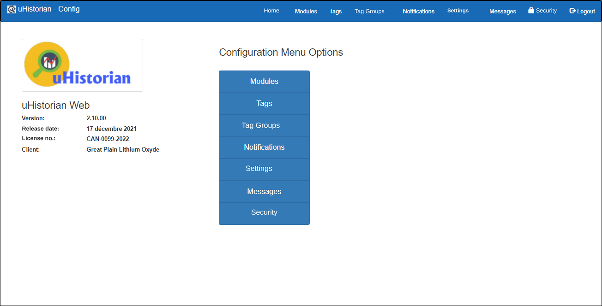

# Configuration

The configuration functions let you manage the operating parameters of the various uHistorian components, including:

- Creating and editing Modules

- Creating and editing Tags

- Creating and editing Notifications

- General configuration

- Security configuration and application access

The following screen appears with all the configuration functions:

{ width=396 }
