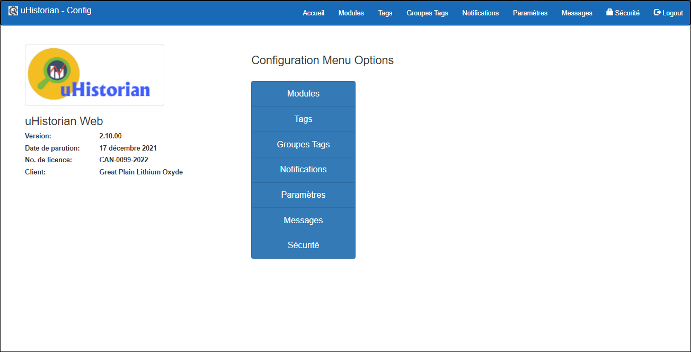

# Configuration

Les fonctions de configuration permettent de gérer les paramètres de fonctionnement des différents composants de uHistorian, notamment:

- Création et modification des Modules

- Création et modification des Tags

- Création et modification des Notifications

- Configuration générale

- Configuration de la sécurité et des accès aux applications

L'écran suivant apparait avec toutes les fonctions de configuration:

{ width=396 }
