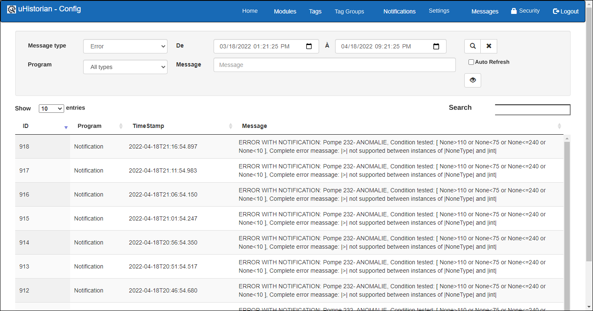

# Messages

All actions and events in uHistorian are recorded in a message log. The display lets you search the messages recorded in the uHistorian log.

{ width=396 }

There are 3 types of messages in uHistorian:

- **Information**: for example, the control actions of the MaestrEau system;

- **Errors**: contains the error messages issued by the system;

- **Warnings**: contains the warning messages issued by the system;

## Step-by-step guide

The message search functions are as follows:

## Navigation

The various fields of the display let you search the message log using search criteria.

1.  Message Type: choose the message type from a drop-down list (i.e. Info, Error, Warning);

2.  Program: you can choose which program recorded the message in the log;

3.  The different programs are Calculator, DataCollect, MaestrEau, Notification, RESTEngine and Watchdog. To search the messages of all programs, enter a \* in this field;

4.  Date range: you can choose the range of dates between which the message was recorded;

5.  Message: you can search by "*wild card*" in the message text. Use the \* as the wild card for a search;

    For example, to get all the messages that mention Zone \#1, enter **\*Zone \#1\*** in the Message field

6.  Once the search criteria are filled in, click the Search button to run the search in the message log; the results appear in the message table on the screen;

7.  You can also display the whole of a message in a dialog to read its content more easily. Choose the message in the message grid and click the View button:

8.  Check the Auto Refresh box so that the message list updates every 15 seconds without having to click the Refresh button.
