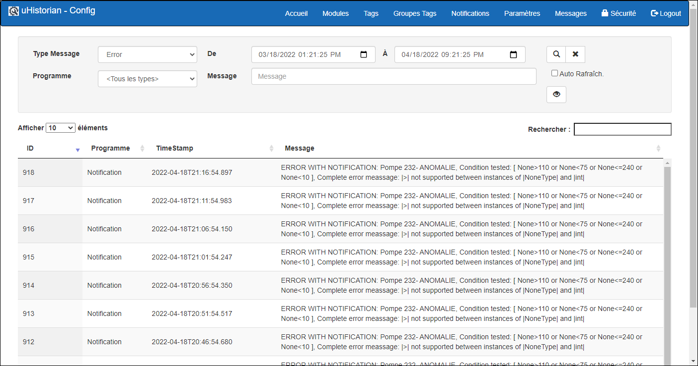

# Messages

Toutes les actions et événements dans uHistorian sont colligés dans journal de messages.  L'affichage permet de faire une recherche des messages enregistrés dans le journal de uHistorian.

{ width=396 }

Il y a 3 types de messages dans uHistorian:

- **Informations**:  Par exemple, les actions de contrôle du système MaestrEau;

- **Erreurs**:  Contiens les messages d'erreur émis par le système;

- **Avertissement**:  Contiens les messages d'avertissement émis par le système;

## Guide étape par étape

Les fonctions de recherche des messages sont les suivantes:

## Navigation

Les différents champs de l'affichage permettent de trouver dans le journal des messages avec des critères de recherche.

1.  Type Message:  Choisir le type de message dans une liste déroulante (c.-à-d. Info, Error, Warning);

2.  Programme:  On peut choisir quel programme à enregistrer le message dans le journal;

3.  Les différents programmes sont Calculator, DataCollect, MaestrEau, Notification, RESTEngine et Watchdog. Si on veut rechercher dans tous les messages des programmes, mettre une \* dans ce champ;

4.  Fourchette de date:  On peut choisir la fourchette des dates entre lesquelles le message a été inscrit;

5.  Message:  On peut faire une recherche par "*wild card*" dans le libellé du message.  On utilisera l' \* comme carte maitresse pour faire une recherche;

    Par exemple, si on veut obtenir tous les messages qui contiennent la mention de la Zone \#1, on écrira dans le champ Message la mention **\*Zone \#1\***

6.  Lorsqu'on a rempli les critères de recherche, cliquer sur le bouton Recherche   pour exécuter la recherche dans le journal des messages qui apparaissent dans le tableau des messages de l'écran;

7.  On peut également afficher la totalité d'un message dans un dialogue afin de mieux lire son contenu. Choisir le message dans la grille des messages et cliquer sur le bouton Visualiser :

8.  Cliquer sur la case Auto Rafraich.  afin que la liste des messages se mette à jour toutes les 15 secondes sans avoir à cliquer sur le bouton Rafraichir.
