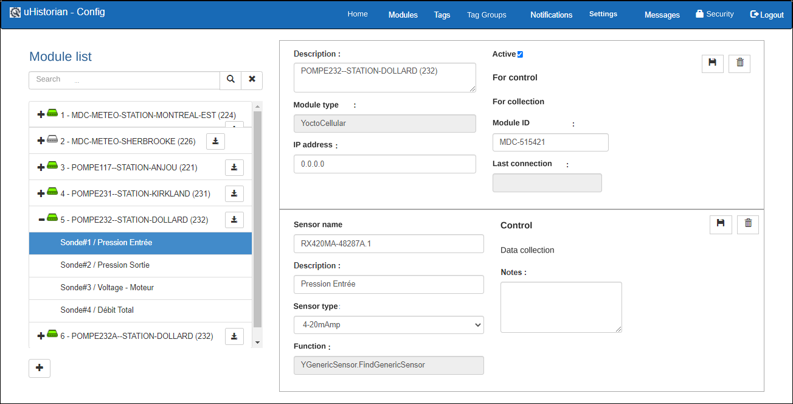
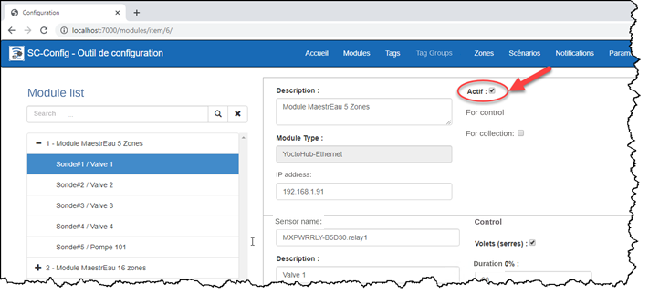
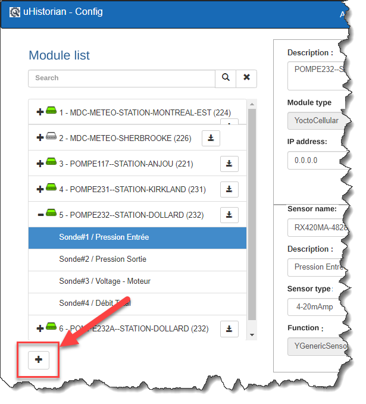
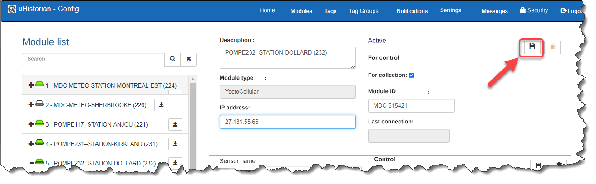
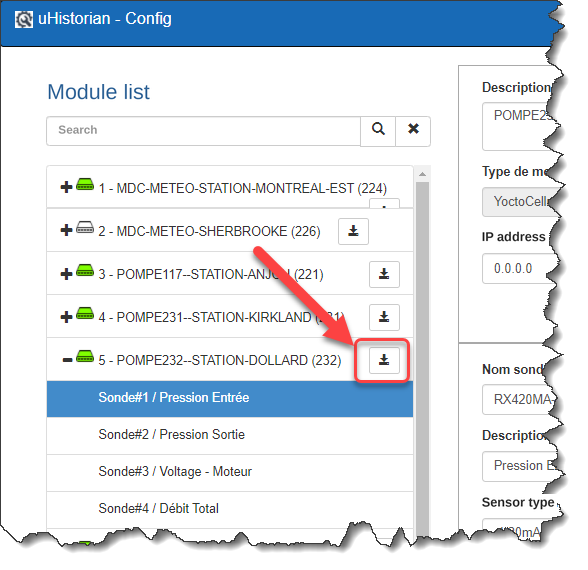
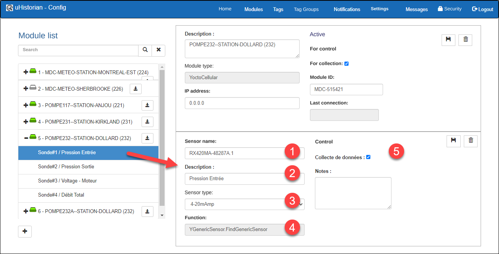
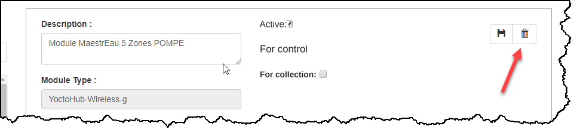
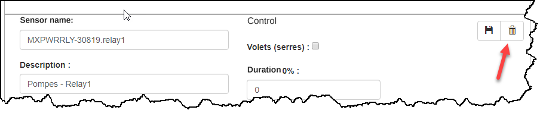
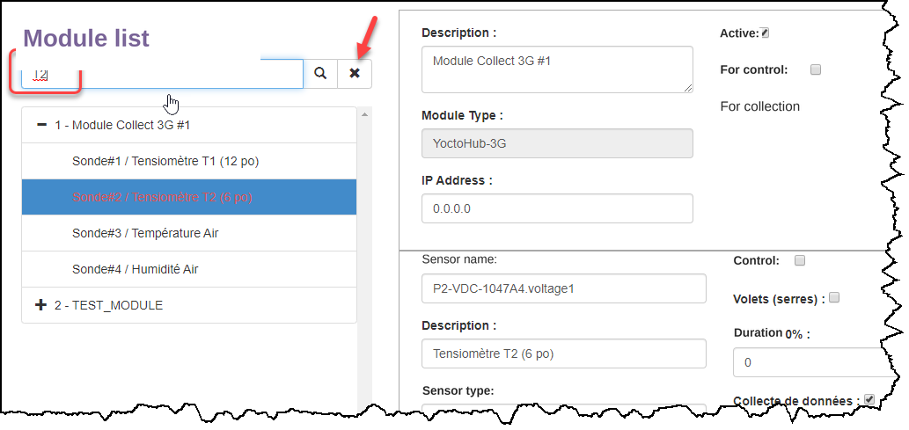

# Modules

A module is an electronic device that captures signals directly (e.g. 4-20 mA, voltage, etc.) or connects to measurement sensors (e.g. humidity, temperature, etc.). Please refer to the section on uHistorian modules for more information.

Once a module is connected to your wireless or wired network, or directly to the gateway, it must be added in the configuration application so that the gateway can acquire its data and operate the controls attached to it.

The following screen gives an overview of the module management display.

{ width=396 }

The module configuration features are:

- Lets you register modules in uHistorian

- 4 module types:

    - WiFi

    - Cellular

    - Wired Ethernet

    - Sensors connected to the gateway

- Sensors must be added according to the type of components installed in the module

!!! info

    If the module has an automatic identification feature (e.g. YoctoHub boards), the module is configured automatically when it is connected to the gateway

- The module must be given a name

- The parameters of each sensor must be confirmed and each sensor must be given a name (the name should be descriptive to make it easy to find)

## Step-by-step guide

The functions for configuring a module are as follows:

## Activate a module

To activate or deactivate a module:

1.  Choose the module in the list on the right;

2.  Click the Active checkbox to activate (checked) or deactivate a module:

{ width=711 }

!!! info

    When a module is deactivated, uHistorian stops collecting data from that module and stops monitoring whether the module is online.

## Add a new module

1.  Open the configuration application and click the Modules button to access the list of modules configured in the uHistorian gateway;

2.  To add a new module, click the "+" button at the bottom of the module tree:

    { width=136 }

3.  The function displays a screen with empty fields in the right-hand panel for configuring the new module;

4.  Enter a meaningful description;

5.  Choose the module type;

6.  In the module IP address field, enter the IP address that was assigned to this module when it was configured (see the module configuration utility);

7.  Check the For Control and/or For Collection boxes according to how the module is used;

8.  Click the floppy disk icon at the top right of the panel to save the new module's information;

    { width=442 }

9.  The new module appears in the module tree:

10. Click the new module to finish the configuration and activate it:

## Edit an existing module

1.  Click the module to edit;

2.  The module's parameters appear in the window on the right side of the screen;

3.  Some module parameters, such as the description, can be changed without affecting how the module operates. However, other parameters, such as the IP address, do affect how the module operates. The changes must be validated before the parameters are modified. The fields of a module are described in the following table:

| Field            | Description                                                                                                                  |
|------------------|------------------------------------------------------------------------------------------------------------------------------|
| ID               | Module identification number                                                                                                 |
| Active           | Module activation indicator                                                                                                  |
| Description      | Module description                                                                                                           |
| Module type      | Module type: WiFi (wireless), Ethernet (wired), Virtual Hub (driver installed on a computer (Windows, Linux, Mac))            |
| IP address       | Module IP address                                                                                                            |
| For control      | Indicates that the module is used for control                                                                                |
| For acquisition  | Indicates that the module is used for data acquisition.                                                                      |

## Add a sensor to an existing module

1.  Select the module and click the add-sensor button located on the module's row on the right:

    { width=204 }

2.  A new sensor appears under the selected module:

3.  { width=442 }

    Enter the sensor parameters:

    1.  The sensor address (see the module documentation)

    2.  A description of the sensor

    3.  The sensor type

    4.  The sensor function (entered automatically according to the sensor type)

    5.  And whether it is used to control (relay/actuator), collect data (measurement) or start equipment (relay)

4.  **When finished, click the floppy disk icon at the top right of the sensor panel to save.**

## Edit an existing sensor

1.  Click the module containing the sensor to edit;

2.  Click a sensor under the module tree to edit its content. The same comments apply as for the module. The fields of a sensor are described in the following table:

| Field           | Description                                                                          |
|-----------------|--------------------------------------------------------------------------------------|
| ID              | Sensor identification number                                                         |
| Sensor name     | Sensor name - used for the connection to the Tag                                     |
| Description     | Full description of the sensor                                                       |
| Sensor type     | Type of sensor, linked to the list of sensors configured in uHistorian               |
| Control         | Indicates that the relay is used for control                                         |
| Data collection | Indicates that the sensor is used for data acquisition                               |
| To start        | Indicates that the relay is used to start equipment                                  |
| Function        | Function performed by the sensor/relay                                               |
| Notes           | Field for adding notes to the sensor/relay.                                          |

## Remove an existing module

1.  To remove a module, select it and click the trash can in the module panel;

    { width=966 }

2.  A message asks you to confirm the deletion of the module;

3.  Once confirmed, the module is removed and the display is refreshed;

4.  Note that if the module contains sensors, they are also deleted.

## Remove a sensor from an existing module

1.  To remove a sensor, select it and click the trash can in the sensor panel;

    { width=909 }

2.  A message asks you to confirm the deletion of the sensor;

3.  Once confirmed, the sensor is removed and the display is refreshed;

4.  Note that if a Tag is associated with this sensor, it is set to "Scan Off" mode so that it is no longer looked up on this sensor.

## Search for a module or a sensor

1.  Enter the module or sensor to find in the search box. The search value can be only part of the module or sensor description:

    { width=374 }

2.  The module or sensor is automatically selected and its properties are displayed on screen.

3.  If nothing is found, nothing is selected.

4.  If several modules or sensors match the search, the first one in the list is selected and the others are displayed in red.

5.  Click the **X** button to clear the search.
