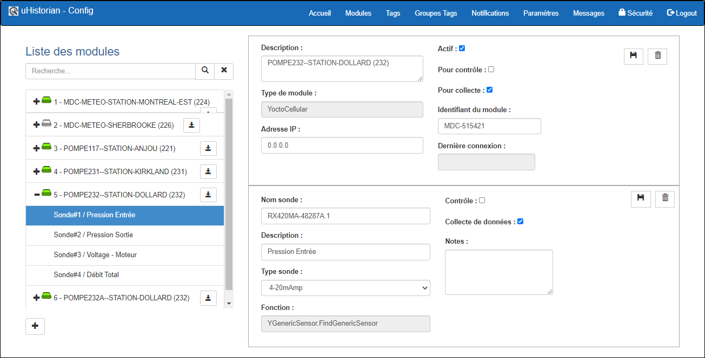
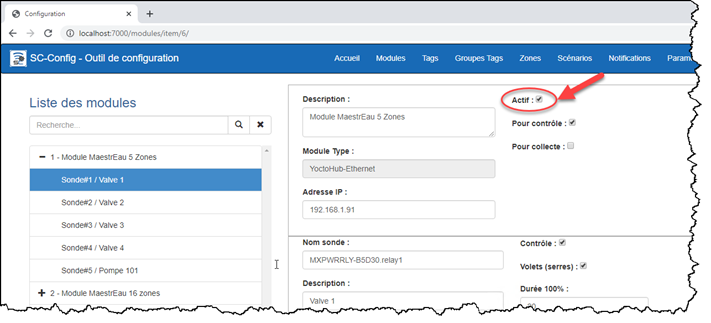
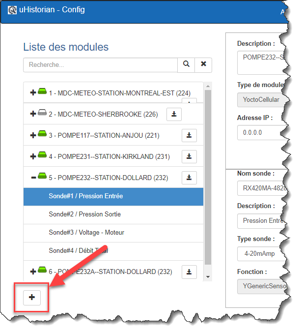
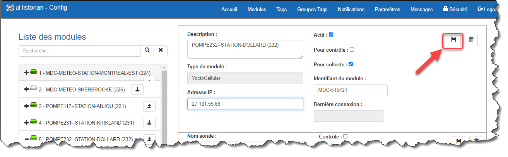
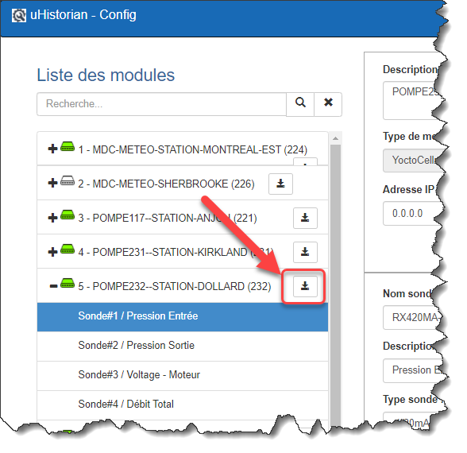
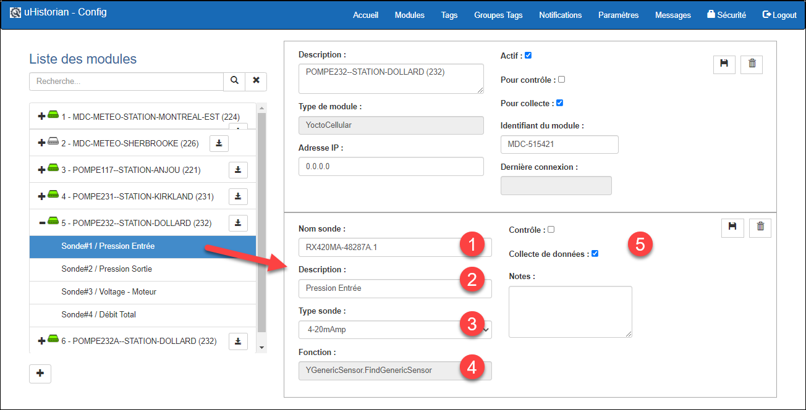
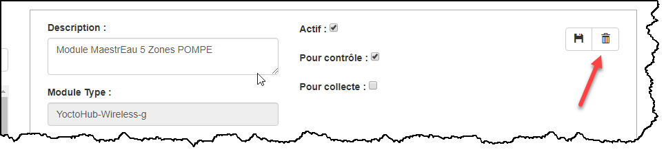
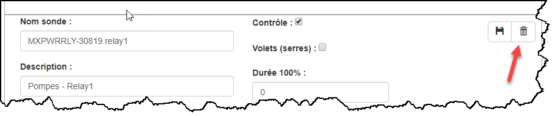
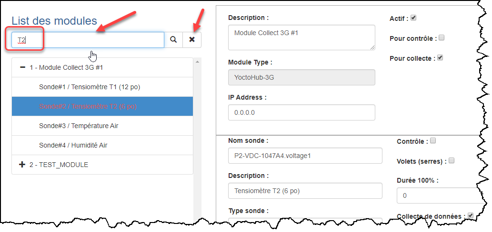

# Modules

Un module est un dispositif électronique qui permet la capture de signaux directement (ex.: 4-20 mA, voltage, etc.) ou de se raccorder à des sondes de mesures (ex.: humidité, température, etc.).  Veuillez consulter la section sur les modules uHistorian pour plus d'information.

Une fois qu’un module est raccordé à votre réseau sans fil ou câblé ou directement à la passerelle, il faut l’ajouter dans l'application de configuration afin que la passerelle puisse en acquérir les données ainsi que d'actionner les contrôles qui s'y rattachent.

L'écran suivant donne un aperçu de l’affichage de gestion des modules.

{ width=396 }

Les caractéristiques de la configuration des modules sont:

- Permets d’inscrire les modules dans uHistorian

- 4 types de modules:

    - WiFi

    - Cellulaire

    - Ethernet câblé

    - Sondes connectées sur la passerelle

- Les sondes doivent être ajoutées selon le type de composants installés dans le module

!!! info

    Si le module est doté d’un dispositif automatique d’identication (ex.: cartes YoctoHub), la configuration du module est fait automatiquement lors de sa connexion à la passerelle

- Il faut donner un nom au Module

- Il faut confirmer les paramètres de chaque Sonde et leur donner un nom (le nom doit être descriptif pour faciliter sa recherche)

## Guide étape par étape

Les fonctions pour la configuration d'un module sont les suivantes:

## Activer un module

Pour activer ou désactiver un module:

1.  Choisir le module dans la liste de droite;

2.  Cliquer sur la case Actif pour activer (crochet) ou désactiver un module:

{ width=711 }

!!! info

    Lorsqu'un module est désactivé, uHistorian cesse de faire la collecte de données de ce module et cesse de surveiller si ce module est en ligne ou non.

## Insérer un nouveau module

1.  Ouvrir l'application de configuration et cliquer sur le bouton Modules pour avoir accès à la liste des modules configurés au sein de la passerelle uHistorian;

2.  Pour ajouter un nouveau module, faire un clique sur le bouton “+” situé en base de l'arborescence des modules:

    { width=136 }

3.  La fonction affichera un écran avec des champs vide dans le panneau de droite pour la configuration du nouveau module;

4.  Entrer une description significative;

5.  Choisir le type de module;

6.  Et dans le champ Adresse IP du module, entrer l'adresse IP qui a été attribuée à ce module lors de sa configuration (voir utilitaire de configuration d'un module);

7.  Cocher les cases Pour Contrôle et/ou Pour collecte selon l'utilisation du module;

8.  Cliquer sur la disquette en haut à droit du panneau pour sauvegarder l'information du nouveau Module;

    { width=442 }

9.  Le nouveau module apparaît dans l'arborescence des modules:

10. Cliquer sur le nouveau module afin de terminer la configuration et de l'activer:

## Éditer un module existant

1.  Cliquer sur le module à modifier;

2.  Les paramètres du module apparaissent dans la fenêtre de droite de l'écran;

3.  Il est possible de modifier certains paramètres du module sans en affecter le fonctionnement tel que la description.  Cependant, les autres paramètres tels que l'adresse IP, ont impact sur le fonctionnement du module.  Il est requis de valider le contenu des changements avant de modifier les paramètres.  La description des champs d'un module est dans le tableau suivant:

| Champs           | Description                                                                                                             |
|------------------|-------------------------------------------------------------------------------------------------------------------------|
| ID               | Numéro d'identification du module                                                                                       |
| Actif            | Indicateur d'activation du module                                                                                       |
| Description      | Description du module                                                                                                   |
| Type module      | Type de module: Wifi (sans fil), Ethernet (câblé), Virtual Hub (pilote installé sur un ordinateur(Windows, Linux, Mac)) |
| Adresse IP       | Adresse IP du module                                                                                                    |
| Pour contrôle    | Indicateur que le module est pour faire du contrôle                                                                     |
| Pour acquisition | Indidateur que le module est pour faire de l'acquisition.                                                               |

## Ajouter une sonde à un module existant

1.  Sélectionner le module et cliquer sur le bouton d’ajout de sonde situé sur la ligne du module à droite:

    { width=204 }

2.  Une nouvelle sonde apparaitra sous le module sélectionné:

3.  { width=442 }

    Entrer les paramètres de la sonde:

    1.  L'adresse de la sonde (voir documentation du module)

    2.  Une description de la sonde

    3.  Le type de sonde

    4.  La fonction de la sonde (s’insère automatiquement selon le type de sonde)

    5.  Et si elle sert pour contrôler (relais/actuateur), collecter des données (mesure) ou démarrer un équipement (relais)

4.  **Lorsque terminé, appuyer sur la disquette en haut à droit du panneau de la sonde pour sauvegarder.**

## Éditer une sonde existant

1.  Cliquer sur le module contenant la sonde à éditer;

2.  Cliquer sur une sonde sous l'arborescence du module pour en modifier son contenu.  Les mêmes commentaires s'appliquent que pour le module.  La description des champs d'une sonde est dans le tableau suivant:

| Champs              | Description                                                                       |
|---------------------|-----------------------------------------------------------------------------------|
| ID                  | Numéro d'identification de la sonde                                               |
| Nom Sonde           | Nom de la sonde - utilisé pour la connexion au Tag                                |
| Description         | Description complète de la sonde                                                  |
| Type sonde          | Type de sonde qui est reliée à la liste des sondes configurées dans Simplicollect |
| Contrôle            | Indicateur que le relais est pour faire du contrôle                               |
| Collecte de données | Indicateur que la sonde est pour faire de l'acquisition de données                |
| À démarrer          | Indicateur que le relais est pour le démarrage d'un équipement                    |
| Fonction            | Fonction exécutée par la sonde/relais                                             |
| Notes               | Champ qui permet d'ajouter des notes à la sonde/relais.                           |

## Retirer un module existant

1.  Pour retirer un module, Sélectionner celui-ci et cliquer sur la poubelle du panneau de module;

    { width=966 }

2.  Un message vous demanderas de confirmer l'effacement du module;

3.  Une fois confirmer, le module sera retirée et l'affichage sera rafraichi;

4.  Noter que si le module contient des sondes, elles seront aussi effacées.

## Retirer une sonde d'un module existant

1.  Pour retirer une sonde, Sélectionner celle-ci et cliquer sur la poubelle du panneau de sonde;

    { width=909 }

2.  Un message vous demanderas de confirmer l'effacement de la sonde;

3.  Une fois confirmer, la sonde sera retirée et l'affichage sera rafraichi;

4.  Noter que si un Tag est associé à cette sonde, il serait mis en mode "Scan Off" afin que ce dernier ne soit plus recherché sur cette sonde.

## Rechercher un module ou une sonde

1.  Entrer dans la boite de recherche le module ou la sonde à trouver dans la liste. La valeur de recherche peut être une partie seulement de la description du module ou de la sonde:

    { width=374 }

2.  Le module ou la sonde seras automatiquement sélectionné et ses propriétés, affiché à l'écran.

3.  Si rien n'est trouvé, rien ne seras sélectionné.

4.  Si il y a plusieurs Modules ou Sondes qui correspondent à la recherche. la première dans la liste seras sélectionné. et les autres seront affichés en rouges.

5.  cliquer sur le bouton **X** pour effacer la recherche.
