# Notifications and event management

Notifications alert us when the value of a Tag (i.e. a value that is measured, calculated or obtained from an external system) exceeds specific conditions (e.g. the soil humidity is too low and the soil is too dry…).

For example, you may want to receive an SMS warning if the temperature in a greenhouse exceeds 40 C or if the soil humidity falls below 30%. To do this, you can create a "Notification" in uHistorian that will monitor these values continuously and alert us when needed.

The function creates an "event" each time a notification occurs. As such, you can even create a notification with no message and no recipient in order to create only an event.

See the event management documentation for more information ([Event Viewer](../visualisation/eventview.md)).

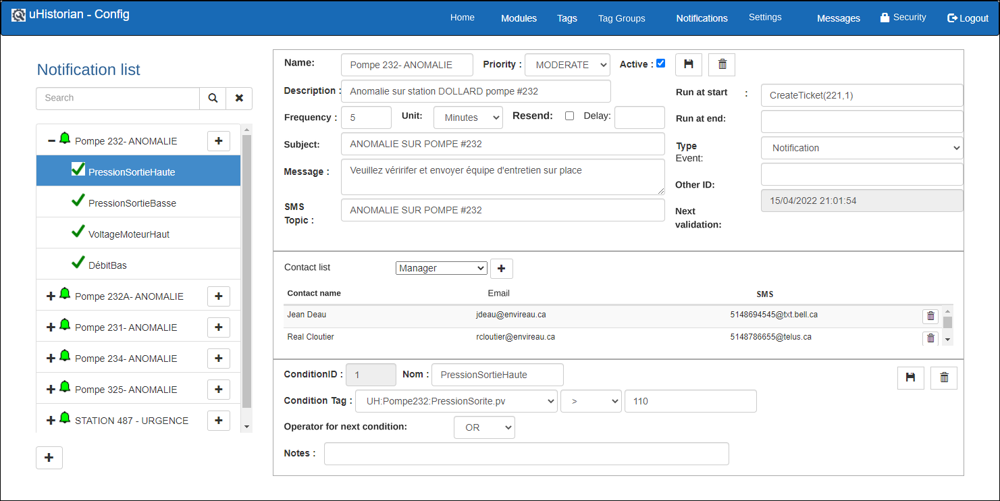{ width=394 }

## Step-by-step guide

The functions for configuring a notification are as follows:

## Add a notification

1.  Click the **+** button located in the lower left corner of the screen;

2.  A new empty screen is displayed;

    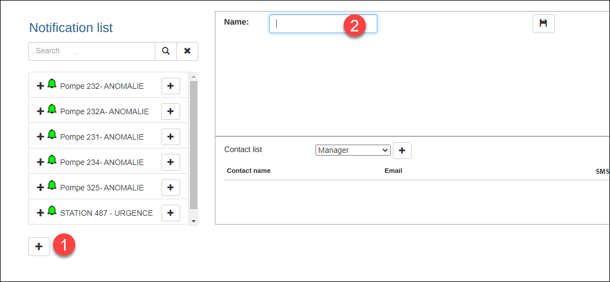{ width=306 }

3.  Enter the name of the notification and click the Save button:

    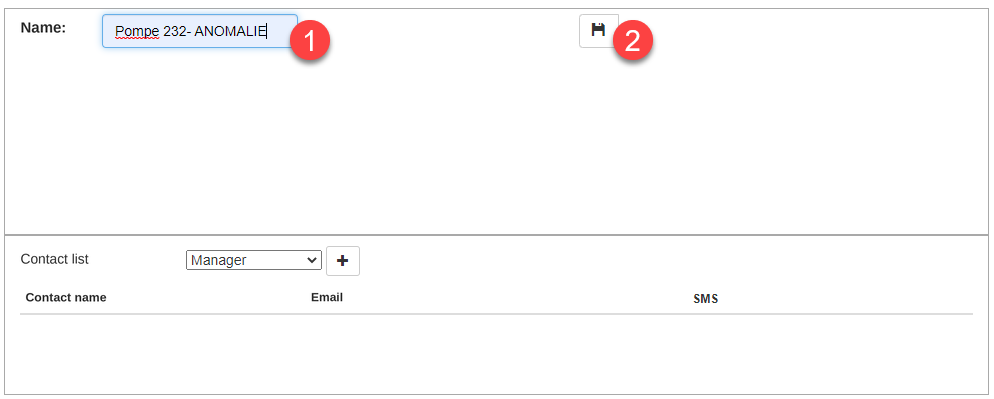{ width=306 }

4.  Once the notification is saved, it is automatically selected and ready for you to enter its parameters;

    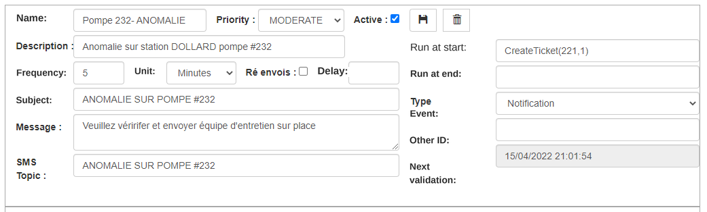{ width=1041 }

5.  The notification parameters include:

    1.  The name and description of the notification;

    2.  The validation frequency and the time units (minute, hour, day)

    3.  The Resend option, which resends a notification at every time interval (frequency) even if the threshold was already exceeded previously;

        { width=1223 }

    4.  The Delay field defines the waiting time, in seconds, before the notification is created. At the end of this delay, the values of the conditions are evaluated again, and if the conditions are still met, the event is created;

6.  If the notification must be sent by email/SMS, fill in the notification subject, the message and the subject for the SMS;

7.  Once the parameters are entered, <u>always</u> click the Save button.

## Fields related to event management

Each time the conditions of a notification are met, an event is created with a timestamp for the start of the event (i.e. the moment the conditions are met) and another timestamp at the end of the event, when the notification conditions are no longer met. A search and management function is available to follow the events created by the notification function ([Event Viewer](../visualisation/eventview.md)).

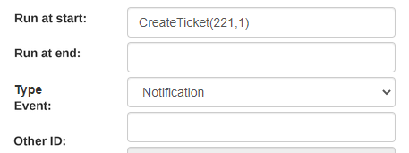{ width=457 }

The following fields let you configure the events created by notifications:

1.  Run at start: function programmed in the Python module NotifLib.py, located in the /UHist/BIN/Lib directory. The function is executed at the exact moment the notification is triggered;

2.  Run at end: function programmed in the Python module NotifLib.py and executed at the exact moment the notification ends;

3.  Event type: you can assign an event type in order to refine the search for events. The list of event types is maintained in the EventType table in SQL Server;

4.  Other ID: you can assign an ID to an event, for example an equipment number, in order to refine the search for events.

## List of recipients

You can enter the recipients of the notification by choosing the recipient's name from a drop-down list. The list of recipients comes from the Settings section, in which the recipients' names are managed:

1.  Choose a recipient in the list; click the + button next to the list;

    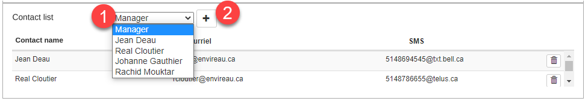{ width=976 }

2.  You can add as many recipients as desired. Each recipient receives the notification by email and/or by SMS on a mobile phone;

3.  You can remove a recipient by clicking the Delete button on the row of the recipient in question.

## Add a condition

A notification can contain one or more "conditions" that will be tested by the uHistorian monitoring engine. If several conditions are used, the conditions must be "chained" together with a "logical operator" (OR or AND), which lets a condition be "strict" (AND) or "optional" (OR).

1.  Click the + button on the right of the condition name in the tree:

    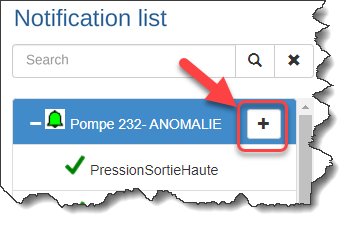{ width=356 }

2.  This creates a new condition under the notification with the name New Condition:

    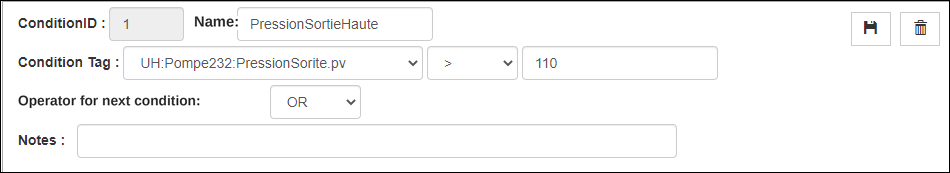{ width=950 }

3.  The condition parameters are:

    1.  Condition name;

    2.  The Tag that is the subject of the condition, chosen from the drop-down list (click the arrow);

    3.  The mathematical operator used to compare with the condition value;

        The operators are **greater than or equal** (\>=), **less than or equal** (\<=), **greater than** (\>), **less than** (\<), **not equal to** (!=) or **equal to** (==).

    4.  The condition value;

    5.  The operator used to "chain" the next condition (OR or AND);

        When the OR operator is used, condition 1 **OR** condition 2 must be met. If the AND operator is chosen, condition 1 **AND** condition 2 must both be met to trigger the notification.

    6.  An explanatory note for the condition (optional);

    7.  You can enter other conditions within the same notification, remembering to choose the chaining operator OR or AND between the conditions. **The last condition has an empty chaining operator**

4.  Once finished, click the **Save** button;

5.  You can add as many conditions as you want;

!!! warning

    It is sometimes wise not to put too many conditions in the same notification. You can add another notification to cover other conditions for the same location.

    **Make sure to validate the chaining operators between the conditions, and remember that the last condition must have no chaining operator**

### Activate the notification

For the notification to be put into service, it must be made active.

1.  Click the Active checkbox located in the section at the top of the screen:

    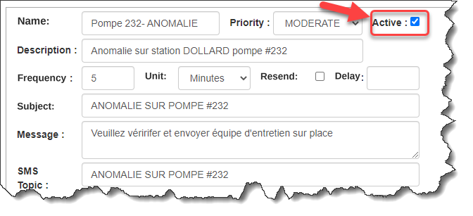{ width=217 }

2.  Click the **Save** button to update the display;

3.  You will notice that the notification icon turns green, which indicates that the notification is active:

### Email and SMS examples

1.  Each time the notification is sent to a recipient, the email and the SMS look like the example below:

    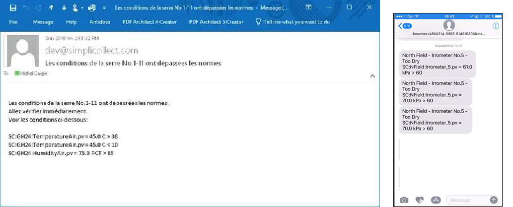{ width=1033 }

## Edit a condition

1.  Choose a notification in the window on the left;

2.  In the sections on the right, make the desired changes;

3.  Click the **Save** button in the Notification section to update the display;

4.  To remove a condition, click the Delete button ("trash can") on the condition's row:

5.  Confirm the deletion and the Condition will be removed from the Notification;

!!! warning

    **Make sure to validate the chaining operators between the conditions, and remember that the last condition must have no chaining operator.**

## Delete a notification

1.  Choose a notification in the list on the left;

2.  Click the Delete button at the top right of the screen;

    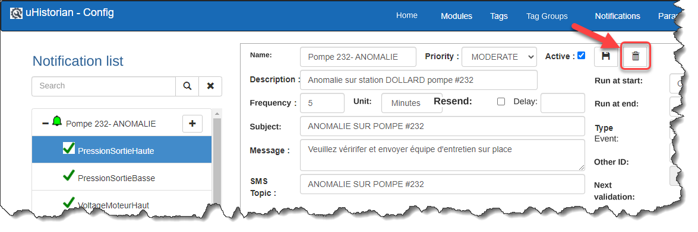{ width=330 }

3.  A message asks you to confirm the deletion of the Notification;

4.  Click **Confirm** and the Notification is removed from the list.
