# Notifications et gestion des événements

Les notifications nous avertissent si la valeur d’un Tag (c.-à-d. une valeur mesurée, calculée ou obtenue d'un système externe) dépasse des conditions spécifiques (ex.: l’humidité du sol est trop basse et ce sol est trop sec…).

Par exemple, on désire recevoir un avertissement par SMS si la température dans une serre dépasse 40 C ou que l'humidité du sol est moins que 30%.  Pour se faire, on peut créer une "Notifcation" dans uHistorian qui va surveiller ces valeurs en temps continu et nous alerter le cas échéant.

La fonction crée un “événement” à chaque occurance d’une notification. A ce titre, on peut même créer une notification sans message et destinataire pour créer seulement un événement.

Consulter la documentation de gestion des événements pour plus d’information ([Event Viewer](../visualisation/eventview.md) ).

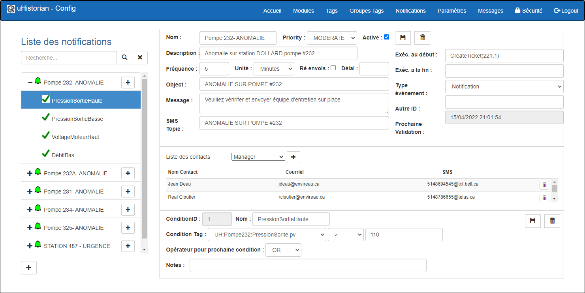{ width=394 }

## Guide étape par étape

Les fonctions pour la configuration d'une notification sont les suivantes:

## Ajouter une notification

1.  Cliquer le bouton **+** situé dans le coin inférieur gauche de l'écran;

2.  Un nouvel écran vide est affiché;

    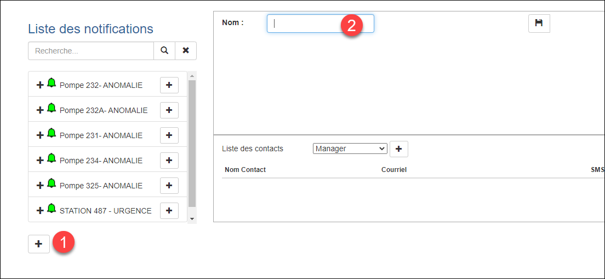{ width=306 }

3.  Entrer le nom de la nodification et Cliquer sur le bouton Sauvegarde:

    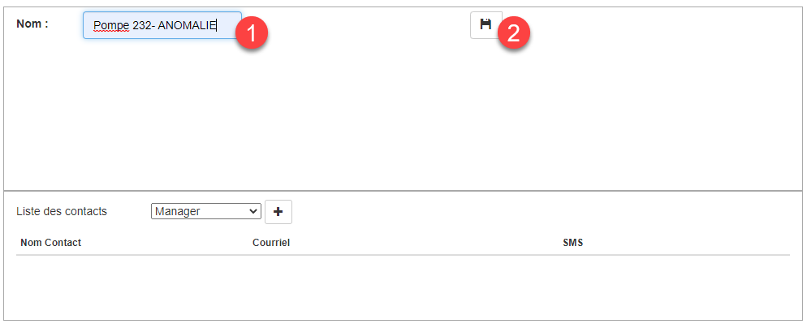{ width=306 }

4.  Une fois la notification sauvegardée, elle sera automatiquement sélectionnée et prêt pour entrer ses paramètres;

    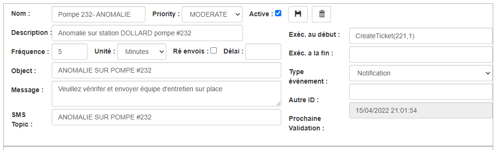{ width=1041 }

5.  Les paramètres de la notification inclus:

    1.  Le nom et la description de la notification;

    2.  La fréquence de validation ainsi que les unités de temps (minute, heure, jour)

    3.  L'option de Réenvoi qui consiste à renvoyer une notification à tous les intervalles de temps (fréquence) même si le dépassement a été activé précédemment;

        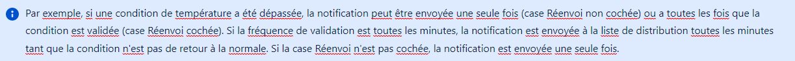{ width=1223 }

    4.  Le champ Délai définie le délai d’attente, en secondes, avant que la notification soit créée. À la fin de ce délai, les valeurs des conditions sont évaluées de nouveau et si les conditions sont toujours rencontrées, alors l'événement est créé;

6.  Si la notification doit être envoyée par courriel/SMS, remplir le sujet de la notification, le message et le sujet pour le SMS;

7.  Une fois les paramètres entrés, <u>toujours</u> cliquer sur le bouton Sauvegarder.

## Champs reliés à la gestion des événements

Chaque fois que les conditions d’une notification sont rencontrées, un événement est créé avec un horodatage du début de l'événement (c.-à-d. le moment où les conditions sont rencontrés) et un autre horodatage à la fin de l'événement lorsque les conditions de notificiation ne sont plus rencontrés. Une fonction de recherche et de gestion est disponible pour suivre les événements créés par la fonction de notification ([Event Viewer](../visualisation/eventview.md) ).

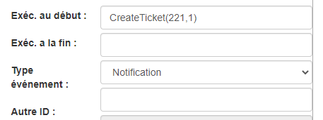{ width=457 }

Les champs suivant permettent de paramétriser les événements créés par les notifications:

1.  Exécution au début: Fonction programmée dans le module Python NotifLib.py qui se trouve dans le répertoire /UHist/BIN/Lib. La fonction est éxécutée au moment exacte où la notification est lancée;

2.  Exécution au début: Fonction programmée dans le module Python NotifLib.py et qui est éxécutée au moment exacte où la notification est terminée;

3.  Type d'événement: On peut apposer un type d'événement afin de paramétrer la recherche des événements. La liste des types d'événement est mis à jour dans la table EventType dans SQL Server;

4.  Autre ID: On peut apposer un ID pour paramétrer un événements, par exemple, un numéro d'équipement. Ceci afin de paramétrer la recherche des événements.

## Liste des destinataires

On peut entrer les destinataires de la notification en choisissant le nom du destinataire dans une liste déroulante:La liste des destinataires provient de la section Paramètres dans laquelle les noms des destinataires sont gérés:

1.  Choisir un destinataire dans la liste;Cliquer sur le bouton + à côté de la liste;

    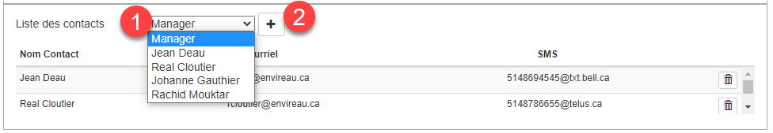{ width=976 }

2.  On peut ajouter autant de destinataires que désiré.  Chaque destinataire reçoit la notification par courriel et/ou par SMS sur un téléphone portable;

3.  On peut retirer un destinataire en cliquant sur le bouton Effacer sur la ligne du destinataire en question.

## Ajouter une condition

Une notification peut contenir une ou plusieurs "conditions" qui seront testées par l'engin de surveillance uHistorian.  Si plusieurs conditions sont utilisées, il faut “chaîner” les conditions entre elle avec un “opérateur logique” (OR ou AND) qui permet à une condition d'être “stricte” (AND) ou “optionelle” (OR).

1.  Faire un clique sur le bouton + à droite sur le nom de la condition dans l’arborescence:

    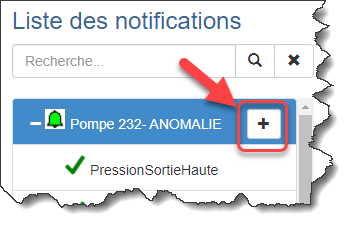{ width=356 }

2.  Ceci créé une nouvelle condition sous la notification avec le nom Nouvelle Condition:

    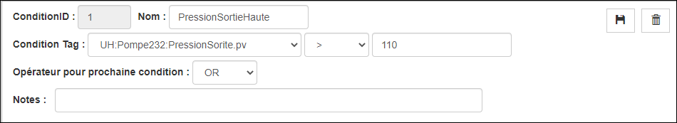{ width=950 }

3.  Les paramètres de la condition sont:

    1.  Nom de la condition;

    2.  Le Tag qui fait l'objet de la condition qui est choisi dans la liste déroulante (cliquer sur la flèche);

    3.  L'opérateur mathématique qui permet la comparaison avec la valeur de la condition;

        Les opérateurs sont **plus grand ou égal** (\>=), **plus petit ou égale** (\<=), **plus grand** (\>), **plus petit** (\<), **différent que** (!=) ou **égale à** (==).

    4.  La valeur de la condition;

    5.  L'opérateur pour "chainer" la prochaine condition (OR ou AND);

        Lorsqu'on utilise l'opérateur OR, la condition 1 **OU** la condition 2 doit être remplie. Si l'opérateur AND est choisi, la condition 1 **ET** la condition 2 doivent être remplies pour déclencher la notification.

    6.  Une note explicative pour la condition (optionnel);

    7.  On peut entrer d'autres conditions au sein de la même notification en n'oubliant pas de choisir l'opérateur de chainage OR ou AND entre les conditions. **La dernière condition contient un opérateur de chainage vide**

4.  Une fois terminé, cliquer sur le bouton **Sauvegarder**;

5.  On peut ajouter autant de conditions que voulu;

!!! warning

    Il est parfois judicieux de ne pas mettre trop de conditions dans une même notification. On peut ajouter une autre notification pour couvrir d'autres conditions pour le même endroit.

    **Assurez-vous de bien valider les opérateurs de chainage entre les conditions et souvenez-vous que la dernière Condition doit n'avoir aucun opérateur de chainage**

### Activation de la notification

Pour que la notification soit mise en service, il faut mettre cette en activité.

1.  Cliquer sur la case Actif située dans la section en haut de l'écran:

    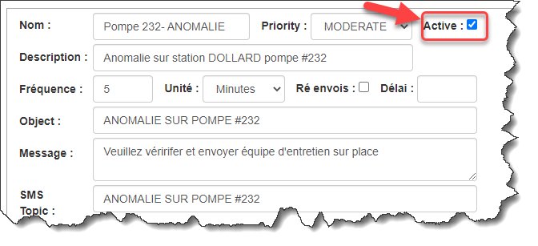{ width=217 }

2.  Cliquer sur le bouton **Sauvegarder** pour mettre à jour l'affichage;

3.  On remarquera que l'icône de la notification change de couleur pour le vert qui indique que la notification est active:

### Exemples de courriel et de SMS

1.  À chaque fois que la notification est expédiée à un destinataire, le courriel et le SMS ressemblent à l'exemple ci-dessous:

    { width=1033 }

## Éditer une Condition

1.  Choisir une notification dans la fenêtre de gauche;

2.  Dans les sections de droite, apporter les modifications voulues;

3.  Cliquer sur le bouton **Sauvegarder** dans la section Notification pour mettre à jour l'affichage;

4.  Pour retirer une condition, cliquer sur le bouton Effacer (“poubelle”) sur la ligne de la condition:

5.  Confirmer l'effacement et la Condition sera retirer de la Notifications;

!!! warning

    **Assurez-vous de bien valider les opérateurs de chainage entre les conditions et souvenez-vous que la dernière Condition doit n'avoir aucun opérateur de chainage.**

## Effacer une notification

1.  Choisir une notification dans la liste de gauche;

2.  Cliquer sur le bouton Effacer supérieur droite de l'écran;

    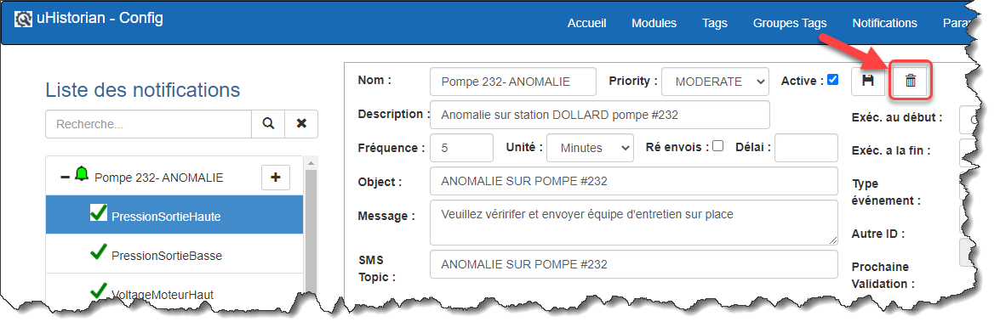{ width=330 }

3.  Un message demande de confirmer l'effacement de la Notification;

4.  Cliquer sur **Confirmer** et la Notification sera retirée de la liste.
