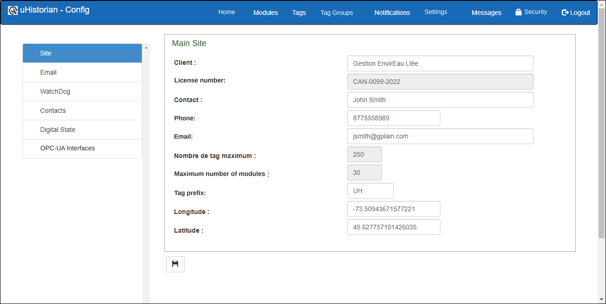
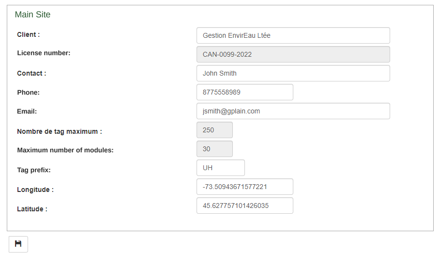
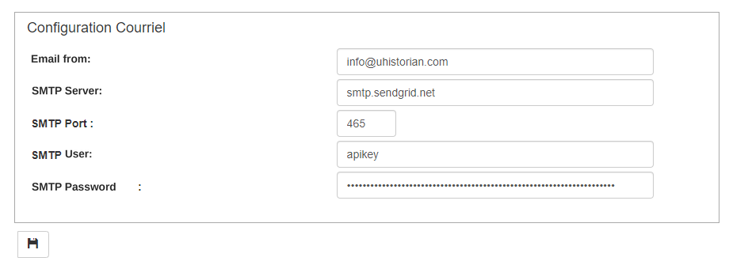
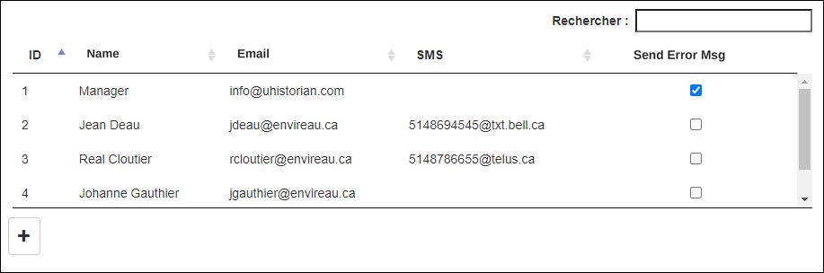

# General settings

The purpose of this screen is to configure the general settings of the uHistorian gateway, including the customer references (customer name, site details, etc.), the external communication links, the module monitoring (*watchdog*) and certain uHistorian usage parameters. This screen also hosts the configuration of interfaces such as OPC-UA, MQTT, LIDAR485 and others.

{ width=387 }

## Step-by-step guide

The functions for configuring the settings are as follows:

## Site definition and details

This section lets you define the site and its details.

{ width=340 }

1.  Click the Site section in the menu on the left;

2.  Fill in the fields requested on screen;

3.  Enter the Longitude and Latitude coordinates in decimal format;

4.  The "Tag prefix" field is made up of a maximum of 5 characters, which are added at the start of every tag created in "automatic" mode;

5.  The maximum number of modules and the maximum number of tags that the gateway can host are also displayed on screen;

6.  **Always click the save button to record the changes you made on the screen**.

## Email configuration

{ width=340 }

These fields contain the email sending settings.

1.  Email from: the sender's email address. Use an address that really exists, because some servers may reject the emails sent;

2.  SMTP Server: the SMTP mail server that relays the emails sent;

3.  SMTP Port: the SMTP communication port. The supported ports are 465 and 587;

4.  SMTP User: the name of the SMTP user account;

5.  SMTP Password: the password of the SMTP user;

6.  **Always click the save button to record the changes you made on the screen.**

## System operating error notifications (watchdog)

This section lets you configure the error notification utility (SC-Watchdog). This function monitors system errors and sends an email to the recipients who are marked to receive error messages. In addition, the Watchdog function monitors communication with the "active" data collection modules, sends an email when communication is lost, and keeps sending a message for as long as the module has not come back.

{ width=340 }

1.  Subject: subject of the error message email sent by the Watchdog;

2.  Content: body of the error message email sent by the Watchdog;

3.  SMS Topic: text of the SMS text message;

4.  Execution frequency: frequency, in minutes, for monitoring the Modules and Tags;

5.  Validate Modules: option for monitoring the Modules. You may want to stop monitoring the Modules if they are on the cellular network or if no measurement module is installed in the system.

6.  Validate Tags: option for monitoring the Tags.

7.  This monitoring consists of watching the value of the Tags... If a value has not been updated since the last Watchdog scan, an email is sent;

8.  **Always click the save button to record the changes you made on the screen.**

## List of recipients

The list of recipients contains all the possible recipients for sending notification emails or for sending error and Watchdog messages.

{ width=340 }

1.  To enter a new recipient, click the "**+**" button and the data entry fields appear below the list;

2.  Enter the recipient's email address. **If the recipient does not want to receive messages by email, leave this field empty**;

3.  Enter the email address used to receive notifications or messages by SMS. **If the recipient does not want to receive messages by SMS, leave this field empty**;

4.  Most cell phone companies allow SMS transmission through an email address. The format is generally *phonenumber@company.ca*.  The list below shows the companies operating in Quebec:

    **Bell Mobility and Solo Mobile** <XXXXXXXXXX@txt.bell.ca>

    **Fido:** <XXXXXXXXXX@fido.ca>

    **Koodo Mobile:** <XXXXXXXXXX@msg.koodomobile.com>

    **Rogers:** <XXXXXXXXXX@pcs.rogers.com>

    **TELUS:** <XXXXXXXXXX@msg.telus.com>

    **Virgin Mobile:** <XXXXXXXXXX@vmobile.ca>

5.  For a recipient to receive error messages, check the **Send Error Msg** box;

6.  **Once finished, click the Save button and the list of recipients will be refreshed;**

7.  To edit the fields of a recipient, choose the recipient in the list and the values appear in the edit fields below the list;

8.  Make the required changes and click the save button.

### Remove a recipient

1.  To remove a recipient, choose them in the list;

2.  Click the **Delete** button (trash can) that appears in the recipient's edit section;

3.  A message is displayed to confirm the deletion; click **Confirm** or **Close**;

4.  Confirm deletes the recipient;

5.  Close cancels the deletion.
