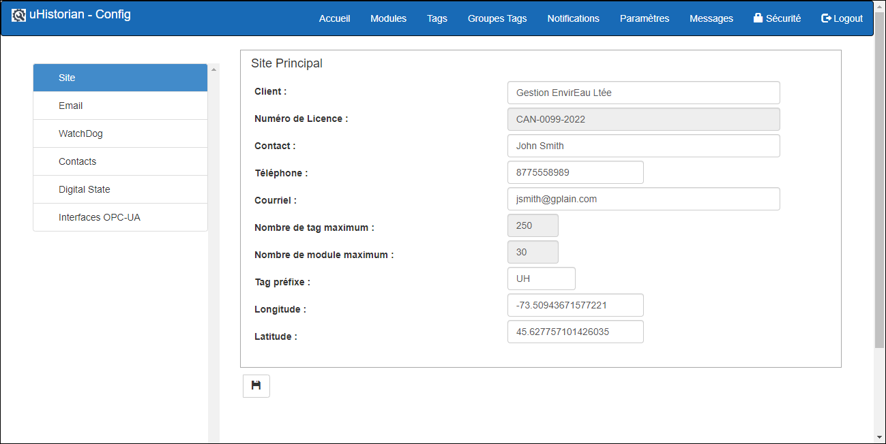
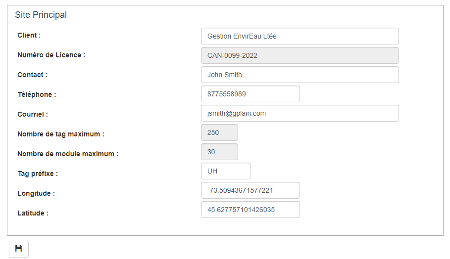
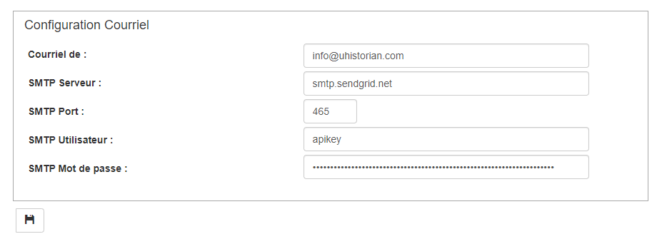
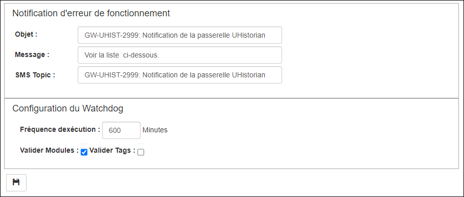
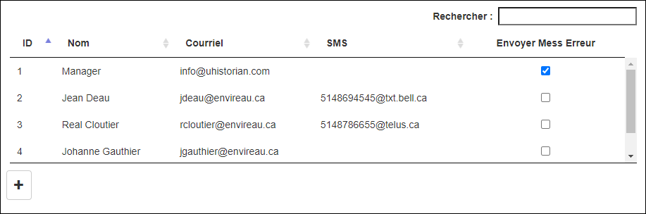

# Paramètres généraux

Le but de l'écran est de configurer les paramètres généraux de la passerelle uHistorian incluant les références du client (nom du client, coordonnées du site, etc.), les liens de communication externes, la surveillance des modules (*watchdog*) et certains paranmètre d’utilisation de uHistorian. De plus, cet écran héberge la configuration des interfaces telles que OPC-UA, MQTT, LIDAR485 et autres.

{ width=387 }

## Guide étape par étape

Les fonctions pour la configuration des paramètres de sont les suivantes:

## Définition et coordonnées du site

Cette section permet de définir le site ainsi que ses coordonnées.

{ width=340 }

1.  Cliquer sur la section Site dans le menu de gauche;

2.  Remplir les champs demandé à l'écran;

3.  Entrer les coordonnées Longitude et Latitude en format décimal;

4.  Le champ “Tag préfixe” est composé d’un maximum de 5 caractères et sont apposés au début de chaque tag créé en mode “automatique”;

5.  Le nombre de module maximum et le nombre de tag maximum qui peuvent être hébergés par la passerelle sont également affichés à l'écran;

6.  **Toujours cliquer sur le bouton de sauvegarde pour enregistrer les changements que vous avez apporter à l'écran**.

## Configuration courriel

{ width=340 }

Ces champs contiennent les paramètres d'envois de courriel.

1.  Courriel de:  L'adresse courriel de l'expéditeur.  Mettre une adresse qui existe réellement, car il se peut que certains serveurs rejettent les courriels envoyés;

2.  SMTP Serveur:  Serveur de courriel SMTP qui relai les courriels envoyés;

3.  SMTP Port:  Port de communication SMTP. Les ports supportés sont 465 ety 587;

4.  SMTP Utilisateur:  Nom du compte utilisateur SMTP;

5.  SMTP Mot de passe:  Mot de passer de l'utilisateur SMTP;

6.  **Toujours cliquer sur le bouton de sauvegarde pour enregistrer les changements que vous avez apporter à l'écran.**

## Notifications sur les erreurs de fonctionnement du système (watchdog)

Cette section permet de configurer l'utilitaire de notifications des erreurs (SC-Watchdog).  Cette fonction surveille les erreurs de système et envoi un courriel aux destinataires qui sont marqués pour recevoir les messages d'erreur. De plus, la fonction Watchdog surveille la communication avec les modules “actif” de collecte de données et envois un courriel lorsque la communication est compromise et renvoi un message tant et aussi longtemps que le module n’est pas de retour.

{ width=340 }

1.  Objet:  Sujet du courriel des messages d'erreur envoyé par le Watchdog;

2.  Contenu:  Message du courriel des messages d'erreur envoyé par le Watchdog;

3.  SMS Topic:  Message du message texte SMS;

4.  Fréquence d'exécution:  Fréquence en minutes pour la surveillance des Modules et des Tags;

5.  Valider Modules:  Option pour la surveillance des Modules. On peut vouloir cesser la surveillance des Modules si ces derniers sont sur le réseau cellulaire ou qu'aucun module de mesure n’est installé dans le système.

6.  Valider Tags:  Option pour la surveillance des Tags.

7.  Cette surveillance consiste à surveiller la valeur des Tags... Si une valeur n'a pas été mise à jour depuis le dernier balayage du Watchdog, alors un courriel est envoyé;

8.  **Toujours cliquer sur le bouton de sauvegarde pour enregistrer les changements que vous avez apporter à l'écran.**

## Liste des destinataires

La liste des destinataires contient tous les destinataires possibles pour l'envoi de courriels de notifications ou pour l'envoi des messages d’erreur et du Watchdog.

{ width=340 }

1.  Pour entrer un nouveau destinataire, cliquer sur le bouton “**+**” et les champs de saisie de données apparaissent sous la liste;

2.  Entrer l'adresse courriel du destinataire.  **Si le destinataire ne veut pas recevoir les messages par courriel, laisser ce champ vide**;

3.  Entrer l'adresse de courriel pour recevoir les notification ou message par SMS.  **Si le destinataire ne veut pas recevoir les messages par SMS, laisser ce champ vide**;

4.  La plupart des compagnies de cellulaire permettent la transmission de SMS via une adresse courriel. Le format est généralement, le format est *no* [*téléphone@compagnie.ca.*](mailto:téléphone@compagnie.ca.)  La liste ci-dessous représente les compagnies en fonction au Québec:

    **Bell Mobilité et Solo Mobile** <XXXXXXXXXX@txt.bell.ca>

    **Fido:** <XXXXXXXXXX@fido.ca>

    **Koodo Mobile:** <XXXXXXXXXX@msg.koodomobile.com>

    **Rogers:** <XXXXXXXXXX@pcs.rogers.com>

    **TELUS :** <XXXXXXXXXX@msg.telus.com>

    **Virgin Mobile:** <XXXXXXXXXX@vmobile.ca>

5.  Pour qu’un destinataire recoive les messages d’erreur, cocher la case **Envoyer Mess Erreur** ;

6.  **Une fois terminé, cliquer sur le bouton Sauvegarder et la liste des destinataires seras rafraîchie;**

7.  Pour éditer les champ d’un destinataire, choisir le destinataire dans la liste et les valeurs apparaissent dans les champs d'édition sous la liste;

8.  Faire les changements réquis et cliquer sur le boutin de sauvegarde.

### Retirer un destinataire

1.  Pour retirer un destinataire, le choisir dans la liste;

2.  Cliquer sur le bouton **Effacer** (poubelle) qui apparaît dans la section d'édition du destinataire;

3.  Un message seras affiché pour confirmer l'effacement, cliquer sur **Confirmer** ou **Fermer**;

4.  Confirmer effaceras le destinataire;

5.  Fermer annuleras l'effacement.
