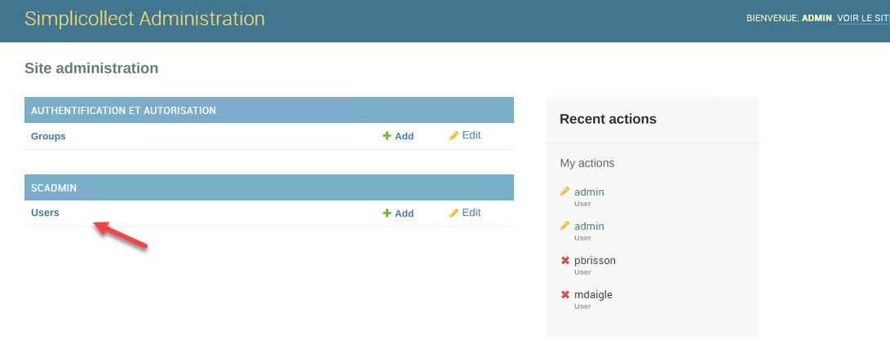
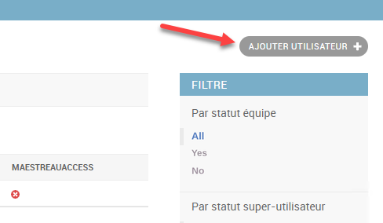
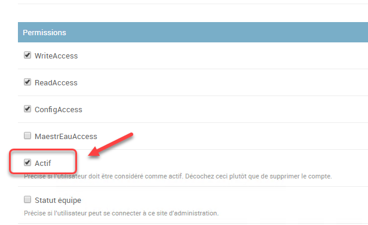
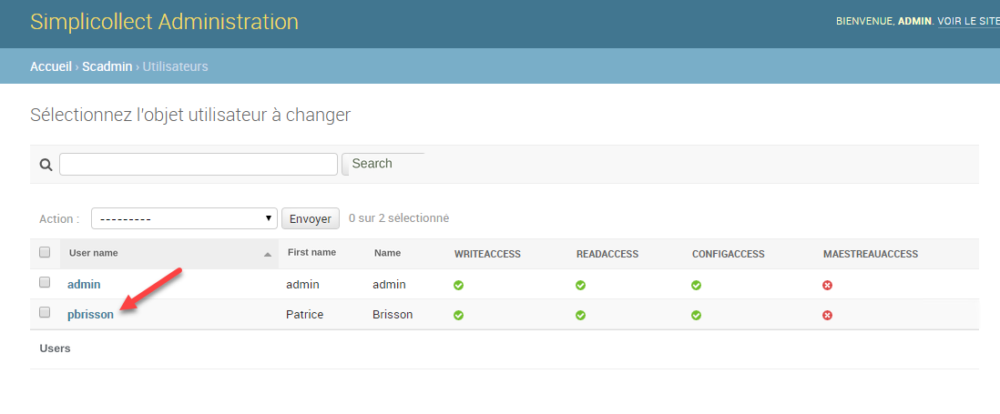
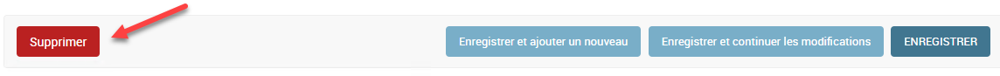

# Security

To access the function, click the Security button on the home page of the Configuration section.

Using uHistorian requires an account and a password in order to secure the use of the application.

## Step-by-step guide

The functions for configuring security are as follows:

## Navigation

1.  From the uHistorian main menu, click Security;

2.  Then click Users; the user management interface appears;

{ width=1091 }

## Create a user account

1.  Click the Add User + button;

2.  Enter the user's first name and last name;

3.  Enter the user name (no French accented characters);

    Enter the password and its confirmation;

    Adjust the accesses that the user will have rights to;

    Save the new user by clicking the **Save** button.

{ width=1381 }{ width=488 }

## Deactivate a user account

You can deactivate a user's account so that they can no longer access the system, without destroying their account.

1.  Choose the user account in the list at the top of the display;

2.  Uncheck the Active box in the user's parameters;

3.  Click the **Save** button.

{ width=616 }{ width=1098 }

## Delete a user account

You can delete a user account completely.

1.  Choose the user account in the list at the top of the display;

2.  Click the Delete button and click Yes at the confirmation message;

3.  The user is completely removed from the system.

{ width=1144 }
