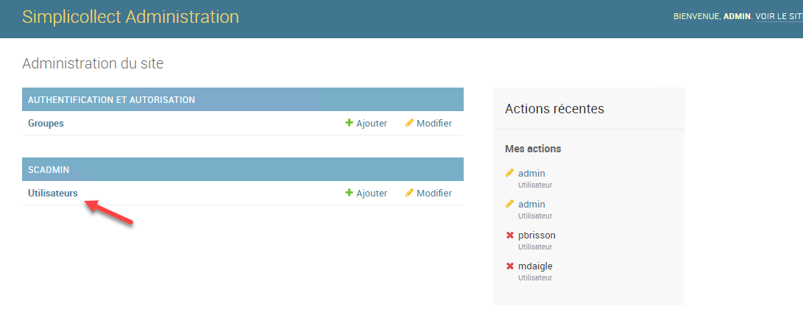
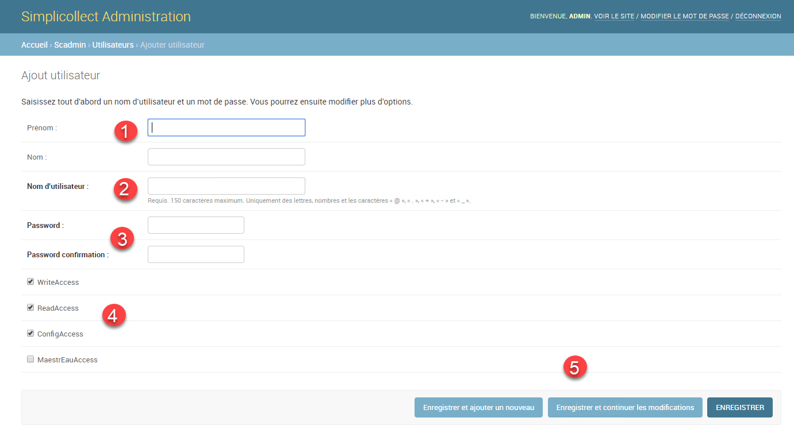
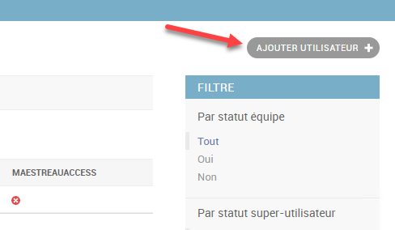
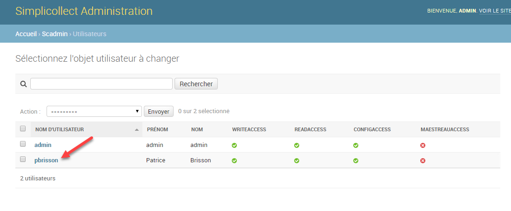

# Sécurité

Pour accéder à la fonction, cliquez sur le bouton Sécurité de la page d'acceuil de la section de Configuration.

L'utilisation de uHistorian demande l'utilisation de compte et de mot de passe afin de sécuriser l'utilisation de l'application.

## Guide étape par étape

Les fonctions pour la configuration de la sécurité sont les suivantes:

## Navigation

1.  À partir du menu principal de uHistorian, cliquer sur Sécurité;

2.  Ensuite cliquer sur Utilisateurs, l'interface de gestion des utilisateur s'apparaîtra;

{ width=1091 }

## Créer un compte d'utilisation

1.  Cliquer sur le bouton Ajouter Utilisateur + ;

2.  Entrer le prénom et le nom de l'utilisateur;

3.  Entrer le nom d'utilisateur (aucun caractère français);

    Entrer le mot de passe et la confirmation;

    Ajuster les accès dont l'utilisateur auras les droits;

    Sauvegarder le nouvel utilisateur en cliquant sur le bouton **Enregistrer**.

{ width=1381 }{ width=488 }

## Désactiver un compte d'utilisateur

On peut désactiver le compte d'un utilisateur afin qu'il ne puisse plus accéder au système sans détruire son compte.

1.  Choisir le compte d'utilisateur dans la liste en tête de l'affichage;

2.  Décocher la case Actif dans les paramètres de l'utilisateur;

3.  Cliquer sur le bouton **Enregistrer**.

{ width=616 }{ width=1098 }

## Effacer un compte d'utilisateur

On peut effacer complètement un compte d'utilisateur.

1.  Choisir le compte d'utilisateur dans la liste en tête de l'affichage;

2.  Cliquer sur le bouton Supprimer et cliquer Oui au message de confirmation;

3.  L'utilisateur sera complètement retiré du système.

{ width=1144 }
