# Tags

The Tag is the entity that holds all the data collected by uHistorian and forms data series (*time series*). Each tag has an identifier (or name) that tells you which data it contains. The data of a tag is collected at a frequency set by the administrator, and a value is sampled into the database at that frequency for a period that can span several consecutive years. The data of a tag can be viewed from the Dataview application or others, where it is shown as curves over a given time range.

There are 4 types of Tag:

- **Module**: measured by a sensor through a uHistorian module

- **Calculation**: computed from other tags and linked by a formula or a program (Python language)

- **External**: coming from another data source (e.g. the Environment Canada weather site)

- **Totalizer**: computes the daily, monthly or yearly total of a tag (e.g. a water meter based on a water flow meter tag)

The data collected is used for several purposes:

- Values used for control (e.g. MaestrEau)

- To follow up on operations

- For analysis

- To feed various alarms and notifications [Notifications and event management](notifications-et-gestion-des-evenements.md)

To access the configuration, click the Tag tab, which shows the list of the system's tags and their configuration fields:

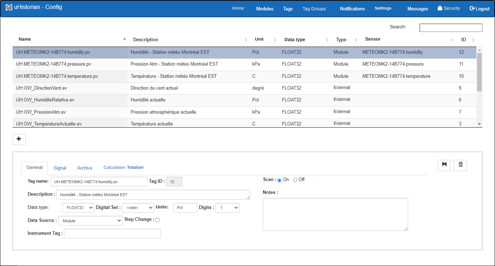{ width=340 }

## Step-by-step guide

The functions for configuring a tag are as follows:

## Add a Tag

1.  To add a tag, click the **+** button, which frees up the fields of the display.

    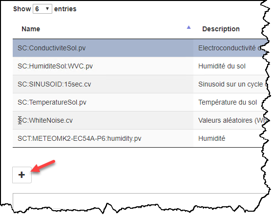{ width=170 }

2.  When all the fields are filled in, click the Save button to complete the creation of the tag.

    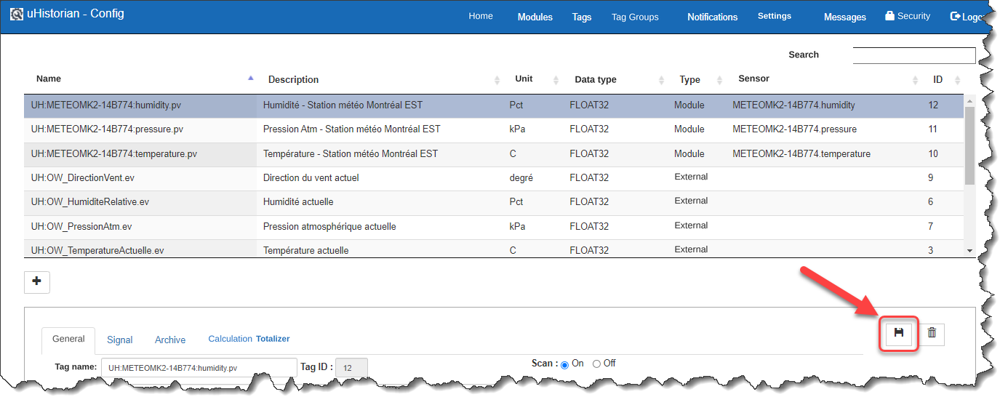{ width=374 }

### Tab: General

1.  On the General tab, enter a name for the tag that follows certain naming standards so that the content of the tag can be identified quickly;

    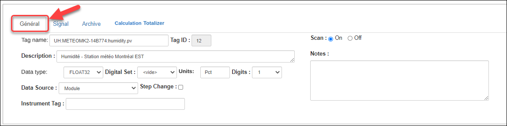{ width=374 }

2.  The tag name must be unique and should follow a naming "convention" such as: ***Prefix:Location code:Description.Suffix***  - Prefix: Initials of your company

    - Suffix: Tag type: PV for measured value

3.  Enter a description (100 characters max)

4.  Enter the type of data that will be recorded: Float32 (32-bit decimal) or Digital (integer value defined in a DigitalSet… See the [General settings](parametres-generaux.md) section)

5.  If the data type is Digital, choose a Digital Set to feed the tag;

6.  Enter the engineering units;

7.  Enter the number of digits after the decimal point;

8.  Specify the source of the tag: measured (module), calculated, external or totalizer (see the Totalizer section below);

9.  Specify whether a change of value, on a chart, is shown as a "ramp" or as a "staircase" (*step change*);

10. Specify the Instrument Tag for certain interfaces (e.g. Open Weather, OPC-UA Client, MQTT Client, etc.);

11. Set whether the point is Scan On or Off, that is, whether or not uHistorian records the values sent to the Tag;

!!! info

    Other data sources (Data Source) may be added when certain interfaces are present, such as OPC-UA Client and MQTT Client

!!! info

    The Scan field is handy when you want to stop archiving a tag… for example, for "inactive" tags whose historical data you want to keep.

### Tab: Signal

Lets you configure the signal parameters when the tag is of the type measured from a data collection module. For some sensors, a voltage signal (e.g. 0-5 V) or a current signal (e.g. 4-20 mA) is read and must be converted into a "physical" value. An equation is then used to convert the signal into a value, where the signal value is held in the variable SignalVal, which is used in the calculation.

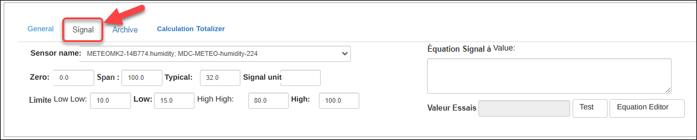{ width=374 }

1.  Choose the measurement sensor from the drop-down list. The sensors in this list were configured in the Module section of the application ([Modules](modules.md));

2.  Enter the signal parameters:

    - Zero: the lowest value that can be read

    - Span: the highest value that can be read

    - Typical: a value that is typical for this sensor

    - Signal unit: for example, a signal in mA that is converted to a physical value

3.  You can also enter "limits" (LowLow, Low, High, HighHigh) for the value read, in order to document the signal and use them in other functions;

4.  Enter the equation that transforms the signal. For example, a 4-20 mA signal converted to pressure. You can enter the equation directly, using the usual mathematical operators (+ - \* /). You can also use an equation editor, which lets you invoke equations as well as values from other tags.

5.  If the Equation field is left empty, the signal value is copied directly into the Tag, and an editor can be used to build the equation;

6.  If you entered an equation to process the signal, you can click the Test button to check the validity of the equation, and the result appears on screen.  **The Zero, Span and Typical fields must be filled in in order to use the Test function.**

### Tab: Archive

The parameters of the Archive tab determine how often data is updated in the uHistorian archives, whether in equal-interval archiving mode or in compression mode.

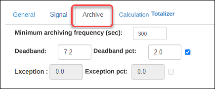{ width=170 }

- The Minimum archiving frequency field sets the frequency at which a data point is archived, whether or not a compression mode is set (i.e. a "deadband" or an exception factor). Based on its value in seconds, a value is inserted into the archive;

- The "deadband" value sets the "corridor" around the value for which a value is archived if it leaves this corridor. For example, if the last reading of the tag is 147.2 and the deadband is 7.2, the next value that will be recorded must be greater than 154.4 or smaller than 140.0. You can also set the deadband value as a percentage of scale by entering a value between 0 and 100 in the Deadband pct field and checking the box. **Also, the Zero and Span fields must be configured so that the range of the tag's values is known in order to enable the deadband as a percentage of scale;**

### Tab: Calculation

The parameters of this tab relate to calculated tags and let you enter the calculation formula.

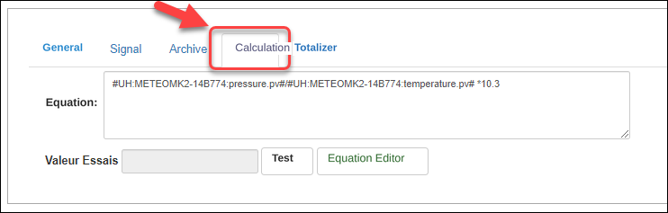{ width=742 }

You can enter a formula with

- the standard mathematical operators (+ - \* /);

- mathematical functions (log, sin, etc.);

- other tags;

- functions programmed within the uHistorian engine.

The content of the formula can be typed directly in the Equation field, and you can test it by clicking the **Test** button.

You can also use the equation editor by clicking the **Equation Editor** button.

The uHistorian calculation engine computes each tag of the calculated type every second, and the value is archived in the uHistorian database at the frequency set in the General tab.

!!! info

    A function can be programmed in Python3 in the Calclib.py file located in the /UHist/BIN/Lib directory on the uHistorian gateway. We recommend editing the Python files with Notepad++ on your Windows PC and updating the uHistorian gateway with Filezilla (FTP).

### Equation Editor

The content of a tag can be computed from other tags as well as from data coming from other systems. The equation editor lets you build the calculation formula or specify the function programmed in Python in the CalcLib.py file.

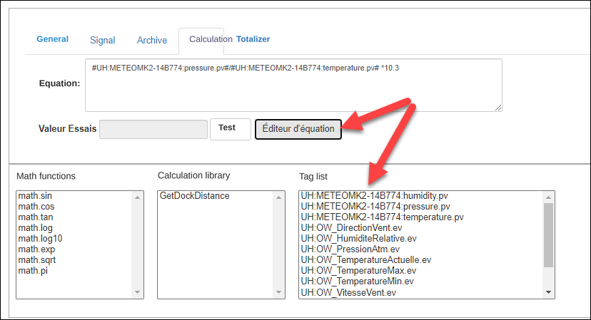{ width=340 }

1.  From the tag management screen, click the **Equation Editor** button; this simplifies the screen and displays three lists to help build a mathematical formula;

2.  The lists give:

    - the available mathematical functions

    - the calculation functions available in uHistorian

    - the list of Tags

3.  Double-click one of the items to bring it into the equation;

4.  Functions are brought into the equation with their parameters, which must be replaced with the right values;

5.  Tags are brought into the equation between two \# signs;

6.  Click the Test button to test the content of the equation;

7.  Click **Save** to save the content of the equation and return to the previous screen

### Tab: Totalizer

A "totalizer" can be created in a tag.

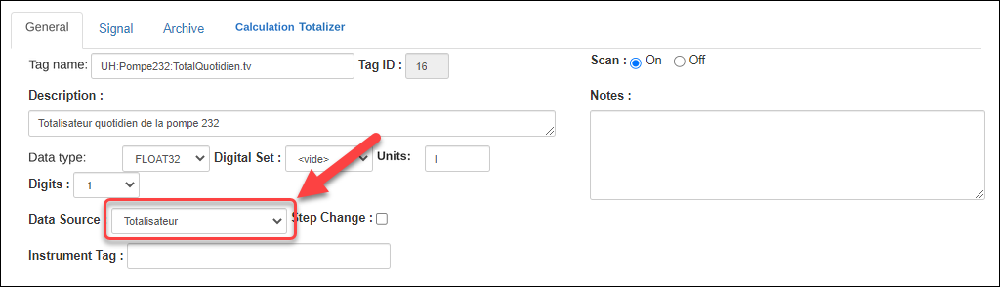{ width=340 }

For example, if you have a tag that gives the flow of liquid in a pipe in liters per minute, you can create another tag that takes this flow and counts the number of liters for a day, a month or a year. The only difference is that the totalizer tag resets to zero at 00:00, or on the last day of the month, or on December 31 of the year. Its value is computed continuously, however, and you can follow the progress of the running total in Dataview [Dataview on Web](../visualisation/dataview-sur-web.md).

To configure the totalizer:

1.  Create a tag and set the Data source to totalizer;

2.  Click the Totalizer tab and set the tag parameters:

    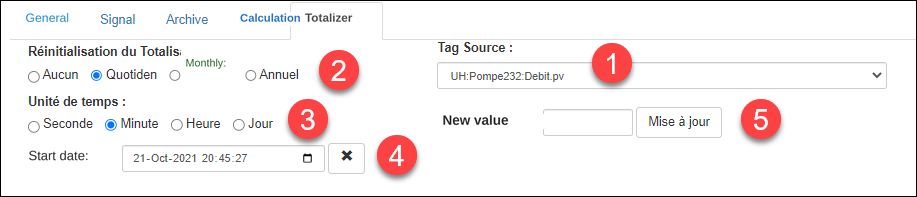{ width=917 }

    1.  Choose the Source tag… For example, the flow tag;

    2.  Set how often the total is reset. You can also specify that the totalizer is not reset automatically;

    3.  Set the time unit of the source tag. For example, choose Minutes in the case of our flow meter, which is in liters per minute;

    4.  Optionally, you can enter the date and time of the first day the totalizer was put into service;

    5.  Optionally, you can set the starting value of the totalizer in the New value field. You can also go back into the tag configuration and do a "manual update" if you want to correct the totalizer.

## Edit a tag

You can edit the configuration parameters of a tag.

1.  Choose the tag in the list of tags;

2.  The tag's parameters appear in the fields at the bottom of the screen;

3.  Make the desired changes;

4.  Click the **Save** button to keep the changes.

## Stop scanning

You can change the state of a tag so that the system stops sampling its values. The values already saved are still kept in the database. This function is particularly handy if you have to repair a sensor or if operations stop for the winter period.

1.  Choose the tag in the list of tags;

    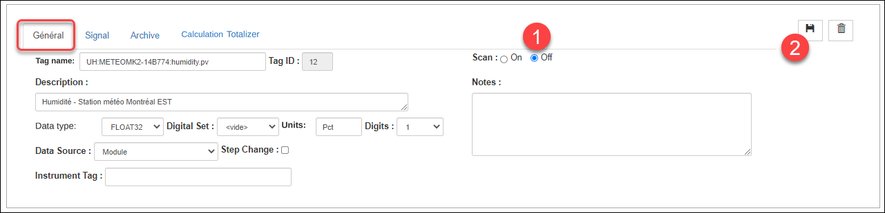{ width=442 }

2.  In the General tab, click the Scan Off selector:

3.  Click the **Save** button.

## Delete a tag

1.  Choose the tag in the list of tags;

2.  Click the **Delete** button;

3.  A message asks you to confirm the deletion of the tag. Click Confirm to delete the tag or Close to cancel the deletion;

{ width=217 }

## Search for a tag

1.  Enter characters in the Search box;

    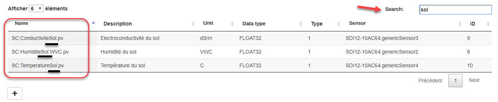{ width=442 }

2.  The list of Tags will only show the Tags whose name contains the characters typed;

3.  Remove the characters from the Search box to clear the search.

!!! warning

    The data recorded in the database will be lost. However, if you ever want to recover data that was deleted by mistake, contact technical support (info@uHistorian.com)
