# Tags

Le Tag est l’entité qui contient toutes les données recueillies par uHistorian et qui forment des séries de données (*time series*).  Chaque tag possède un identifiant (ou nom) qui permet de savoir quelle est la donnée qu'il contient.  Les données d'un tag sont recueillies à une fréquence établie par le gestionnaire et une valeur est échantillonnée dans la base de données à cette fréquence pour une durée pouvant aller à plusieurs années consécutives.  On peut visionner les données d'un tag à partir de l'application Dataview ou autres où elles sont représentées sous forme de courbes pour une fourchette de temps donné.

Il y a 4 types de Tag:

- **Module** mesuré par une sonde via un module uHistorian

- **Calcul** à partir d’autres tags et relié par une formule ou un programme (language Python)

- **Externe** qui provient d’une autre source de données (ex.: site météo d'environnement Canada)

- **Totalisateur**:  Fait le total, quotidien, mensuel, annuel, d'un tag (ex.: compteur d'eau sur un tag de débitmètre d'eau

Les données recueillies sont utilisées pour plusieurs raisons:

- Valeurs utilisées pour fins de contrôle (ex.: MaestrEau)

- Pour faire un suivi des opérations

- Pour fins d'analyse

- Pour alimenter différentes alarmes et notification [Notifications et gestion des événements](notifications-et-gestion-des-evenements.md)

Pour avoir accès la la configuration, cliquer sur l'onglet Tag qui donne la liste des différents tags du système et les champs de configuration de ces derniers:

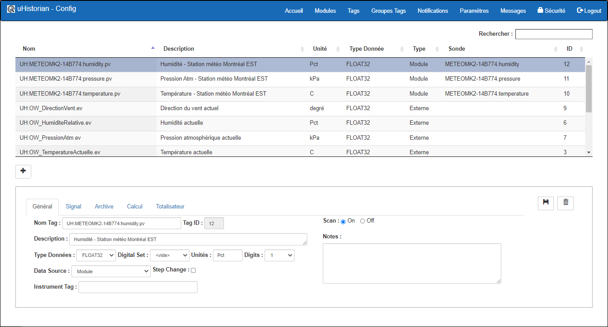{ width=340 }

## Guide étape par étape

Les fonctions pour la configuration d'un tag sont les suivantes:

## Ajouter un Tag

1.  Pour ajouter un tag, cliquer sur le bouton **+** qui libèrera les champs de l'affichage.

    { width=170 }

2.  Lorsque tous les champs sont remplis, cliquer sur le bouton Sauvegarder pour compléter la création du tag.

    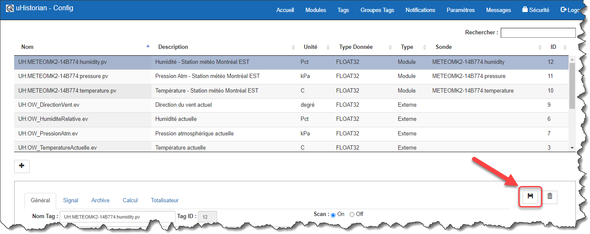{ width=374 }

### Onglet: Général

1.  Sur l'onglet Général, entrer un nom pour le tag qui rencontre certaines normes de nomenclature afin d'identifier rapidement le contenu du tag;

    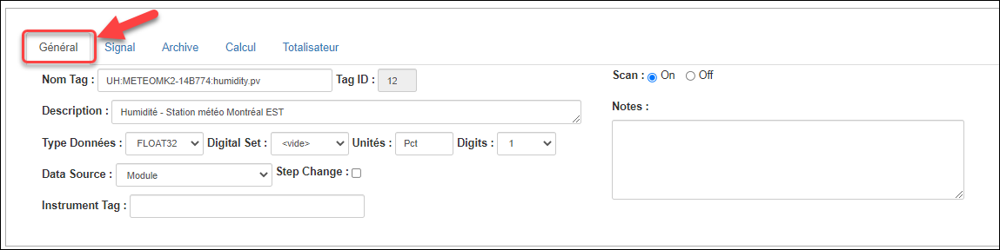{ width=374 }

2.  Nom du tag dois être unique et entrez-le selon une “convention” de nomenclature telle que: ***Préfixe:Code de location:Description.Suffixe***  - Préfixe:  Initiale de votre compagnie

    - Suffixe:  Type de Tag:  PV pour valeur mesurée

3.  Entrer une description (100 caractères max)

4.  Entrée le type de données qui sera enregistrée: Float32 (décimale 32 bits) ou Digital (valeur entière défini dans un DigitalSet… Voir la section [Paramètres généraux](parametres-generaux.md) )

5.  Si le type de données est Digital, choisir un Digital Set pour alimenter le tag;

6.  Entrer les unités d’ingénierie;

7.  Entrer le nombre de chiffres après le point;

8.  Spécifier la source du tag à savoir mesuré (module), calculé, externe ou totalisateur (voir la section Totalisateur ci-dessous);

9.  Spécfier si le changement de valeur, sur un graphique, sera montré par une une “rampe” pour par un “escalier” (*step change*);

10. Spécifier le Instrument Tag dans le cas de certaines interfaces (Ex.: Open Weather, OPC-UA Client, MQTT Client, etc,);

11. Établir sur le point est Scan On ou Off, c’est-à-dire que uHistorian enregistre ou non les valeurs transmises au Tag;

!!! info

    D’autres sources de données (Data Source) peuvent s’ajouter dans le cas de la présence de certaines interface telles que OPC-UA Client et MQTT Client

!!! info

    Le champ Scan est pratique lorsque on veut cesser l’archivage d’un tag… par exemple, pour les tags “innactif” mais dont on veut conserver les données historiques.

### Onglet: Signal

Permets de configurer les paramètres du signal lorsque ce dernier est de type mesuré à partir d'un module de collecte de données.  Pour certaines sondes, on lit un signal en voltage (ex.: 0-5 V) ou en ampérage (ex.: 4-20 mA) et il faut transformer le signal en valeur “physique”.  Il y a alors une équation pour transformer le signal en valeur où la valeur du  signal est sous la variable SignalVal qui est utilisée dans le calcul.

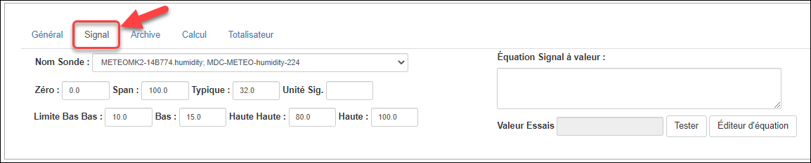{ width=374 }

1.  Choisir la sonde de mesure dans la liste défilente.  Les sondes sous cette liste ont été configurées dans la section Module de l'application ([Modules](modules.md) );

2.  Entrer les paramètres du signal:

    - Zero:  consiste dans la valeur la plus basse qui peut être lue

    - Span:  consiste dans la valeur la plus haute qui peut être lue

    - Typique:  valeur qui est typique à cette sonde

    - Unité du signal:  par exemple, un signal en mA qui est transformé en valeur physique

3.  Il est également possible d’entrer des “limites” (BasseBasse, Basse, Haute, HauteHaute) à la valeur lue afin de documenter le signal et pouvoir utiliser dans d’autres fonction;

4.  Entrer l'équation de transformation du signal.  Par exemple, un signal en 4-20 mA qui est transformé en pression.  On peut entrer directement l'équation avec les opérateurs mathématiques normalement utilisés (+ - \* /).  On peut également utiliser un éditeur d'équation qui permet d'invoquer des équations ainsi que des valeurs provenant d'autres tags.

5.  Si on laisse le champ Équation vide, alors la valeur du signal est directement copiée dans le Tag et on peut utiliser un éditeur pour monter l’équation;

6.  Si on a entré une équation pour traiter le signal, on peut cliquer sur le bouton Tester pour tester la validité de l'équation et le résultat apparait à l'écran.  **Il est important que les champs Zéro, Span et Typique soient remplies afin d’utiliser la fonction Tester.**

### Onglet: Archive

Les paramètres de l’onglet Archive détermine la fréquence de mise à jour des données dans les archives de uHistorian que ce soit en mode d’archivage à intervalles égaux ou en mode compression.

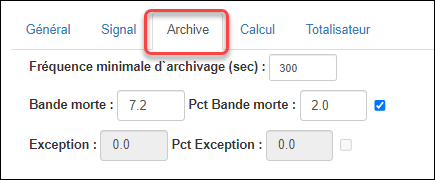{ width=170 }

- Le champ Fréquence minimale d’archivage établie la fréquence à laquelle une données est archivée peut importe que le mode de compression soit établie ou pas (c.-à-d. une “bande morte” ou un facteur d’exception). Selon à valeur en seconde, une valeur est insérer dans l’archive;

- La valeur de “bande morte” établie le “couloir” autour de la valeur pour lequel un valeur est archivée si elle sort de ce couloir. Par exemple, si la dernière lecture du tag est 147.2 et que la bande morte est de 7.2, la prochaine valeur qui sera enregistrée devra être plus grande que 154.4 ou plus petite que 140.0. On peut également établir la valeur de la bande morte en pourcentage d'échelle en insérant une valeur, entre 0 et 100, dans le champ Pct bande morte et cocher la case. **Aussi, il est important que les champs Zéro et Span soient configurés afin de connaitre l'étendue des valeurs du tags pour activer la bande morte en pourcentage d'échelle;**

### Onglet: Calcul

Les paramètres de cet onglet sont reliés aux tags calculés et permettent de saisir la formule de calcul.

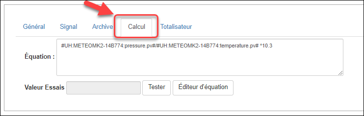{ width=742 }

On peut y saisir une formule avec

- les opérateurs mathématiques standards (+ - \* /);

- des fonctions mathématiques (log, sin, etc.);

- d'autres tags ;

- des fonctions programmées au sein de l'engin uHistorian.

Le contenu de la formule peut être tapé directement dans le champ Équation et on peut en tester le contenu en cliquant sur le bouton **Tester**.

On peut également utiliser l'éditeur d'équation en cliquant sur le bouton **Éditeur d'équation**.

L'engin de calcul de uHistorian collecte effectue le calcul de chaque tag de type calculé toutes les secondes et la valeur est archivée dans la base de données uHistorian à la fréquence établie dans l'onglet Général.

!!! info

    On peut programmer une fonction en Python3 dans le fichier Calclib.py qui est situé dans le répertoire /UHist/BIN/Lib sur la passerelle uHistorian. On vous recommande d'éditer les fichiers Python à l’aide de Notepad++ sur votre PC Windows et de faire la mise à jour sur la passerelle uHistorian à l’aide de Filezilla (FTP).

### Éditeur d'équation

Le contenu d’un tag peut être calculé à partir d’autres tags ainsi que des données provenant d’autres systèmes. L'éditeur d'équation permet de construire la formule de calcul ou de spécifier la fonction programmée en Python dans le fichier CalcLib.py.

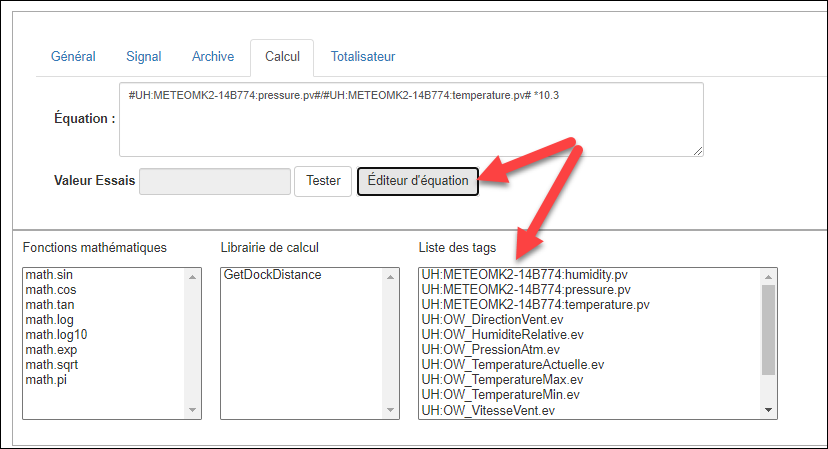{ width=340 }

1.  De l’écran de gestion des tags, cliquer le bouton **Éditeur d'équation** simplifie l'écran et affiche trois list pour aider à créer une formule mathématique;

2.  Les listes donnent:

    - les fonctions mathématiques disponibles

    - Les fonctions de calcul qui sont disponibles dans uHistorian

    - La liste des Tags

3.  Double cliquer sur un des éléments pour l’amener dans l’équation;

4.  Les fonctions sont amenées dans l’équation avec les paramètres de la fonction qu’il faut remplacer avec les bonnes valeurs;

5.  Les Tags sont amenés dans l’équation entre deux signes \#;

6.  Cliquer sur le bouton Test pour tester le contenu de l’équation;

7.  Cliquer sur **Sauvegarder** pour sauvegarder le contenu de l’équation et retourner à l’écran précédent

### Onglet: Totalisateur

Il est possible de créer un “totalizateur” dans un tag.

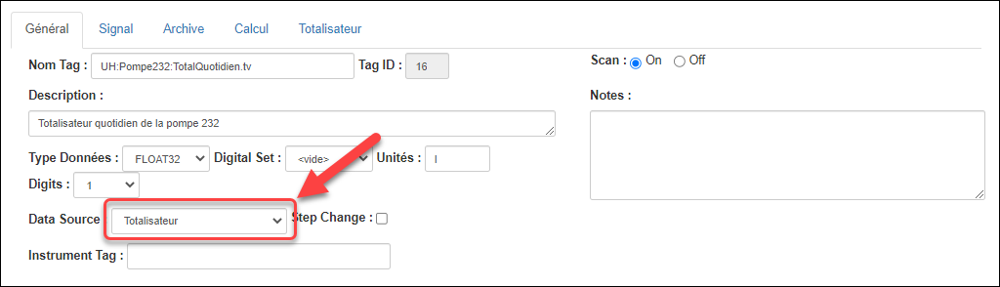{ width=340 }

Par exemple, si on a un tag qui donne le débit de liquide dans un tuyau en litres par minute, on peut créer un autre tag qui prend ce débit et compte le nombre de litre pour une journée, un mois ou une année. Cette différence n’est seulement que le tag totalisateur se remet à zéro à 00:00 ou le dernier jour du mois ou le 31 décembre de l’année. Mais sa valeur est calculée en continue et on peut suivre la progression du total en cours d’exécution sur Dataview [Dataview sur Web](../visualisation/dataview-sur-web.md).

Pour configurer le totalisateur:

1.  Créer un tag et mettre le Data source à totalisateur;

2.  Cliquer sur l’onglet Totalisateur et établir les paramètres du tag:

    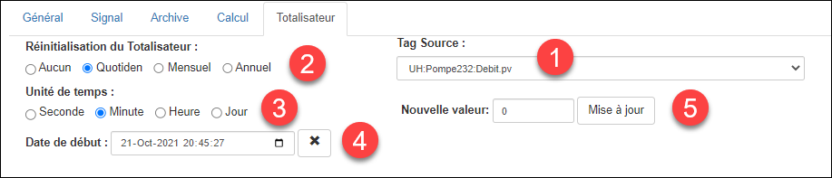{ width=917 }

    1.  Choisir le tag Source… Par exemple, le tag de débit;

    2.  Établir la fréquence de réinitialisation du total. On peut également spécifier qu’il n’y a pas de réinitialisation automatique du totalisateur;

    3.  Établir l’unité de temps du tag source. Par exemple, on choisira Minutes dans le cas de notre débimètre qui est en litres par minute;

    4.  Facultativement, on peut inscrire la date et l’heure du premier jour où le totalisateur a été mis en service;

    5.  Facultativement, on peut inscrire mettre la valeur de départ du totalisateur dans le champ Nouvelle valeur. On peut également revenir dans la configuration du tag et farie une “mise à jour manuelle” dans le cas où on veut corriger le totalisateur.

## Éditer un tag

Il est possible d'éditer les paramètres de configuration d'un tag.

1.  Choisir le tag dans la liste des tags;

2.  Les paramètres du tag apparaitront dans les champs en bas de l'écran;

3.  Faire les changements désirés;

4.  Cliquer sur le bouton **Sauvegarder** pour conserver les changements.

## Cesser le balayage

On peut changer l'état d'un tag afin que le système cesse d'en échantillonner les valeurs.  Les valeurs déjà sauvegardées sont toujours conservées dans la base de données.  Cette fonction est particulièrement pratique si on doit réparer une sonde ou que l'on cesse les opérations pour la période hivernale.

1.  Choisir le tag dans la liste des tags;

    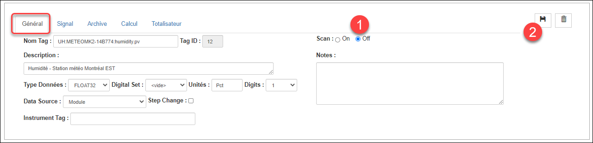{ width=442 }

2.  Dans l'onglet Général, cliquer sur le sélecteur Scan Off:

3.  Cliquer sur le bouton **Sauvegarder**.

## Effacer un tag

1.  Choisir le tag dans la liste des tags;

2.  Cliquer sur le bouton **Effacer**;

3.  Un message demande de confirmer l'effacement du tag.  Cliquer Confirmer pour effacer le tag ou Fermer pour annuler l'effacement;

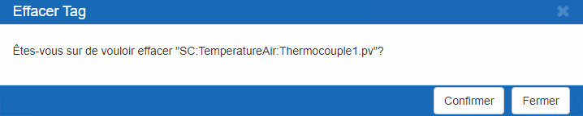{ width=217 }

## Rechercher un tag

1.  Entrer des caractères dans la case Rechercher;

    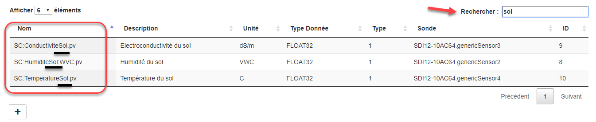{ width=442 }

2.  La liste des Tags afficheras seulement les Tags dont le noms contient les caractères tappés;

3.  Retirer les caractères de la case Rechercher pour effacer la recherche.

!!! warning

    Les données enregistrées dans la base de données seront perdues. Toutefois, si jamais vous désirez récupérer les données effacées par erreur, contactez le service d'assistance technique (info@uHistorian.com)
