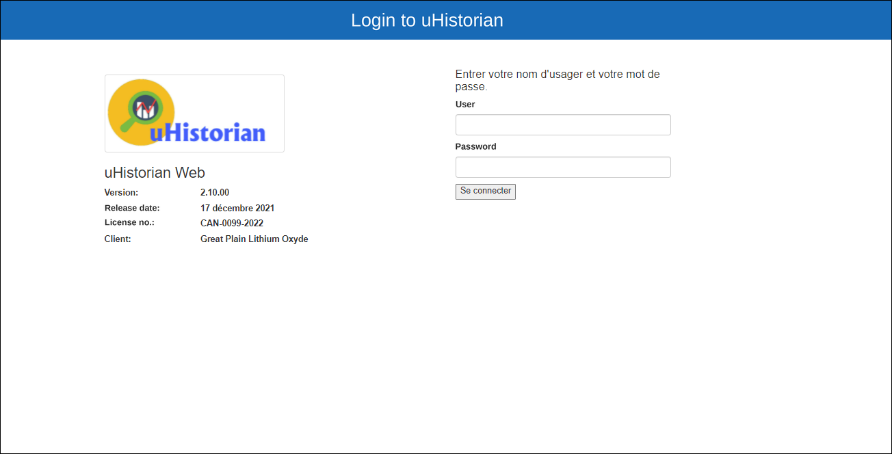
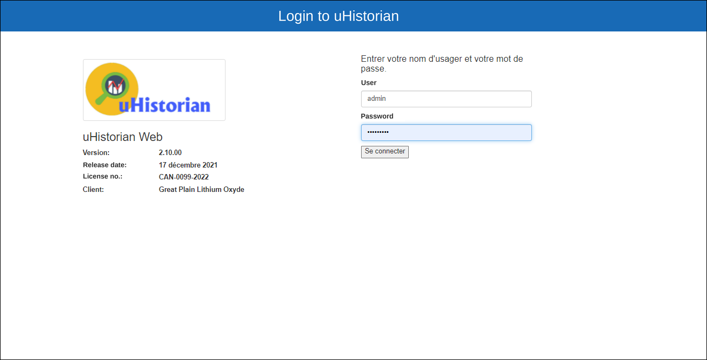
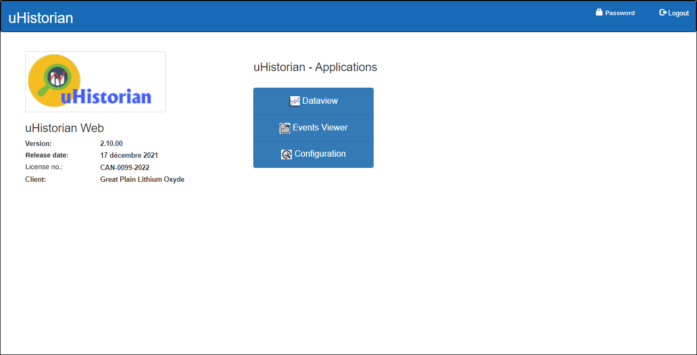

# User Manual

This section contains the various user guides for uHistorian. Refer to the subsections for each function of the software.

The uHistorian functions can be accessed from a web page using the Google Chrome browser, or from your smartphone.

## Accessing uHistorian Web

1.  Open the Chrome browser;

2.  Type the IP address of the uHistorian gateway or the URL used to access uHistorian;

3.  The login page appears:

    { width=387 }

4.  Enter your user name and password and click **Log in:**

    { width=387 }

5.  The main navigation screen appears:

    { width=387 }

6.  Click Dataview to open the data visualization application: [Dataview](visualisation/index.md)

7.  Click Events Viewer to open the event management application: [Event Viewer](visualisation/eventview.md)

8.  Click Configuration to open the uHistorian configuration applications: [Configuration](configuration/index.md)

!!! info

    Note: The Configuration application is only available if your user has permission to change the uHistorian configuration.
