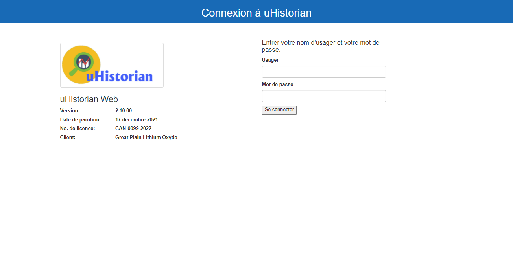
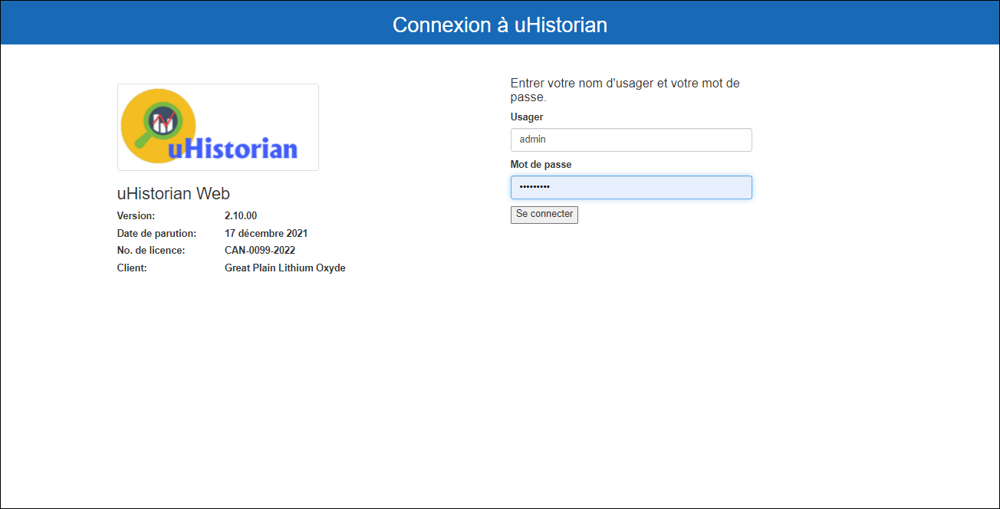
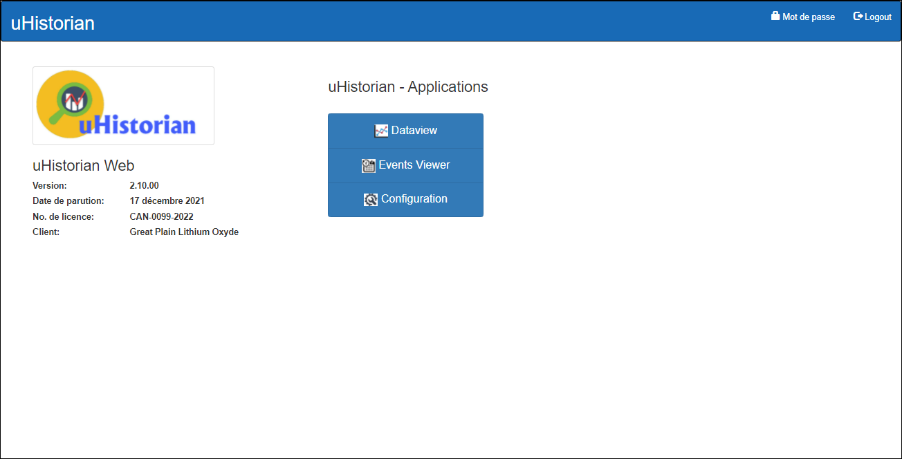

# Manuel d'utilisation

Cette section contient les différents guides d’utilisation de uHistorian. Référez-vous aux sous-sections pour chaque fonction du logiciel.

On peut accéder aux fonctions de uHistorian à partir d’une page web et du fureteur Google Chrome ou à partir de votre téléphone intelligent.

## Accès à uHistorian Web

1.  Ouvrir le fureteur Chrome;

2.  Taper l’adresse IP de la passerelle uHistorian ou l’url d’accès à uHistorian;

3.  La page d’identification apparait:

    { width=387 }

4.  Entrez votre nom d’utilisateur et votre mot de passe et cliquez sur **Se connecter:**

    { width=387 }

5.  L'écran principal de navigation apparait:

    { width=387 }

6.  Cliquer sur Dataview pour accèder à l’application de visualisation des données: [Dataview](visualisation/index.md)

7.  Cliquer sur Events Viewer pour accéder à l’application de gestion des événements: [Event Viewer](visualisation/eventview.md)

8.  Cliquer sur Configuration pour accèder aux applications de configuration de uHistorian: [Configuration](configuration/index.md)

!!! info

    Note: L’application Configuration seras disponible seulement si votre utilisateur as la permission de modifier la configuration de uHistorian.
