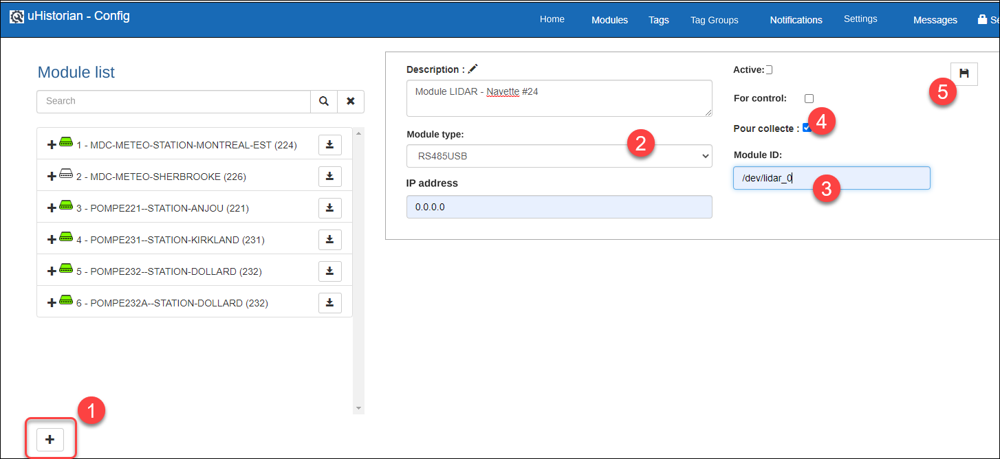
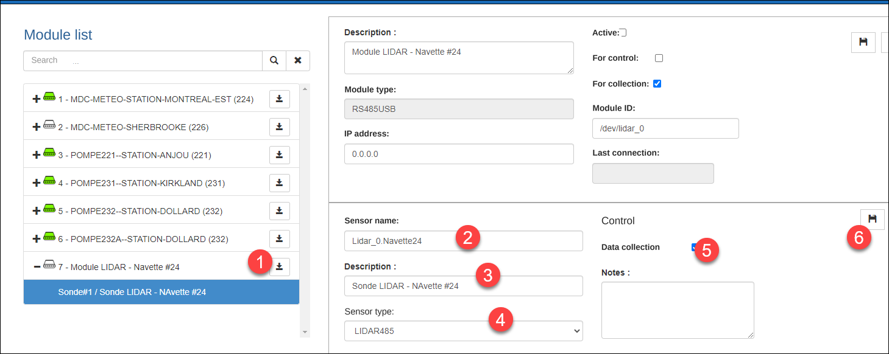

# LIDAR-RS485

The LIDAR (Laser Radar) interface over an RS485 signal allows continuous measurement of the distance between the sensor and a targeted surface. This type of sensor is used to detect the presence of mobile equipment such as trucks, trailers, robots or others. The benefit of this sensor is that it can detect not only a presence, but also the exact distance to the object. Other information can therefore be derived, such as the position or the approach speed of the object. Most LIDAR sensors provide their signal over RS485 or CAN communication. This interface uses RS485, which can easily be connected to the uHistorian gateway with an RS485-to-USB converter.

This equipment is available at a "low cost", for example:

- Benewake LIDAR sensor, model TF02-i, over RS-485

- Waveshare converter, model USB-RS485/RS232/TTL

## 📘 Configuration and use

The interface is provided by the **LIDAR485.exe** application located in the /UHist/BIN/Interface/LIDAR directory, which is run by the **uhlidar485.service** service. The interface can operate as many LIDAR sensors as can be connected to the USB ports of the uHistorian gateway, including the ports available on a USB port extension.

LIDAR modules

An RS485-USB module must be created to connect the LIDAR sensor to the uHistorian gateway.

1.  In Configuration, choose Modules;

2.  Click the + to add a module;

3.  Choose the RS485USB type, enter a description of the module and enter 0.0.0.0 as the IP address;

4.  You must also enter, as the module identifier, the name of the USB port on the uHistorian gateway, for example /dev/lidar_0

    { width=444 }

5.  Click the save button to complete the creation of the module;

6.  Once the RS485USB module is created, the corresponding LIDAR sensor must be added to it;

7.  Click the add-sensor button for this module, enter the sensor name and description, and choose the sensor type LIDAR485:

    { width=444 }

8.  Click the save button to complete the creation of the LIDAR sensor;

9.  To put the sensor into service, do not forget to activate the module (see [Modules](../configuration/modules.md));

10. Finally, create a tag to acquire the distance, in cm, measured by the sensor (see [Tags](../configuration/tags.md)),
