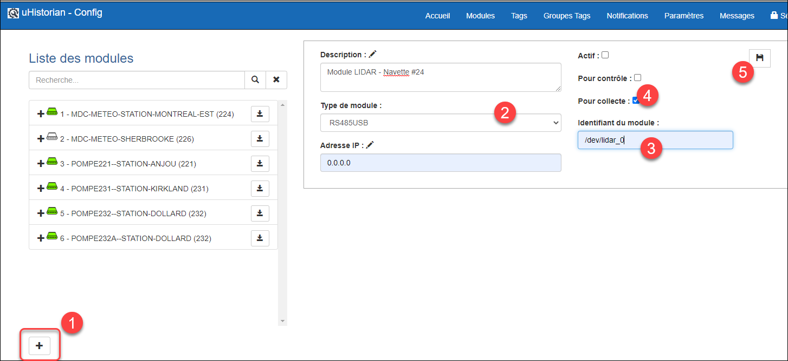
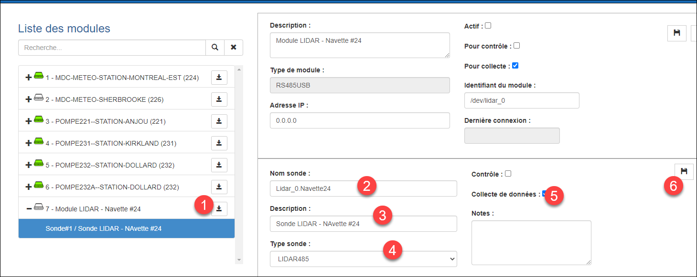

# LIDAR-RS485

L’interface pour LIDAR (Laser Radar) sur signal RS485 permet la mesure en continu de distance entre la sonde et une surface visée. Ce type de sonde est utilisé pour la mesure de présence d'équipement mobile tels que camions, remorque, robots ou autres. Le bénifice de cette sonde est que non seulement il est possible de détecter une présence, mais aussi la distance exacte avec l’objet. On peut donc en dériver d’autres informations tel que le positionnement ou la vitesse d’approche de l’objet. La plupart des sondes LIDAR fournissent leur signal avec une communication RS485 ou CAN. La présente interface utilise le RS485 qui peut facilement se raccorder à la passerelle uHistorian à l’aide d’un convertisseur RS485 pour USB.

C’est équipements sont disponibles à “bon marché” tels que:

- Sonde LIDAR de marque Benewake modèle TF02-i sur RS-485

- Convertisseur Waveshare modèle USB-RS485/RS232/TTL

## 📘 Configuration et utilisation

L’interface est disponible par l’application **LIDAR485.exe** située dans le répertoire /UHist/BIN/Interface/LIDAR et qui est exécuter par le service **uhlidar485.service**. L’interface peut opérer autant de sonde LIDAR qu’il est possible de raccorder aux ports USB de la passerelle uHistorian incluant les ports disponibles sur une extension de port USB.

Modules LIDAR

Il faut créer un module RS485-USB pour connecter la sonde LIDAR à la passerelle uHistorian.

1.  Dans Configuration, choisir Modules;

2.  Cliquer sur le + pour ajouter un module;

3.  Choisir le type RS485USB et entrer une description du module et entrer 0­.0.0.0 comme adresse IP;

4.  Il faut également entre comme identifiant du module le nom du port USB sur la passerelle uHistorian, par exemple, /dev/lidar_0

    { width=444 }

5.  Cliquer sur le bouton de sauvegarde pour compléter la création du module;

6.  Une fois que le module RS485USB est créé, il faut y ajouter la sonde LIDAR correspondante;

7.  Cliquer sur le bouton d’ajout de sonde pour ce module, entrer le nom de la sonde, la description et choisir le type de sonde LIDAR485:

    { width=444 }

8.  Cliquer sur le bouton de sauvegarde pour compléter la création de la sonde LIDAR;

9.  Pour mettre la sonde en service, ne pas oublier d’activer le module (voir [Modules](../configuration/modules.md) );

10. Finalement, créer un tag pour faire l’acquisition de la distance, en cm, mesurée par la sonde (voir [Tags](../configuration/tags.md) ),
