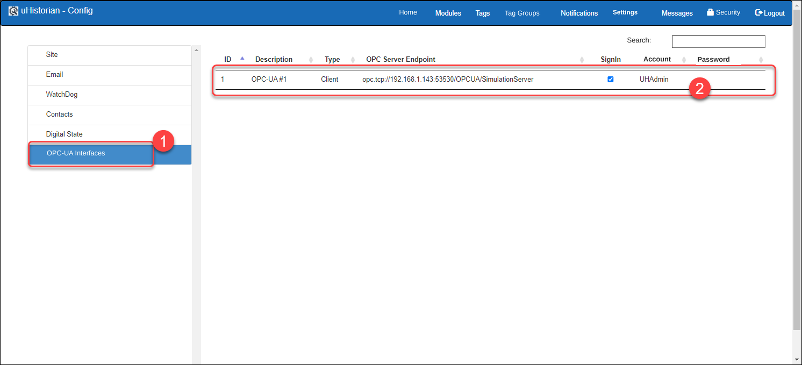
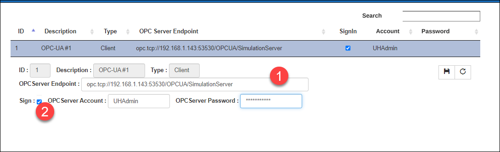
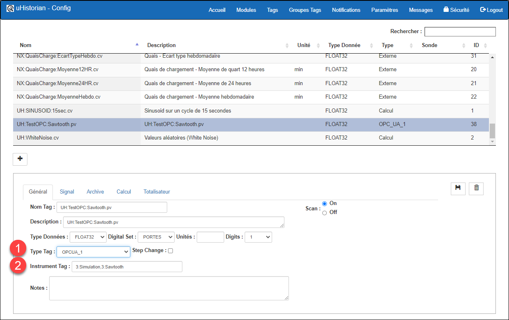
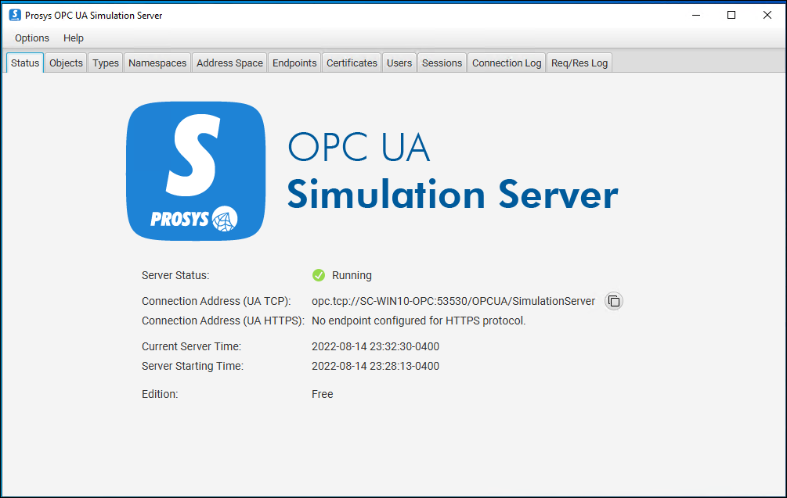

# OPC-UA - Client

The OPC-UA client interface receives data from an OPC-UA Server and stores this data in a tag of the uHistorian database.

One OPC-UA Client interface must be installed per OPC-UA Server source, which means there will be as many OPC-UA Clients as there are OPC-UA Servers to connect.

Installing an OPC-UA Client requires an installation license, which will be provided by uHistorian; you can request it at [info@uhistorian.com](mailto:info@uhistorian.com).

## Step-by-step guide

## Installation

An interface is installed using the Linux installer from a web link (package) provided by uHistorian technical support.

One instance of the interface can connect a single OPC server.

After installation, a record is inserted into the list of OPC interfaces installed on the uHistorian server.

The interface parameters must be configured (Main menu \| Configuration \| Settings, then select the **OPC-UA Interfaces** section).

{ width=442 }

For each Client interface, the connection parameters of this OPC Client instance must be configured. To do so, click the interface you want to modify and the parameters appear below it. When the changes are finished, click the save button.

{ width=374 }

The parameters that can be modified are:

1.  Address of the OPC server "end point" in the format **opc.tcp://**\<server IP address\>**/**\<tag topic\>

2.  Indicator to connect with an account and password. If the box is checked, you must provide the account and password configured on the OPC server.  If the box is not checked, the connection is "anonymous". In that case, make sure the server will accept this type of connection.

## Tag configuration

When the OPC-UA Client interface is installed and correctly configured, all that remains is to create tags that connect to the interface and to configure the address of the corresponding tag on the OPC server.

1.  Go to the Tags tab and create a new tag;

2.  In the General tab, enter the tag parameters, including, as the Tag type, the OPC interface configured in the previous section;

3.  In the Instrument Tag field, enter the coordinates of the corresponding tag on the OPC server;

4.  Enter all the other tag parameters in the Signal and Archive tabs;

5.  Click the save button.

{ width=442 }

Go to Dataview to check that the data of the new tag arrives correctly.

## Testing and OPC-UA Server simulator

You can test that the OPC client works correctly using an OPC server simulator. Several OPC server simulators exist.

The recommendation is to use the Prosys simulator, available at <https://www.prosysopc.com/>

{ width=340 }

To test the interface, use Dataview and view the OPC tags to confirm that the data arrives correctly from the OPC server.

You can also make sure that the OPC interface is working correctly on the uHistorian gateway.
