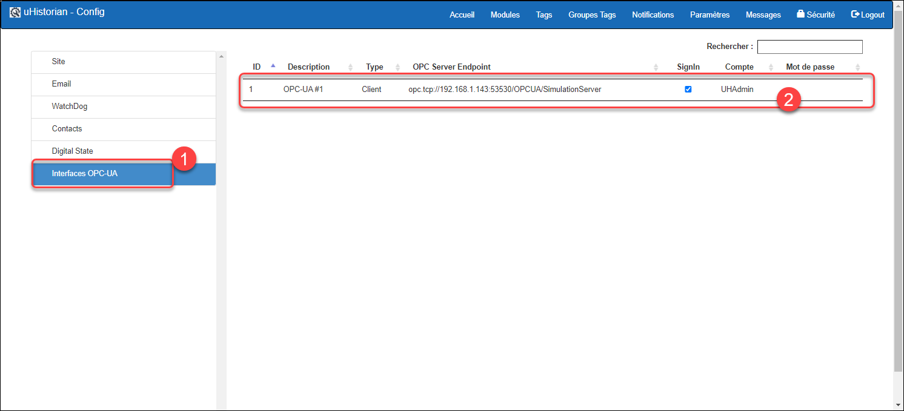
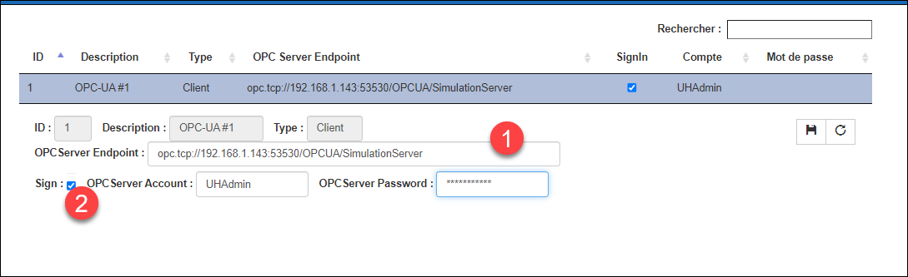

# OPC-UA - Client

L’interface OPC-UA client permet de recevoir des données d’un OPC-UA Server et de stocker ces données dans un tag de la base de données uHistorian.

On doit installer une interface OPC-UA Client par source OPC-UA Server et ce qui veut dire qu’il y aura autant d’OPC-UA Client que d’OPC-UA Serveur à connecter.

L’installation d’un OPC-UA Client demande une licence d’installation qui vous sera fournir par uHistorian et vous pouvez en faire la demande à i[nfo@uhistorian.com.](mailto:info@uhistorian.com)

## Guide étape par étape

## Installation

L’installation d’une interface se fait par l’installateur Linux à partir d’un lien web (package) qui est fourni par le support technique de uHistorian.

Une instance de l’interface permet de connecter un seul serveur OPC.

Suite à l’installation, un enregistrement est inséré dans la liste des interfaces OPC qui est installée sur le serveur uHistorian.

Il faut configurer les paramètres de l’insterface (Menu principale \| Configuration \| Paramètres et sélectionner la section **Interfaces OPC-UA**.

{ width=442 }

Pour chaque interface Client, il faut configurer les paramètres de connexion de cette instance du OPC Client. Pour ce faire, cliquer sur l’interface dont vous désirez modifier et les paramètres apparaitront au-dessous. Lorsque les changements sont terminés, cliquer sur le bouton de sauvegarde.

{ width=374 }

Les paramètres qui peuvent être modifiés sont:

1.  Adresse du “end point” du serveur OPC dans le format **opc.tcp://**\<adresse IP du serveur\>**/**\<topic des tags\>

2.  Indicateur pour connecter avec un compte et mot de passe. Si la case est cochée, il faut fournir le compte et mot-de-passe configuré sur le serveur OPC.  Si la case n’est pas cochée, la connexion est “anonyme”. Dans ce cas, assurez-vous que le serveur acceptera ce type de connexion.

## Configuration des tags

Lorsque l’interface OPC-UA Client est installée et configurée correctement, il suffit de créer des tags qui se connecte à l’interface et de configurer l’adresse du tag correspondant sur le serveur OPC.

1.  Aller vers l’onglet Tags et créer un nouveau tag;

2.  Dans l’onglet Général, entrer les paramètres du tag, entre autres, choisir comme Type de tag, l’interface OPC configuré à la section précédente;

3.  Dans le champ Instrument Tag, saisir les coordonnées du tag correspondant sur le serveur OPC;

4.  Entrer tous les autres paramètres du tag dans les onglets Signal et Archive;

5.  Cliquer sur le bouton de sauvegarde.

{ width=442 }

Aller dans Dataview pour tester que les données du nouveau tag parviennent correctement.

## Essais et simulateur OPC-UA Server

On peut tester le bon fonctionnement du client OPC à l’aide d’un simulateur de serveur OPC. Il existe plusieurs simulateur de serveur OPC.

La recommandation est d’utiliser le simulateur de Prosys disponible au <https://www.prosysopc.com/>

{ width=340 }

Pour tester l’interface, utiliser Dataview et visualiser les tags OPC afin de valider que les données arrivent correctement du serveur OPC.

Aussi, il est possible de s’assurer que l’interface OPC fonctionne correctement sur la passerelle uHistorian.
