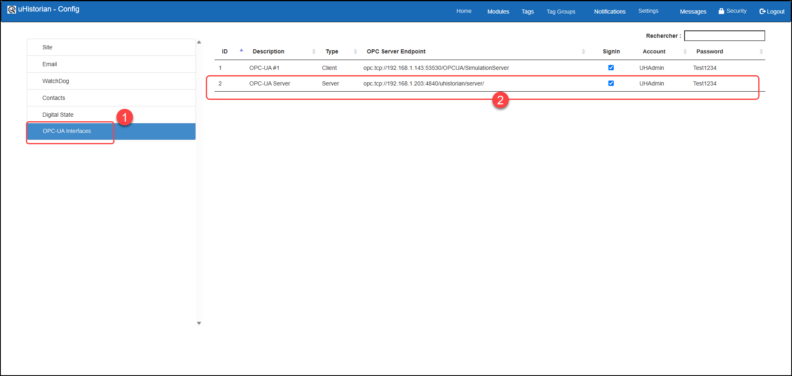
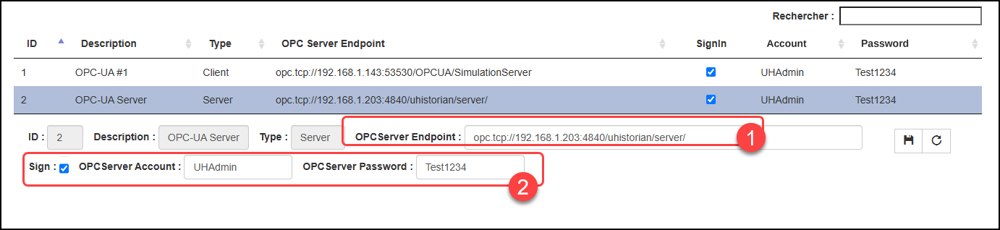
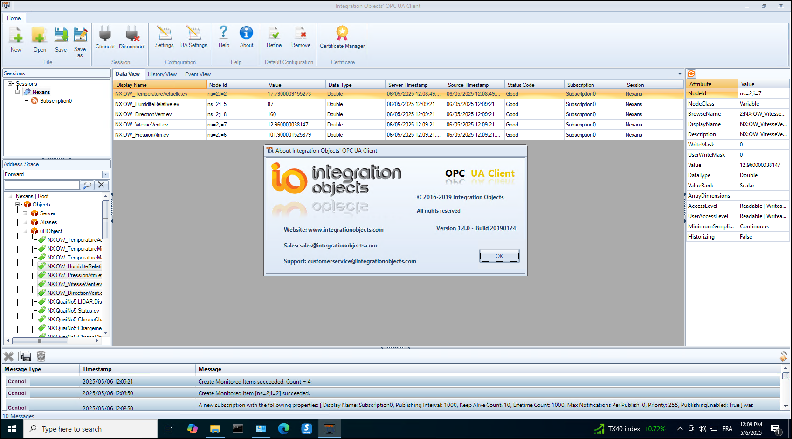

# OPC-UA - Server

The OPC-UA server interface transmits data to OPC-UA clients for all the defined and active tags of the uHistorian database.

The OPC-UA Server interface must be installed on the uHistorian server; it includes 2 client connections. Additional client connections can be added by purchasing a license extension. The OPC-UA server can feed up to 10 OPC-UA client connections.

Installing the OPC-UA server requires an installation license, which will be provided by uHistorian upon purchase of a license; you can request it at [info@uhistorian.com](mailto:info@uhistorian.com).

## Step-by-step guide

## Installation

An interface is installed using the Linux installer from a web link (package) provided by uHistorian technical support.

After installation, a record is inserted into the list of OPC interfaces installed on the uHistorian server.

The interface parameters must be configured (Main menu \| Configuration \| Settings, then select the **OPC-UA Interfaces** section).

{ width=977 }

The connection parameters of this OPC Server instance must be configured. To do so, click the interface you want to modify and the parameters appear below it. When the changes are finished, click the save button.

{ width=1056 }

The parameters that can be modified are:

1.  Address of the OPC server "end point" in the format **opc.tcp://**\<server IP address\>**/**

2.  Indicator to connect with an account and a password. If the box is checked, you must provide the account and password configured on the OPC server, which must be supplied by the OPC client.  If the box is not checked, the connection is "anonymous".

Other protection mechanisms, such as HTTPS encryption and the use of certificates, are not supported by the current version of the uHistorian OPC Server.

## Testing with an OPC client on Windows

You can test that the OPC server works correctly using an OPC client on Windows. This tool lets you check that the OPC Server is configured correctly.

The OPC Client from Integration Objects is easy to configure and works well. You can download it at [www.integrationobjects.com](http://www.integrationobjects.com).

Note that all the tags of the uHistorian server are under the same "topic" (uHObject) and are available to the connected OPC clients.

{ width=1031 }

When the connection to the OPC Server "endpoint" is configured, go to Objects \| uHObject and all the tags appear. Drag the tags you want to follow into the window on the right and you will see the values update along with their timestamps.
