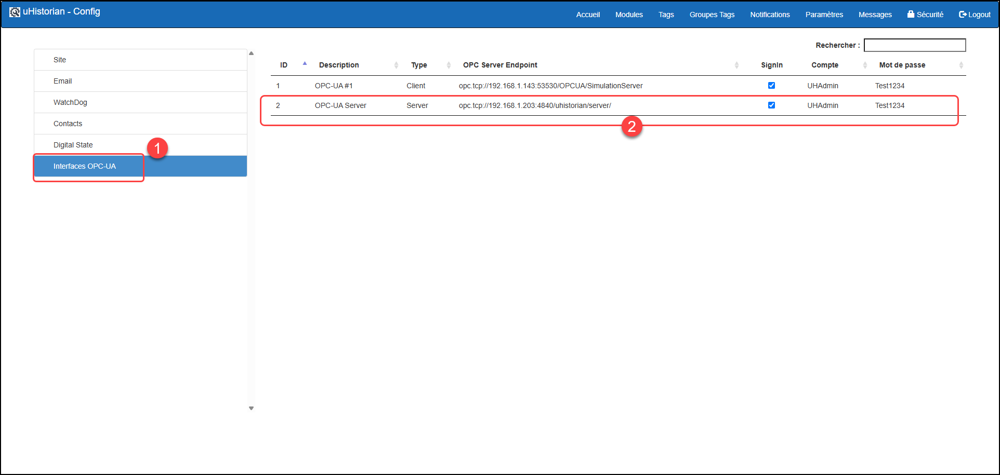
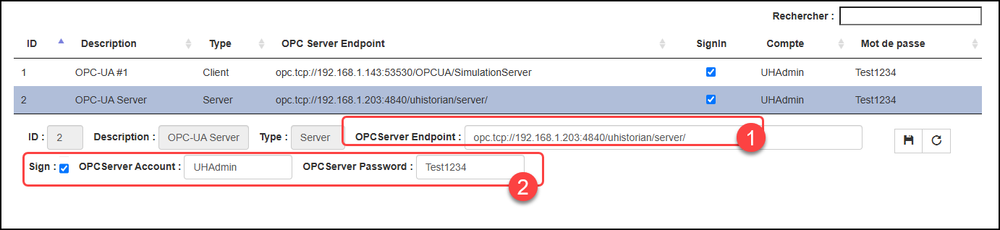
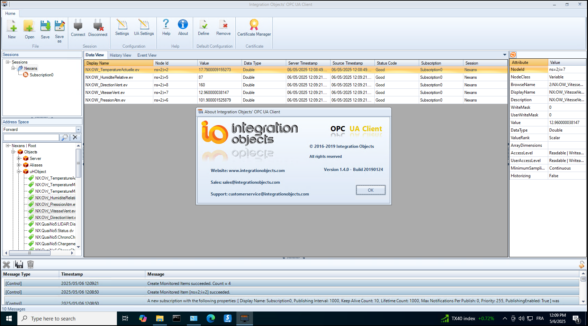

# OPC-UA - Serveur

L’interface OPC-UA serveur permet de transmettre des données vers des OPC-UA clients pour tous les tags défini et actif de la base de données uHistorian.

On doit installer l'interface OPC-UA Serveur sur le serveur uHistorian qui inclus 2 connexions client. On peut ajouter des connexions client additonnelles moyenne l’achat d’une extension de licence. Le serveur OPC-UA peut aliment jusqu'à 10 connexions OPC-UA client.

L’installation du serveur OPC-UA demande une licence d’installation qui vous sera fournir, moyenne l’achat d’une licence, par uHistorian et vous pouvez en faire la demande à i[nfo@uhistorian.com.](mailto:info@uhistorian.com)

## Guide étape par étape

## Installation

L’installation d’une interface se fait par l’installateur Linux à partir d’un lien web (package) qui est fourni par le support technique de uHistorian.

Suite à l’installation, un enregistrement est inséré dans la liste des interfaces OPC qui est installée sur le serveur uHistorian.

Il faut configurer les paramètres de l’insterface (Menu principale \| Configuration \| Paramètres et sélectionner la section **Interfaces OPC-UA**).

{ width=977 }

Il faut configurer les paramètres de connexion de cette instance du OPC Serveur. Pour ce faire, cliquer sur l’interface dont vous désirez modifier et les paramètres apparaitront au-dessous. Lorsque les changements sont terminés, cliquer sur le bouton de sauvegarde.

{ width=1056 }

Les paramètres qui peuvent être modifiés sont:

1.  Adresse du “end point” du serveur OPC dans le format **opc.tcp://**\<adresse IP du serveur\>**/**

2.  Indicateur pour connecter avec un compte et un mot de passe. Si la case est cochée, il faut fournir le compte et mot-de-passe configuré sur le serveur OPC et qui devront être fourni par le client OPC.  Si la case n’est pas cochée, la connexion est “anonyme”.

Les autres mécanismes de protection tel que l’encryption HTTPS et l’utilisation de certificats ne sont pas supportés par la version actuelle du OPC Serveur de uHistorian.

## Essais avec un client OPC sur Windows.

On peut tester le bon fonctionnement du client OPC à l’aide d’un client OPC sur Windows. Cet outil permet de tester la bonne configuration du OPC Serveur.

Le OPC Client de la firme Integration Objects est facile a configurer et fonctionne bien. Vous pouvez le télécharger au [www.integrationobjects.com.](http://www.integrationobjects.com)

Un fait à noter est que tous les tags du serveur uHistorian sont sous le même “topic” (uHObject) et sont disponibles aux clients OPC connectés.

{ width=1031 }

Lorsque la connection vers le “endpoint” du OPC Serveur est configuré, allez sous Objects \| uHObject et tous les tags apparaissent. Acheminez les tags que vous voulez suivre dans la fenêtre de droite et vous verrez les valeurs se mettre à jour ainsi que leur timestamp.
