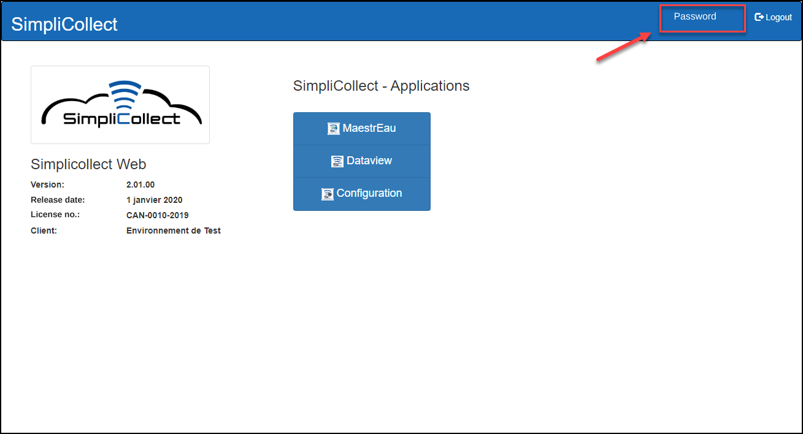
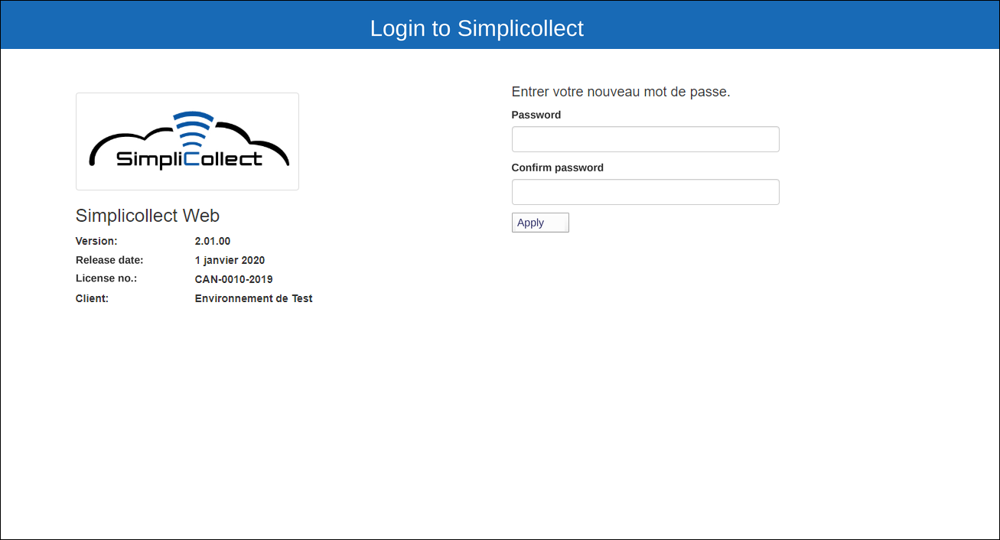
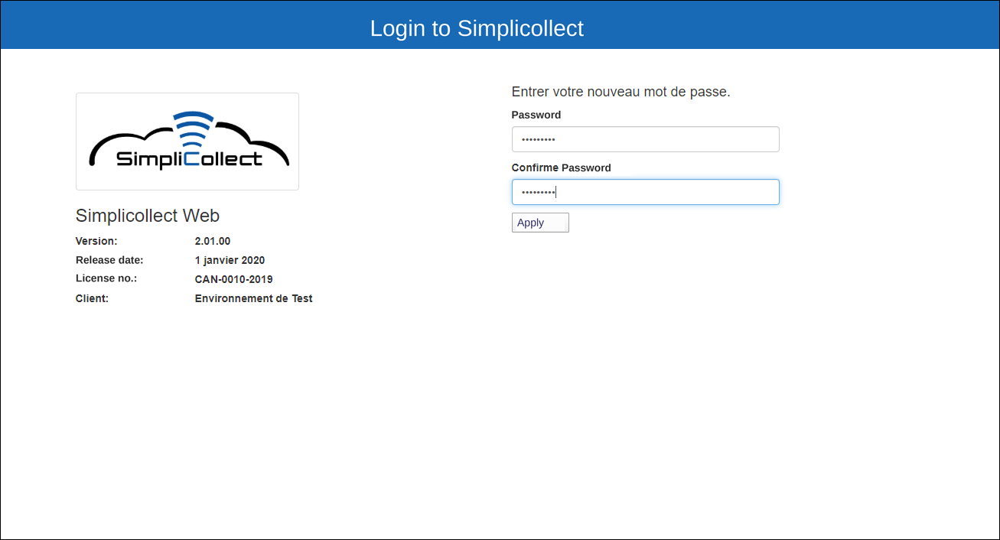
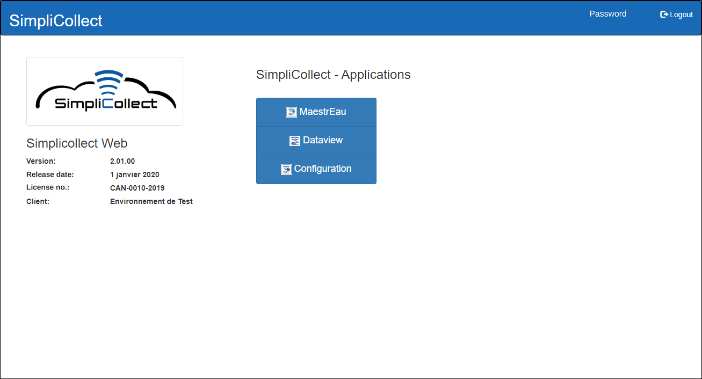
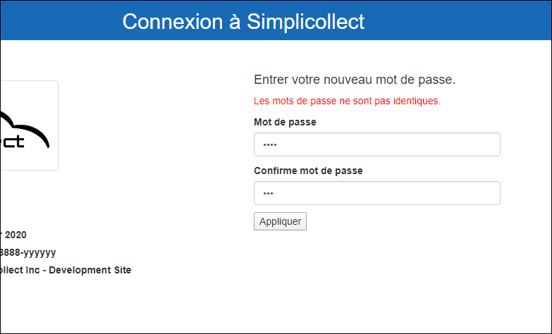
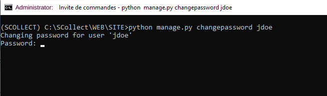
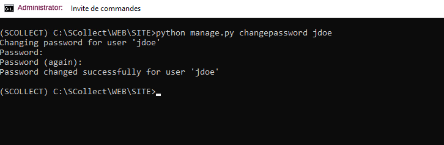
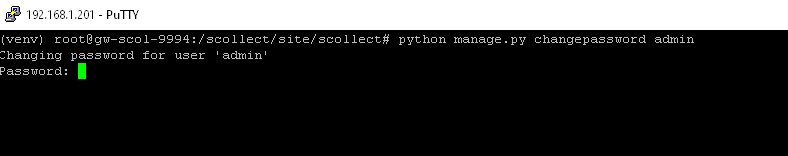

# Changing a password

From the SimpliCollect home page, you can change your password:

{ width=272 }

1.  Click Password.

    { width=272 }

2.  Enter your new password.

3.  Enter your new password a second time to confirm that you entered it correctly.

    { width=272 }

4.  Click Apply.

5.  The application returns to the Home screen once the new password has been saved.

    { width=272 }

6.  A message appears if the passwords are not identical.

    { width=272 }

## Resetting a lost password

If a user has lost their password, including the **admin** account, and it must be reset, you must open a session on Windows or Linux.

### Procedure in Windows

1.  Open a session on the gateway (see the procedure at the following link: Session Windows 10 )

2.  In Windows, click the "magnifying glass" in the lower left corner and type the command **cmd** to open a command window

3.  At the prompt, type the command **\SCollect\WEB\SITE\StartVENV.bat** to open the development environment

4.  Type the command **cd \SCollect\WEB\SITE\\**

5.  Type the command **python manage.py changepassword "user name"**, for example

    { width=306 }

6.  The system asks you to enter the new password and to repeat it

    { width=306 }

7.  The password is now changed

### Procedure for Linux

1.  Open a session on the gateway (see the procedure at the following link: (Confluence page not migrated) )

2.  At the prompt, type the command **source /scollect/venv/bin/activate** to open the development environment

3.  Type the command **cd /scollect/site/scollect**

4.  Type the command **python manage.py changepassword "user name"**, for example

5.  { width=788 }

    The system asks you to enter the new password and to repeat it

    { width=784 }

6.  The password is now changed
