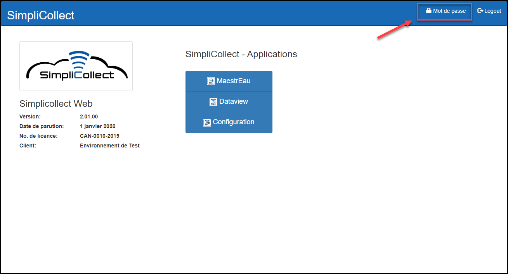
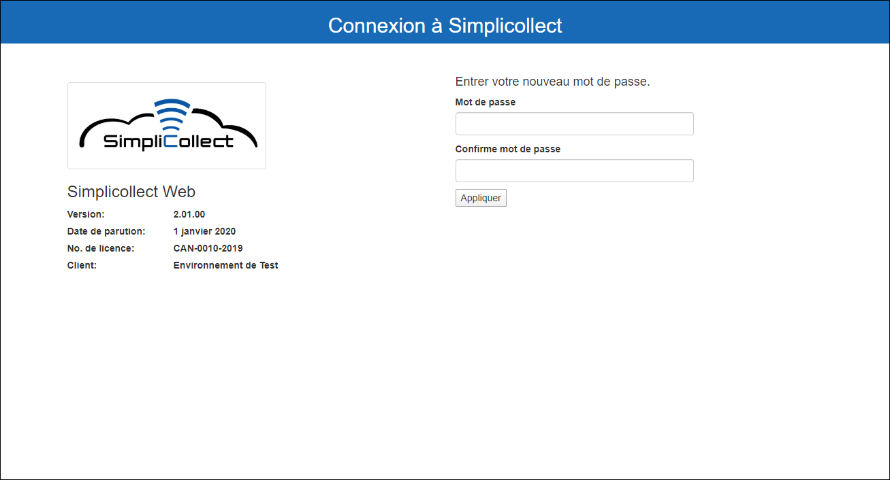
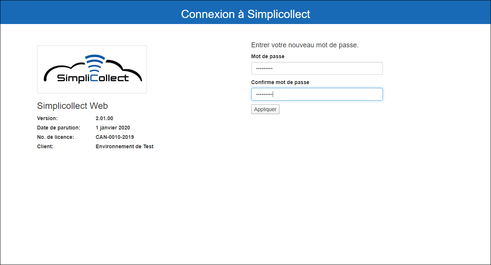
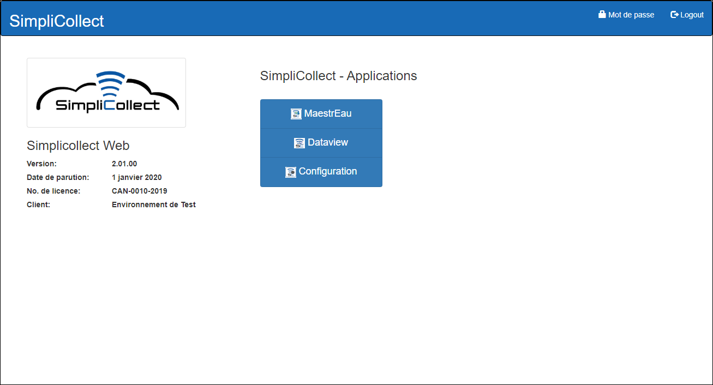
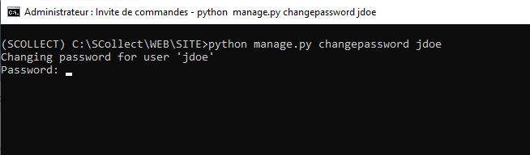
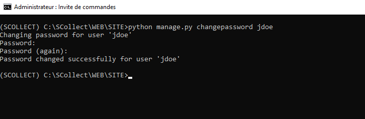
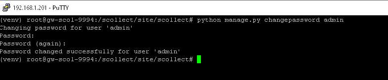

# Changement de mot de passe

À partir de la page d’acceuil de SimpliCollect, il est possible de changer son mot de passe:

{ width=272 }

1.  Cliquer sur Mot de passe.

    { width=272 }

2.  Entrer votre nouveau mot de passe.

3.  Entrer votre nouveau mot de passe une deuxième fois pour confirmer que vous avez bien entrer votre mot de passe.

    { width=272 }

4.  Cliquer sur Appliquer.

5.  L’application revient à l'écran d’Acceuil lorsque le nouveau mot de passe à été sauvegardé.

    { width=272 }

6.  Un message apparaîtreras si les mots de passe ne sont pas identiques.

    { width=272 }

## Initialisation d’un mot de passe perdu

Si un utilisateur à perdu son mot de passe, incluant le compte **admin**, et qu’il faut le réinitialiser, il faut ouvrir une session sur Windows ou Linux.

### Procédure dans Windows

1.  Ouvrir une session sur la passerelle (voir la procédure au lien suivant: Session Windows 10 )

2.  Dans WIndows, cliquez sur la “Loupe” dans le coin inférieur gauche et tapez la commande **cmd** pour ouvrir une fenêtre de commande

3.  Au prompt, tapez la commande **\SCollect\WEB\SITE\StartVENV.bat** pour ouvrir l’environnement de développement

4.  Tapez la commande **cd \SCollect\WEB\SITE\\**

5.  Tapez la commande **python manage.py changepassword "nom de l'utilisateur"** par exemple

    { width=306 }

6.  Le système vous demande d’entrer le nouveau mot de passe et de le répeter

    { width=306 }

7.  Le mot de passe est ainsi changé

### Procédure pour Linux

1.  Ouvrir une session sur la passerelle (voir la procédure au lien suivant: (page Confluence non migrée) )

2.  Au prompt, tapez la commande **source /scollect/venv/bin/activate** pour ouvrir l’environnement de développement

3.  Tapez la commande **cd /scollect/site/scollect**

4.  Tapez la commande **python manage.py changepassword "nom de l'utilisateur"** par exemple

5.  { width=788 }

    Le système vous demande d’entrer le nouveau mot de passe et de le répeter

    { width=784 }

6.  Le mot de passe est ainsi changé
