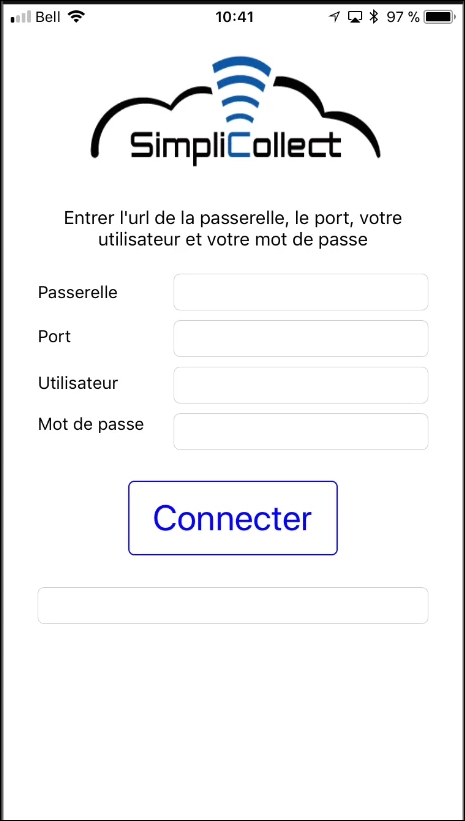
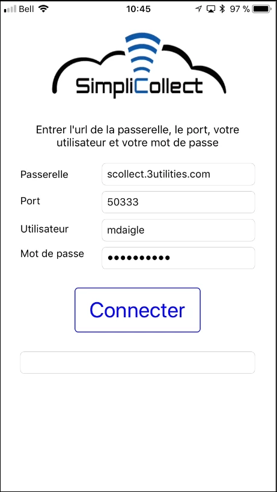
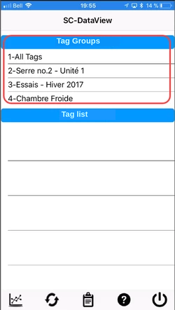
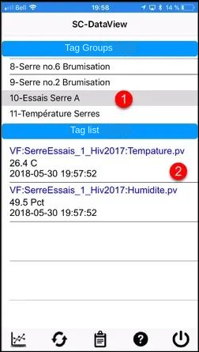
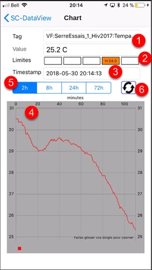
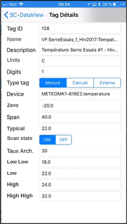
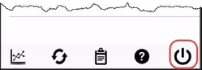

# Dataview on iPhone

Dataview on iOS (iPhone) lets you view your data and get the full value from it. The application works anywhere you can connect to the Internet or to your company's local network, and lets you view one tag at a time over a period of 2 hours, 8 hours, 24 hours or 72 hours;

## Step-by-step guide

The functions of the application are as follows:

## Installing from the App Store

The first step in using Dataview on your iPhone is to install it from Apple's App Store.

1.  Tap the App Store icon on your iPhone, tap Search and type "simplicollect dataview" to find the application:

    { width=102 }

2.  Tap the Install button to download and install the application:

3.  When the installation is finished, tap the Open button to run the application:

## Connection settings

The first time you run the application, you must fill in the fields that let you configure it.

{ width=108 }

1.  Enter the URL of the uHistorian gateway in the Gateway field. This address will be given to you by the uHistorian administrator;

    { width=1237 }

2.  Enter the data access port number of the gateway (4 or 5 digits) given to you by the uHistorian administrator;

3.  In the next field, enter your user code assigned to you by the uHistorian administrator;

4.  Finally, enter your password, which was also assigned to you by the uHistorian administrator;

5.  When all the fields are filled in, you are ready to connect:

    { width=102 }

6.  Tap the Login button and the application establishes the connection to the gateway (delay of 2 to 10 seconds);

7.  A welcome message appears below the Login button and takes you to the main display of the application;

8.  An error message may also appear on the connection display. In that case, read the message carefully and follow the instructions. In most cases, a mistake has slipped into the connection parameters. Correct the mistake and tap the Login button again. If the error persists, contact your uHistorian administrator.

!!! info

    All the connection parameters are saved on your iPhone, and you will not need to enter them again the next time you run the application.

## Navigation

After the application is installed, you can start it and connect to the uHistorian gateway.

1.  The application opens on the list of tag groups that were configured in the uHistorian database ([Tag Groups](../configuration/groupes-de-tags.md));

    { width=250 }

2.  You can scroll the list by moving your finger over it from top to bottom or from bottom to top;

3.  Choose a tag group and its tags appear in the list at the bottom:

    { width=252 }

4.  Each tag entry shows:

    1.  The name of the tag;

    2.  Its current value;

    3.  The timestamp of the last reading;

5.  Tap a tag in the list and tap the Chart button to display the hourly chart of the tag:

    { width=250 }

6.  The screen with the tag's data appears and shows the curve for the last 2 hours:

    { width=108 }

7.  The screen shows several pieces of information:

    - \(1\) the name of the tag

    - \(2\) the current value

    - \(3\) an indicator that shows whether the tag is out of limits (see the configuration of limits in the Tag section of SC-Config at this link)

    - \(4\) the chart of the tag's values

    - \(5\) time range selector for 2 hours, 8 hours, 24 hours and 72 hours

    - \(6\) a button to refresh the data on the screen

8.  Tap the arrow **\< SC-Dataview** to return to the main screen;

9.  Tap the Tag properties button to view the various properties of the selected tag:

    { width=250 }

10. The display that appears shows all the parameters of the tag:

    { width=250 }

11. Tap the arrow **\< SC-Dataview** to return to the main screen;

12. Tap the Exit button to quit the application:

    { width=249 }

13. You are back at the home screen:

    { width=102 }
