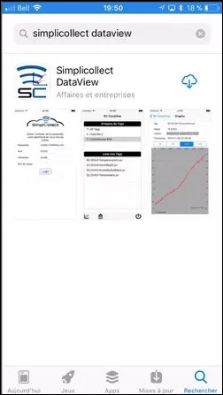
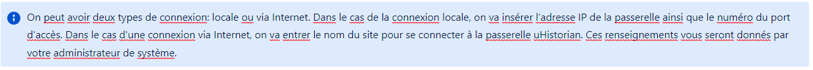
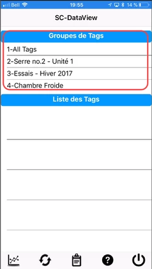
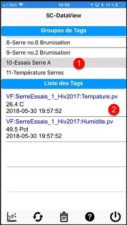
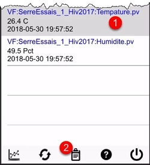
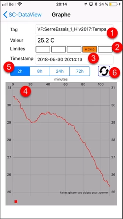
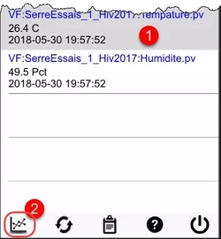
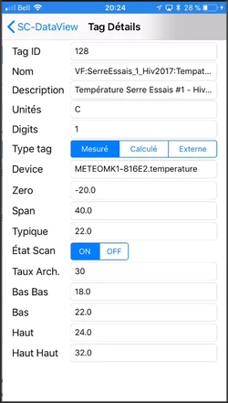

# Dataview sur iPhone

Dataview sur iOS (iPhone) vous permet de visualiser vos données et d'en tirer toute la valeur.  L'application fonctionne partout où on peut se connecter à Internet ou à votre réseau local d'entreprise et permet de visualiser un tag à la fois pour une période de 2 heures, 8 heures, 24 heures et 72 heures;

## Guide étape par étape

Les fonctions de l'application sont les suivantes:

## Installation à partir du App Store

La première étape dans l'utilisation de Dataview sur votre iPhone est l'installation à partir du App Store d'Apple.

1.  Cliquer l'icône App Store sur votre iPhone, cliquer sur le mode Rechercher et taper "simplicollect dataview" pour trouver l'application:

    { width=102 }

2.  Cliquer sur le bouton Installer afin de charger et installer l'application:

3.  Lorsque l'installation est terminée, cliquer sur le bouton Démarrer pour exécuter l'application:

## Paramètres de connexion

La première fois que vous actionner l'application, il faut remplir les champs qui vous permettront de configurer l’application.

{ width=108 }

1.  Entrez l'adresse url de la passerelle uHistorian dans le champ Passerelle.  Cette adresse vous sera donnée par l'administrateur uHistorian;

    { width=1237 }

2.  Entrez le numéro du port d'accès de données de la passerelle (4 ou 5 chiffres) qui vous est donné par l'administrateur uHistorian;

3.  Dans le champ suivant, entrez votre code d'utilisateur qui vous a été attribué par l'administrateur uHistorian;

4.  Finalement, entrez votre mot de passe qui vous a également été attribué par l'administrateur uHistorian;

5.  Lorsque tous les champs sont entrés, vous êtes prêt à vous connecter:

    { width=102 }

6.  cliquez sur le bouton Login et l'application établira la connexion à la passerelle (délais de 2 à 10 secondes);

7.  Un message de bienvenue apparait en dessous du bouton Login et vous dirigera vers l'affichage principal de l'application;

8.  Un message d'erreur peut également apparaitre sur l'affichage de connexion.  Dans ce cas, lire attentivement le message et suivre les instructions.  Dans la plupart des cas, une erreur s'est glissée dans les paramètres de connexion.  Corrigez l'erreur et cliquez de nouveau sur le bouton Login.  Si l'erreur persiste, faite à appel à votre administrateur uHistorian.

!!! info

    Tous les paramètres de connexion sont sauvegardés sur votre iPhone et vous n'aurez pas besoin de les entrer de nouveau la prochaine fois que vous exécutez l'application.

## Navigation

Après que l'application est installée, on peut la démarrer et se connecter à la passerelle uHistorian.

1.  L'application s'ouvre sur la liste des groupes de tags qui ont été configurés dans la base de données uHistorian ([Groupes de Tags](../configuration/groupes-de-tags.md) );

    { width=250 }

2.  On peut faire défiler la liste en déplaçant son doigt sur la liste de haut en bas ou de bas en haut;

3.  Choisir un groupe de tags et ces derniers vont apparait dans la liste du bas:

    { width=252 }

4.  Chaque tag section montre:

    1.  Le nom du tag;

    2.  Sa valeur actuelle;

    3.  L'horodate de la dernière lecture;

5.  Cliquer sur un tag dans la liste et cliquer sur le bouton Graphique pour afficher le graphique horaire du tag:

    { width=250 }

6.  L'écran avec les données du tag apparait et montre la courbe pour les 2 dernières heures:

    { width=108 }

7.  L'écran montre plusieurs informations:

    - \(1\) le nom du tag

    - \(2\) la valeur actuelle

    - \(3\) un indicateur qui montre si le tag est hors limite (voir configuration des limites dans la section Tag de SC-Config à ce lien)

    - \(4\) le graphique des valeurs du tag

    - \(5\) sélecteur de fourchette de temps pour 2 heures, 8 heures, 24 heures et 72 heures

    - \(6\) un bouton pour rafraichir les données de l'écran

8.  Cliquer sur la flèche **\< SC-Dataview** pour revenir à l'écran principal;

9.  Cliquer sur le bouton Propriétés du tag afin de visualiser les différentes propriétés du tag sélectionné:

    { width=250 }

10. L'affichage qui apparait montre tous les paramètres du tag:

    { width=250 }

11. Cliquer sur la flèche **\< SC-Dataview** pour revenir à l'écran principal;

12. Cliquer sur le bouton de Sortir pour quitter l'application:

    { width=249 }

13. On est de retour à l'écran d'accueil:

    { width=102 }
