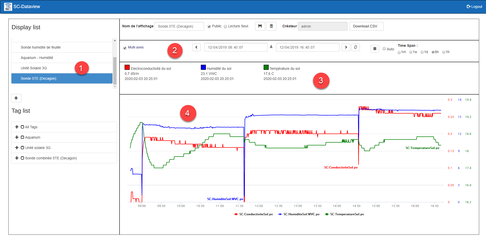
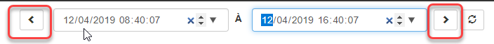
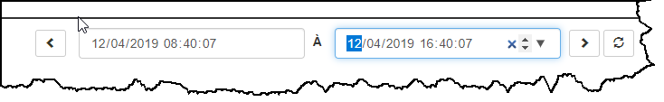
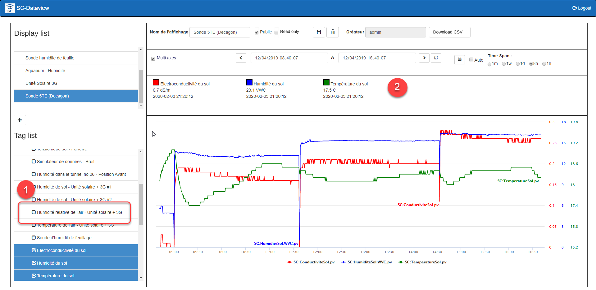
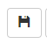
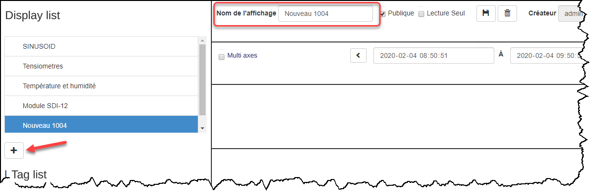
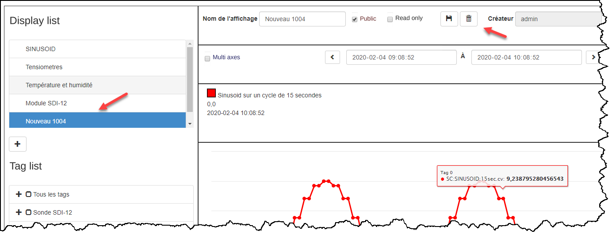
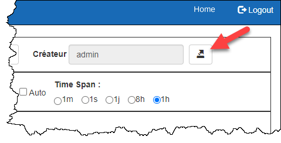
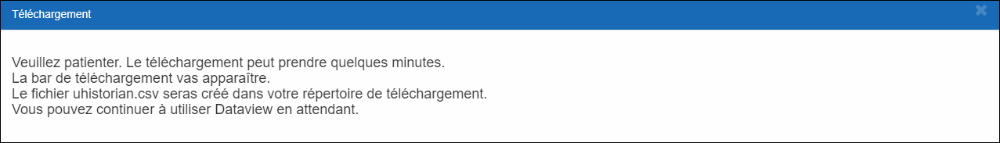
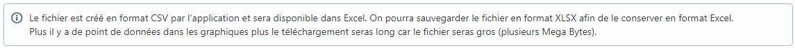

# Dataview on Web

Dataview on Web lets you view your data and get the full value from it:

- Lets you view up to 8 Tags on the same chart

- Access to real-time data coming from a module

- Saves the parameters of a display and lets you access it in a later session

- Export of data to an Excel spreadsheet for more detailed analysis and to produce your reports

Each combination of tags (maximum 8) can be saved as a "display", which is kept in the uHistorian database and can be recalled to show the tags it contains.

Tags are searched in the database through "tag groups", which simplify the search. These groups are configured using the configuration application [Tag Groups](../configuration/groupes-de-tags.md).

## Step-by-step guide

The functions of the application are as follows:

## Navigation

1.  Once connected to the Web interface, click the Dataview icon to start the application, which appears empty;

2.  Choose one of the displays (1) to access the data of the tags that are part of that display;

    By default, the time range is 1 hour

    { width=442 }

3.  For a given display (1), you can change the time span (2) of the data presented on the chart; the different tags that are in the chart are shown at the top of the screen (3), and the data of these tags is shown in the chart (4);

    { width=704 }

4.  You can change the time range by selecting one of the buttons: 1h for 1 hour, 8h for 8 hours, 1d for 1 day (24 hours), 1w for 1 week (7 days) and 1m for 1 month;

    When you choose longer time periods, such as a week or a month, the data search takes longer.

    { width=351 }

5.  The **Refresh** button refreshes the content of the chart for the selected time period without changing the selected time range;

    { width=46 }

    The **now** button updates the content of the chart starting from now, keeping the selected time span;

    { width=54 }

6.  You can choose an "ad hoc" time span using the search start and end fields located at the bottom center of the screen:

7.  Choose the start date/time combination and the end date/time combination of the search and click the Refresh button to get the data for that range;

    The maximum time range is limited to 1 month, and the larger the time range, the longer the search will take.

    { width=734 }

8.  You can also move through time with the forward and backward buttons of the display. Click the back arrow to go back in time and the forward arrow to go forward in time.

### Tag display

1.  Each tag that is part of the display is shown at the top of the screen and gives the "immediate" data related to the tag:

{ width=226 }

### Adding and removing a tag from the display

1.  To add a tag, go to the tag groups section and choose from the various branches of the tree that show the tags:

    { width=380 }

2.  After selecting the tag in the group, it appears at the top of the chart (2) with its current value;

3.  Click the Save button to save the added tag in the Display;

4.  To remove a tag from the display, find the tag in the All Tags group and uncheck the tag in question (1) to make it disappear from the display (2):

5.  Click the **Save** button to update the Display.

    { width=54 }

## Adding a display

1.  Click the Add button at the bottom of the list of displays and the application responds with a new display ready for configuration:

    { width=380 }

2.  Type the name of the display in the field at the top left of the screen, choose whether this display can be shared with other users, and choose whether the items are read-only (i.e. whether another user can change the content of the display):

    { width=704 }

3.  Open a tag group and choose the tags you want to show in the chart:

    { width=380 }

4.  Click the Save button to finish creating the new Display:

## Removing a display

1.  In the list of displays, choose the display to remove and click the Delete button:

    { width=394 }

2.  The application asks you to confirm the removal of the display. Click **Confirm** to delete the display or **Close** to cancel the deletion;

3.  The display is removed from the database.

## Export to Excel

Dataview lets you export the data to an Excel file for analysis.

1.  After selecting a display and a time range, with the charts displayed;

2.  Click the Download CSV button;

3.  { width=479 }

    The application confirms the creation of the file and starts downloading the CSV file;

    { width=1277 }{ width=1145 }

4.  Once the download is finished, the file uhistorian.csv appears at the bottom of the Chrome web browser and is created in the Downloads folder of your computer;

    { width=500 }

5.  The CSV file is in Text format. It is available for analyzing its content with the Excel application, but it can also be opened by any other application that opens Text files.

6.  If a file uhistorian.csv already exists in the Downloads folder, the new file will be named **uhistorian(1).csv**
