# Dataview sur Web

Dataview sur Web vous permet de visualiser vos données et d'en tirer toute la valeur:

- Permets de visualiser jusqu’à 8 Tags sur un même graphique

- Accès aux données en temps réel en provenance d’un module

- Sauvegarde les paramètres d’un affichage et permets d’y accéder à une session suivante

- Exportation des données vers un chiffrier Excel pour analyse plus détaillée et pour produire vos rapports

Chaque combinaison de tags (maximum 8) peut être sauvegardée sous forme "d'affichage" qui sera conservé dans la base de données de uHistorian et qui pourra être rappelé pour exposer les tags qu'il contient.

La recherche des tags dans la base de données est faite par le biais des "groupes de tags" qui simplifient la recherche.  Ces groupes sont configurés à l'aide de l'application de configuration [Groupes de Tags](../configuration/groupes-de-tags.md) .

## Guide étape par étape

Les fonctions de l'application sont les suivantes:

## Navigation

1.  Une fois connecter à l’interface Web, Cliquer sur l'icône Dataview pour démarrer l'application qui apparait vide;

2.  Choisir un des affichages (1) pour accéder aux données des tags faisant partie de cet affichage;

    Par défaut, la fourchette de temps est de 1 heure

    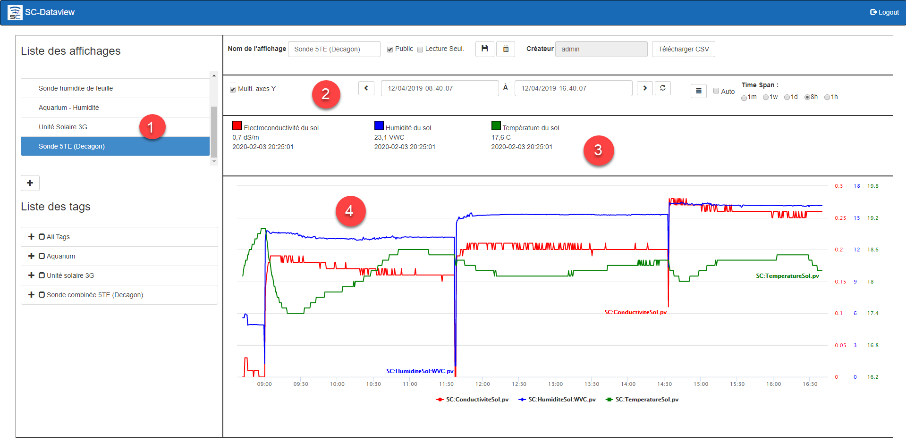{ width=442 }

3.  Pour un affichage donné (1), on peut changer l'écart (2) de temps des données qui sont présentées sur le graphique, les différents tags qui sont dans le graphique sont affichés en tête de l'écran (3) et les données des ces tags sont affichés dans le graphique (4);

    { width=704 }

4.  On peut changer de fourchette de temps en sélectionnant un des boutons:  1h pour 1 heure, 8h pour 8 heures, 1j pour 1 jour (24 heures), 1s pour 1 semaine (7 jours) et 1m pour 1 mois;

    Lorsque vous choisissez des périodes de temps plus longues, tel qu'une semaine ou un mois, la recherche de données prendra plus de temps.

    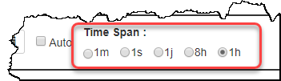{ width=351 }

5.  Le bouton **Rafraîchir** permet de rafraichir le contenu du graphique pour la période de temps sélectionnée sans changer la fourchette de temps sélectionnée;

    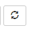{ width=46 }

    Le bouton **maintenant** permet d'actualiser le contenu du graphique à partir de maintenant en conservant l'écart de temps sélectionné;

    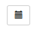{ width=54 }

6.  On peut choisir un écart de temps "ad hoc" à l'aide des champs de début et de fin de recherche situés en bas au centre de l'écran:

7.  Choisir la combinaison date/heure de début de recherche et la combinaison de fin de recherche et cliquer sur le bouton Rafraichir pour obtenir les données correspondantes à cette fourchette;

    La fourchette de temps maximale est limitée à 1 mois et plus la fourchette de temps est grande et plus le temps de recherche sera long.

    { width=734 }

8.  On peut également se déplacer dans le temps avec les boutons de déplacement avant et arrière de l'affichage.  Cliquer sur la flèche arrière pour reculer dans le temps et la flèche avant pour avancer dans le temps.

### Affichage des tags

1.  Chaque tag faisant partie de l'affichage est exposé en tête de l'écran et donne les données "immédiates" reliées au tag:

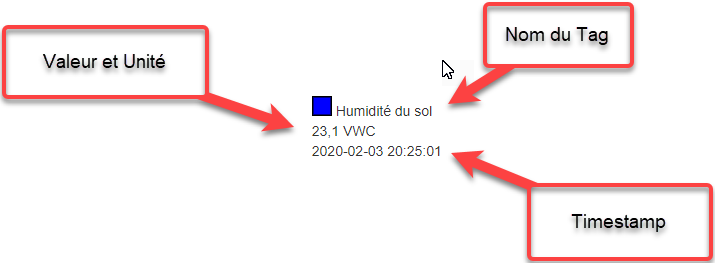{ width=226 }

### Ajout et retrait d'un tag de l'affichage

1.  Pour ajouter une tag, aller dans la section des groupes de tags et choisir parmi les différentes branches de l'arborescence qui montrent les tags:

    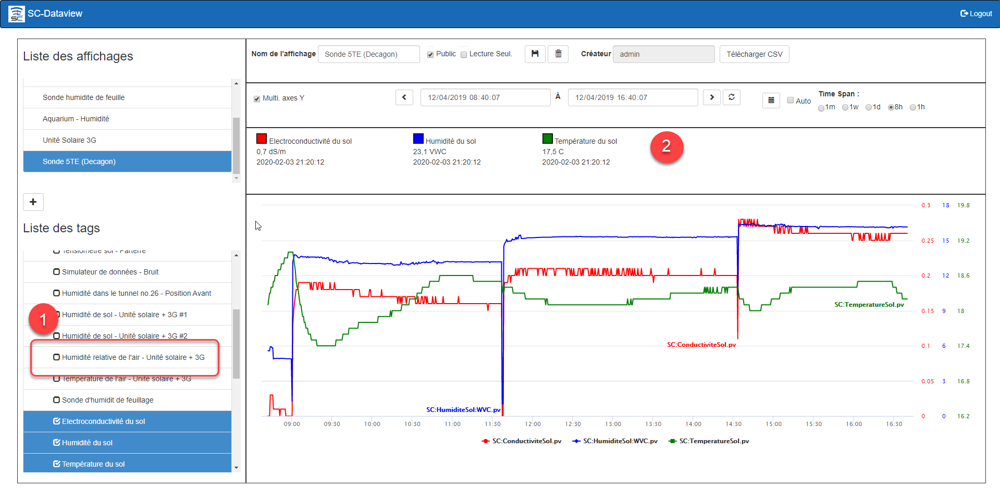{ width=380 }

2.  Suite à la sélection du tag dans le groupe, il apparait en tête du graphique (2) avec sa valeur actuelle;

3.  Cliquer sur le bouton Sauvegarder  afin de sauvegarder le tag ajouté dans l'Affichage;

4.  Pour retirer un tag de l'affichage, trouver le tag dans le groupe Tous les tags (All Tags en anglais) et décocher le tag en question (1) afin de le faire disparaire de l'affichage (2):

5.  Cliquer sur le bouton **Sauvegarder** afin de remettre à jour l'Affichage.

    { width=54 }

## Ajout d'un affichage

1.  Cliquer sur le bouton Ajouter en bas de la liste des affichages et l'application répond avec un nouvel affichage prèt pour la configuration:

    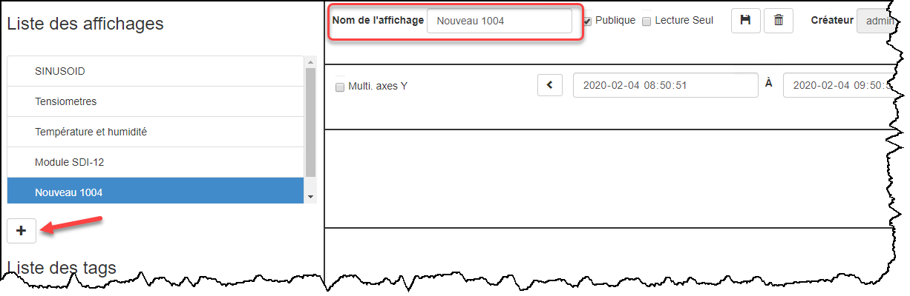{ width=380 }

2.  Taper le nom de l'affichage dans le champ en haut à gauche de l'écran, choisir si cet affichage peut être partagé avec les autres utilisateurs et choisir si les éléments sont en lecture seulement (c.-à-d. qu'un autre utilisateur peut changer le contenu de l'affichage):

    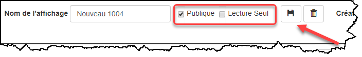{ width=704 }

3.  Ouvrir un groupe de tags et choisir les tags qu'on désire afficher dans le graphique:

    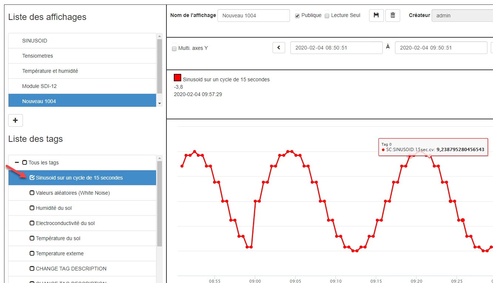{ width=380 }

4.  Cliquer sur le bouton Sauvegarder  pour terminer la création du nouvel Affichage:

## Retrait d'un affichage

1.  Dans la liste des affichages, choisir l'affichage à retirer et cliquer sur le bouton Effacer:

    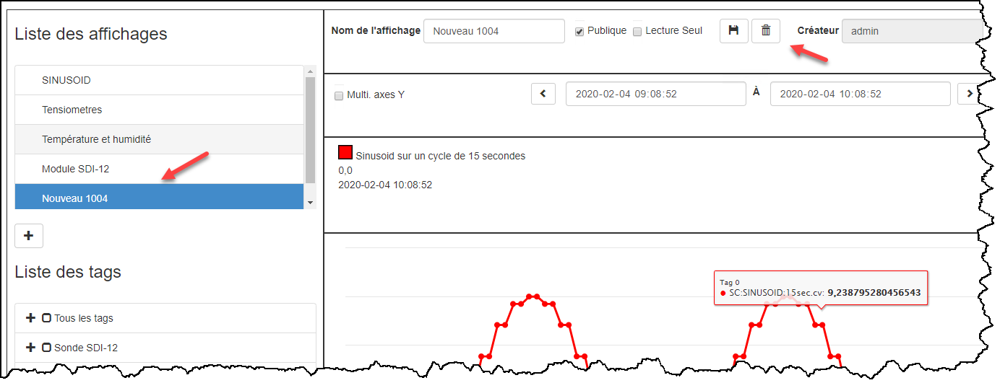{ width=394 }

2.  L'application demande de confirmer le retrait de l'affichage.  Cliquer sur **Confirmer** pour effacer l'affichage ou **Fermer** pour annuler l'effacement;

3.  L'affichage est retiré de la base de données.

## Exporter vers Excel

Dataview permet d'exporter les données vers un fichier Excel afin d'en faire l'analyse.

1.  Après avoir sélectionné un affichage, sélectionné la fourchette de temps et que les graphiques sont affichés;

2.  Cliquer sur le bouton Télécharger CSV;

3.  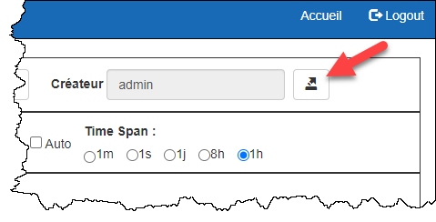{ width=479 }

    L'application confirme la création du fichier et démarre le téléchargement du fichier CSV;

    { width=1277 }{ width=1145 }

4.  Une fois le téléchargement terminé, le fichier uhistorian.csv apparaîtreras en bas du furreteur internet Chrome et seras créé dans le dossiers Téléchargement de votre ordinateur;

    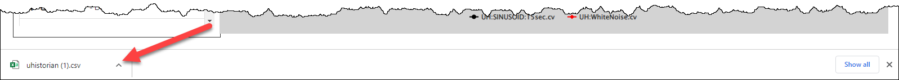{ width=500 }

5.  Le fichier CSV est en format Texte. Il est disponible pour l'analyse de son contenu avec l'application Excel. Mais aussi, il peut être ouvert par toutes autres applications qui permettent d'ouvrir des fichiers Textes.

6.  Si un fichier uhistorian.csv existe déjà dans le dossier Téléchargement, le nouveau fichier seras nommé **uhistorian(1).csv**
