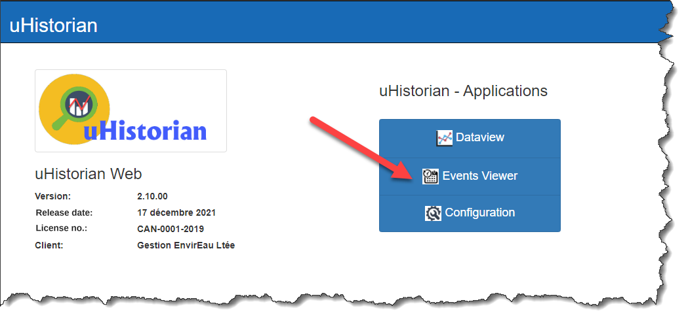
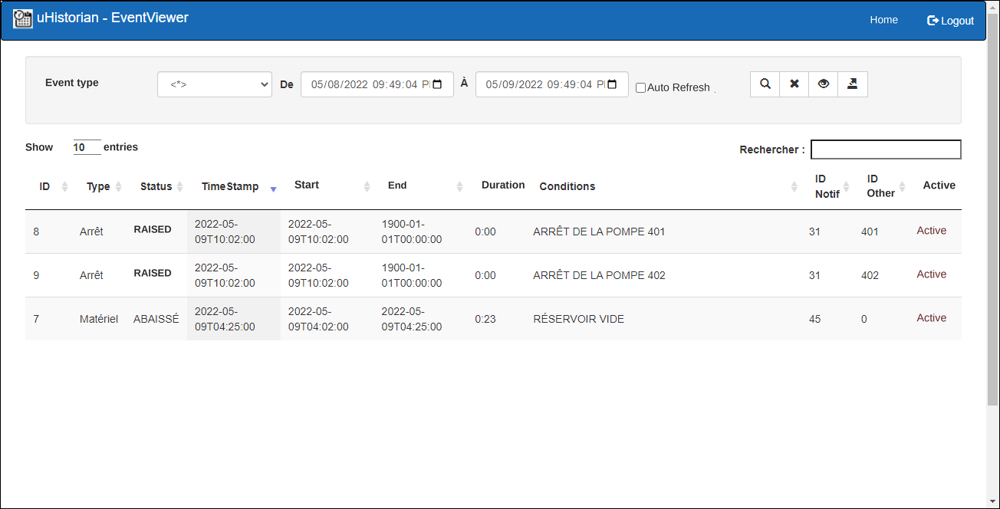
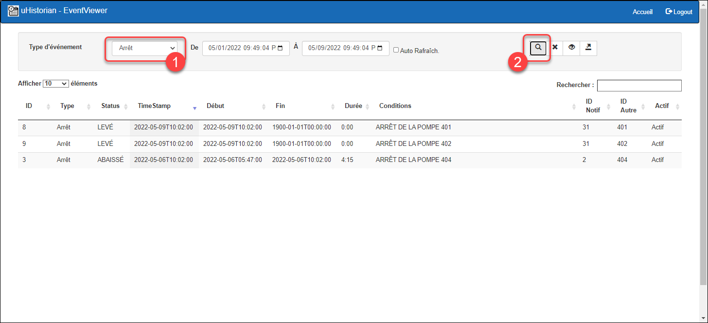
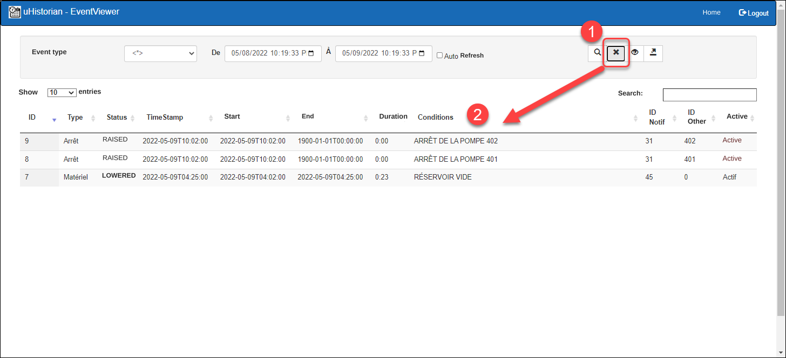
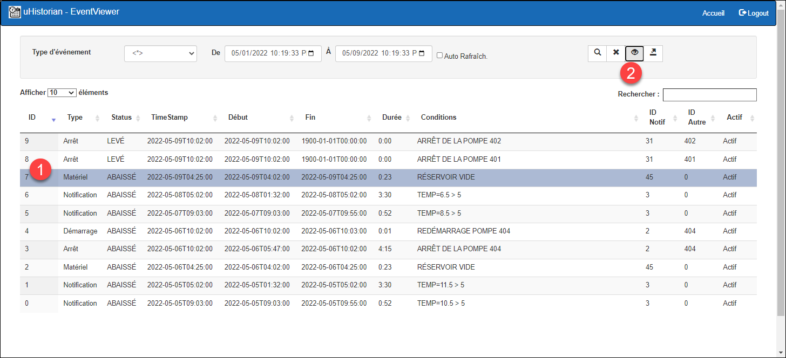
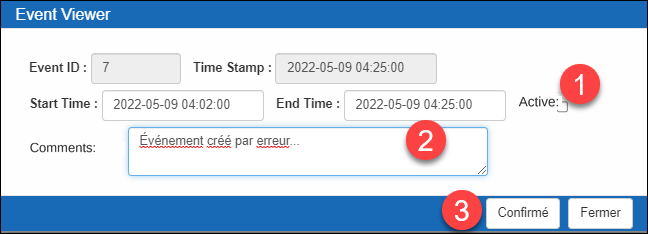
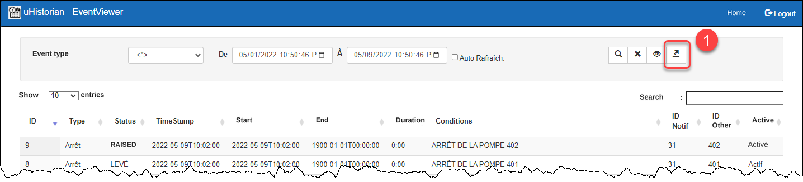

# Eventview

The event visualization function lets you search the events that were generated by the Notification and event management function ([Notifications and event management](../configuration/notifications-et-gestion-des-evenements.md)). This function generates events according to criteria that compare the value of one or more tags. The visualization function lets you find events using search criteria. You can analyze the list of these events or export it to an Excel spreadsheet.

## Searching for events

The main "Event Viewer" menu displays the list of events that occurred in the last 24 hours. You can then change the search criteria to find the events of interest.

The meaning of the fields related to an event is given in the following table:

| **Field**  | **Description**                                                                                                                                                                          |
|------------|------------------------------------------------------------------------------------------------------------------------------------------------------------------------------------------|
| ID         | Unique key of the event.                                                                                                                                                                 |
| Type       | Type of an event (contained in the EventType table).                                                                                                                                     |
| Status     | State of the event. By default, when the event is "raised", the status is RAISED, and when the event is lowered, the status is LOWERED (EventStatus table)                              |
| TimeStamp  | Timestamp of the last change made to the event.                                                                                                                                          |
| Start      | Timestamp of the start of the event.                                                                                                                                                     |
| End        | Timestamp of the end of the event.                                                                                                                                                       |
| Duration   | Duration of the event (i.e. the difference between the start and the end).                                                                                                               |
| Condition  | Condition that created the event.                                                                                                                                                        |
| Notif ID   | Identifier of the notification that was launched to create the event (see [Notifications and event management](../configuration/notifications-et-gestion-des-evenements.md)).           |
| Other ID   | Other ID that is applied to the event and that is configured in the notification form.                                                                                                   |
| Active     | The event is active or inactive.                                                                                                                                                         |

1.  On the home menu, click the Events Viewer button to display the screen:

    { width=272 }

2.  The opening display shows the events of the last 24 hours:

    { width=374 }

3.  Then change the time range and the event type and click the Search button:

    { width=374 }{ width=374 }

4.  You can return to the original filter (24 hours) by clicking the button marked with an X:

    { width=374 }

## Changing the parameters of an event

You can change the timestamp of the event (start/end), add a comment, and activate/deactivate an event.

!!! info

    You can deactivate an event if you use this field to discriminate an event that was created by mistake and that you do not want to use for, for example, statistical calculations.

1.  In the list, choose an event and click the edit button:

    { width=380 }

2.  A pop-up screen appears on which you can make the desired changes:

    { width=272 }

3.  Click the Confirm button to save the change. The result will be visible on the search screen

    { width=380 }

## Exporting the list to Excel

You can export the content of the list on the search screen to a CSV file that is compatible with the Excel spreadsheet.

1.  For the list of current events, click the CSV export button:

    { width=387 }

2.  The application confirms the creation of the file and starts downloading the CSV file;

    { width=1145 }

3.  Once the download is finished, the file events.csv appears at the bottom of the Chrome web browser and is created in the Downloads folder of your computer;

    { width=444 }

4.  The CSV file is in Text format. It is available for analyzing its content with the Excel application, but it can also be opened by any other application that opens Text files.

5.  If a file event.csv already exists in the Downloads folder, the new file will be named **events(1).csv**
