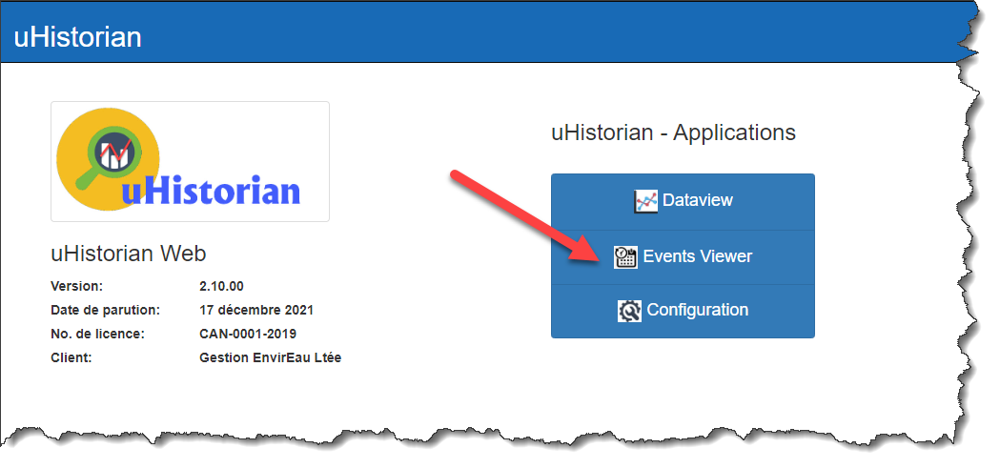
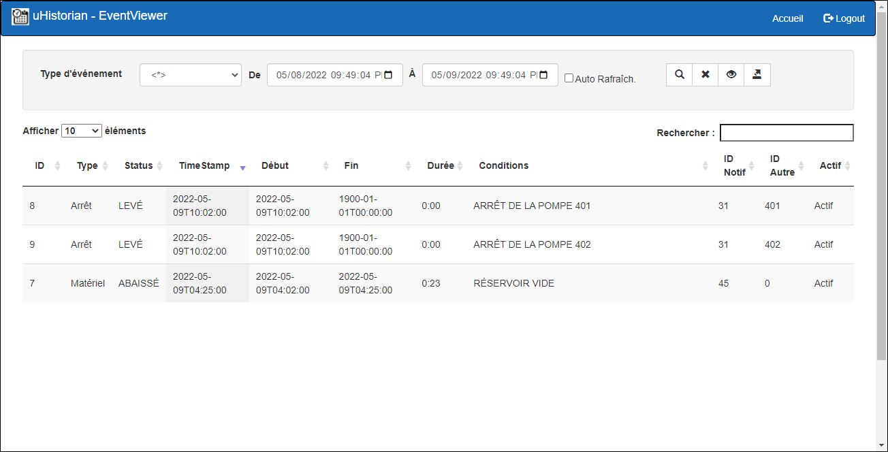
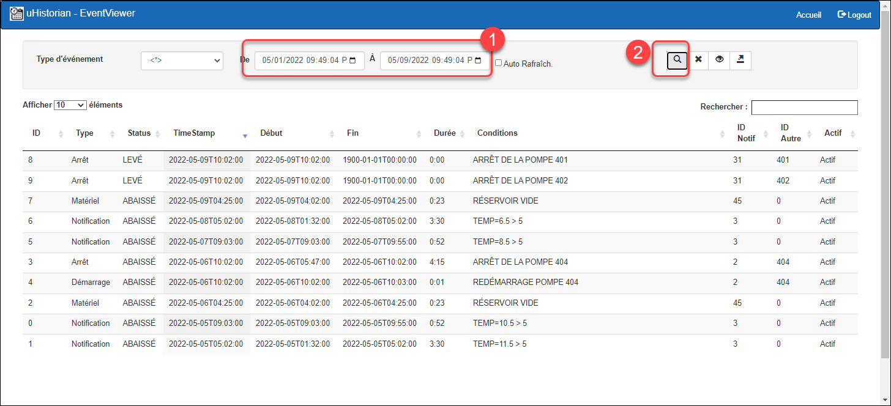
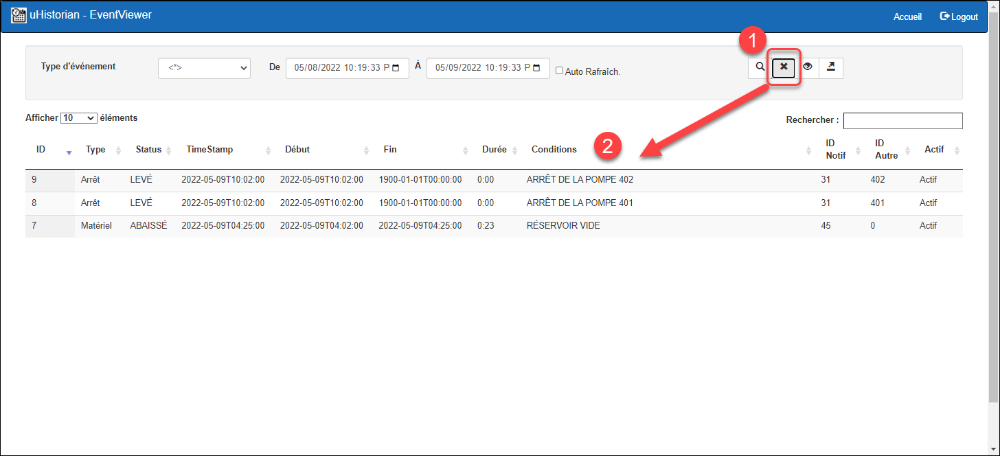
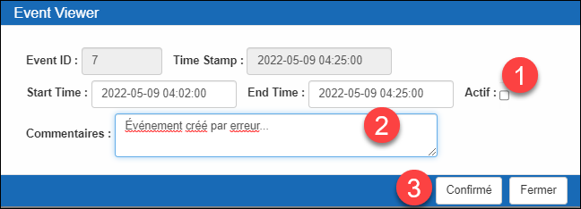
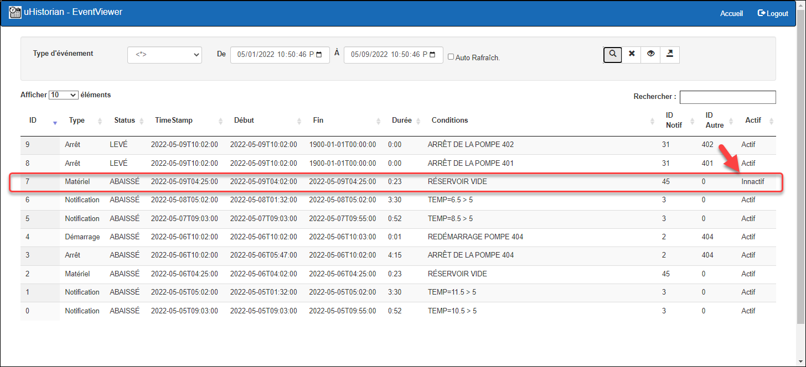
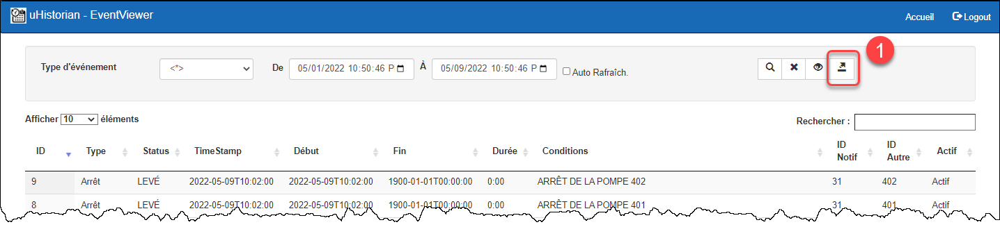

# Eventview

La fonction de visualisation des événements permet de rechercher les événements qui ont été générés par la fonction Notification et gestion des événements ([Notifications et gestion des événements](../configuration/notifications-et-gestion-des-evenements.md)). Cette fontion génére des événements selon des critères de comparaison de la valeur d’un ou plusieurs tags. La fonction de visualisation permet de trouver des événements selon des critères de recherche. On peut analyser la liste de ces événements ou les exporter vers un chiffrier Excel.

## Recherche des événements

Le menu principal “Event Viewer” affiche la liste événements survenus dans les derniers 24 heures. On peut alors changer les critères de recherche afin de trouver les événements d’intérêts.

La signification des champs relié à un événement sont énoncées au tableau suivant:

| **Champs** | **Description**                                                                                                                                                                          |
|------------|------------------------------------------------------------------------------------------------------------------------------------------------------------------------------------------|
| ID         | Clé unique de l'événement.                                                                                                                                                               |
| Type       | Type d’un événement (contenu dans la table EventType).                                                                                                                                   |
| Status     | État de l'événement. Par défaut, lorsque l'événement est “levé”, le status est LEVÉ, et lorsque l'événement est abaissé, le status est ABAISSÉ (Table EventStatus)                       |
| TimeStamp  | Horodatage du dernier changement fait à l'événement.                                                                                                                                     |
| Début      | Horodatage du début de l'événement.                                                                                                                                                      |
| Fin        | Horodatage de la fin de l'événement.                                                                                                                                                     |
| Durée      | Durée de l'événement (c.-à-d. la différence entre le début et la fin).                                                                                                                   |
| Condition  | Condition qui a créé l'événement.                                                                                                                                                        |
| ID Notif   | Identificateur de la notification qui a été lancé pour créer l'événement (voir [Notifications et gestion des événements](../configuration/notifications-et-gestion-des-evenements.md) ). |
| ID Autre   | Autre ID qui est appliqué à l'événement et qui est configuré dans la fiche de notification.                                                                                              |
| Actif      | L'événement est actif ou innactif.                                                                                                                                                       |

1.  Sur le menu d’acceuil, cliquer sur le bouton Events Viewer pour faire apparaître l'écran:

    { width=272 }

2.  L’affichage d’ouverture affiche les événements des derniers 24 heures:

    { width=374 }

3.  Par la suite, changer la fourchette de temps, le type d'événement et cliquer sur le bouton Rechercher:

    { width=374 }{ width=374 }

4.  On peut revenir au filtre original (24 heures) en cliquer le bouton marqué d’un X:

    { width=374 }

## Changer les paramètres d’un événement

Il est possible de changer l’horadatage de l'événement (début/fin), d’ajouter un commentaire et activer/désactiver un événement.

!!! info

    On peut désactiver un événement si on utilise ce champs pour discriminer un événement qui a été créé par erreur et qu’on ne veut pas utiliser pour, par exemple, des calculs statistiques.

1.  Dans la liste, choisir un événement et cliquer sur le bouton d'édition:

    { width=380 }

2.  Un écran surgissant apparaît sur lequel on peut faire les changement voulu:

    { width=272 }

3.  Cliquer sur le bouton Confirmé pour sauvegarder le changement. Le résultat sera visible sur l'écran de recherche

    { width=380 }

## Exporter la liste vers Excel

On peut exporter le contenu de la liste de l'écran de recherche vers un fichier CSV qui est compatible avec le tableur Excel.

1.  Pour la liste des événements présents, cliquer sur le bouton d’exportation CSV:

    { width=387 }

2.  L'application confirme la création du fichier et démarre le téléchargement du fichier CSV;

    { width=1145 }

3.  Une fois le téléchargement terminé, le fichier events.csv apparaîtreras en bas du furreteur internet Chrome et seras créé dans le dossiers Téléchargement de votre ordinateur;

    { width=444 }

4.  Le fichier CSV est en format Texte. Il est disponible pour l'analyse de son contenu avec l'application Excel. Mais aussi, il peut être ouvert par toutes autres applications qui permettent d'ouvrir des fichiers Textes.

5.  Si un fichier event.csv existe déjà dans le dossier Téléchargement, le nouveau fichier seras nommé **events(1).csv**
